# 地形模块 - 第一部分

在这个三部分的教程中，您将熟悉星际争霸 II 编辑器提供的许多功能之一，同时制作一个类似《自由之翼》战役中第一关的小冒险地图。

我们将有一个起始区域，英雄们将在这里开始任务，包括英雄们自己、他们居住和工作的军事基地，以及周围的一些植被。

## 介绍

地形模块是默认启动编辑器时打开的第一个窗口。这是您创建环境的布局和外观的地方，您可以在其中放置游戏开始时创建的道具、单位和结构。

用于更改地形和放置单位的控件分为不同的控制“层”。有一个地形层，您可以在其中修改地图的布局和环境，一个单位层，您可以在其中放置单位，并且还有一些其他层，其中大部分将在这个教程中使用。

## 在开始之前

在 Agria 地图集中创建一个新地图（文件 > 新建...）。对于起始纹理，选择 Agria Dirt。当您创建新地图时，您可以选择地图具有哪些“依赖项”。您可以将依赖项视为一组单位、地图集和选项。在星际争霸 II 中有多个可用的依赖项。Melee（自由）依赖性包含标准多人游戏和排位赛中使用的所有单位和设置。战役（自由）包含战役中的所有内容，例如凯莉根、泽拉图和雷诺单位。我们将选择战役（自由）依赖性，以便可以访问战役中的所有单位和结构，以及一些在标准多人游戏中不可用的额外环境道具和装饰物。最后，将地图的宽度和高度设定为 112 x 112。

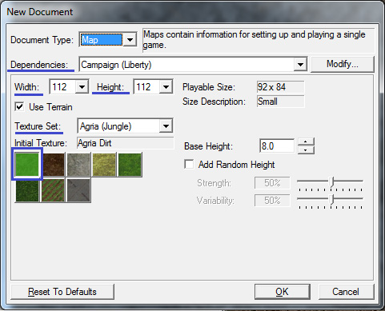

## 创建地形

我们将首先处理的是地形层，我们将在此修改地图地面纹理和地形。要进入地形层，请按 [T] 键或单击具有深蓝色双峰山图片的按钮：

### 悬崖

我们的英雄们工作的军事基地将位于一个大峡谷的边缘，因此我们需要使用“悬崖”工具为我们的峡谷创建一些悬崖：

在窗口左侧，紧挨迷你地图下方的是一排按钮，对应不同的地形“笔刷”。选择“悬崖”笔刷按钮。这是一个带有悬崖和绿色向上箭头图片的按钮。

在编辑器中，“笔刷”一词是用作比喻。在编辑器中，您选择的任何工具，包括添加、修改或移除地形、纹理、单位等的工具都被称为笔刷。

接下来，我们需要为我们的悬崖笔刷选择一个“操作”来执行。选择“下降悬崖”操作以通过将地形向下推动来创建悬崖。下降悬崖操作按钮上有一个悬崖和红色向下箭头。然后，您可以选择笔刷的大小和形状，并选择要绘制的悬崖类型。我们暂时选择了有机悬崖。

通过点击或按住左鼠标按钮在地形上使用笔刷，并通过按住右鼠标按钮并拖动鼠标来移动地图视图。如图片所示，我们将地图视图移动到了地图的左下部分，并在地图的左下方刻出一些悬崖。

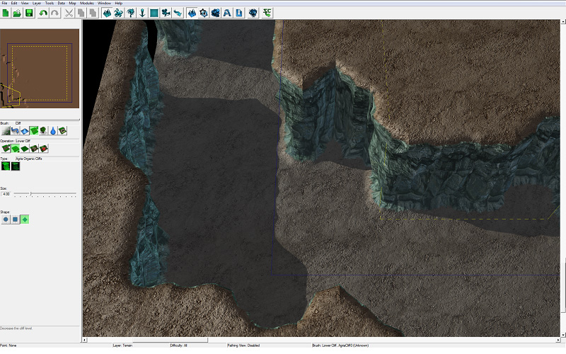

接下来，使用“升高悬崖”操作创建一个伸向峡谷的凸起的人造悬崖。这将是直升机停机坪。

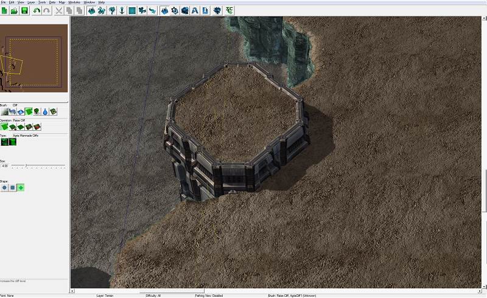

停机坪需要一个坡道，否则将无法进入。选择“添加坡道”笔刷。坡道只能绘制在悬崖边缘，而不能绘制在平地上。

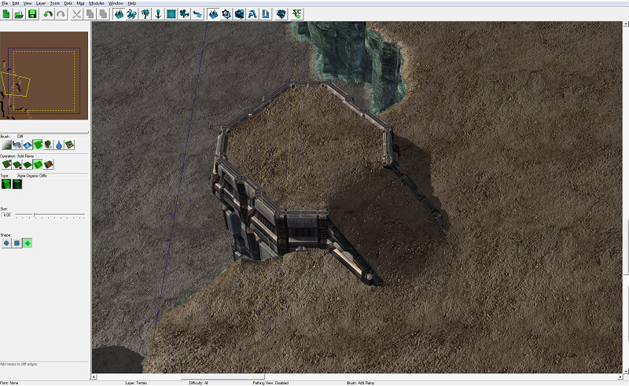

在我们进一步之前，让我们保存地图。意外事件可能导致编辑器因自动更新强制计算机重新启动、电力中断和宠物意外拔掉计算机电源而关闭，从而导致您丢失进度。与其指责电力公司导致 5 小时的工作丢失，不如确保经常保存！

### 纹理

现在我们有了一些悬崖，我们可以想想我们想在地图上放置哪些纹理。我们不希望整个地图被覆盖在泥土上，因此我们还要种植一些草，铺设一些混凝土。

选择纹理笔刷，它是可用笔刷中最左边的按钮。

有许多不同的操作，包括添加纹理、移除纹理、混合、抹平、填充等。我们将对大多数纹理需求使用添加纹理操作，但可以随意尝试其他操作。还有许多选项可控制绘制纹理的速度，以及笔刷的形状、大小和样式：

增量 - 此选项控制按住左鼠标按钮时绘制纹理的速度。

大小 - 增加此选项的滑块以增加纹理笔刷的半径。

速度 - 与增量选项类似操作。

我们将选择混凝土纹理，并在直升机停机坪和坡道上涂画。

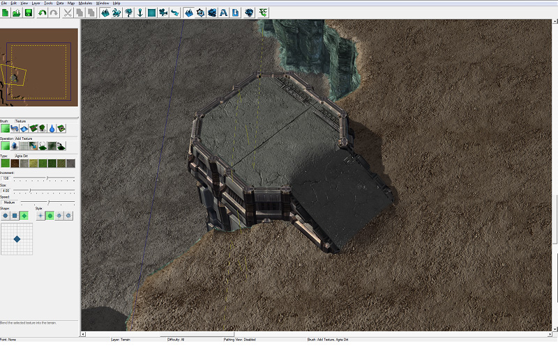

继续在基地周围绘制纹理。我们的英雄们现在在基地周围有了一些混凝土，供建筑和机库建造，以及一些草地和土路。

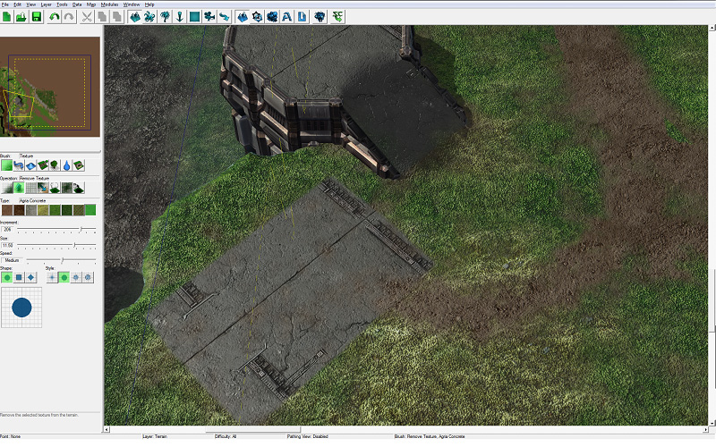

### 高度

峡谷通常是由水侵蚀形成的，因此我们将在峡谷底部放一条河。在放置水之前，我们将降低一些地形以形成水流的沟渠。我们可以使用高度笔刷来升高或降低地形而不形成悬崖。借助这个笔刷，我们可以制作山丘、山谷、火山口，并按需制作泥土或叶子堆。

选择高度笔刷按钮，它看起来像一个蓝色山丘，位于悬崖笔刷左边。

选择下降操作。

使用笔刷在峡谷中制造一条沟渠。

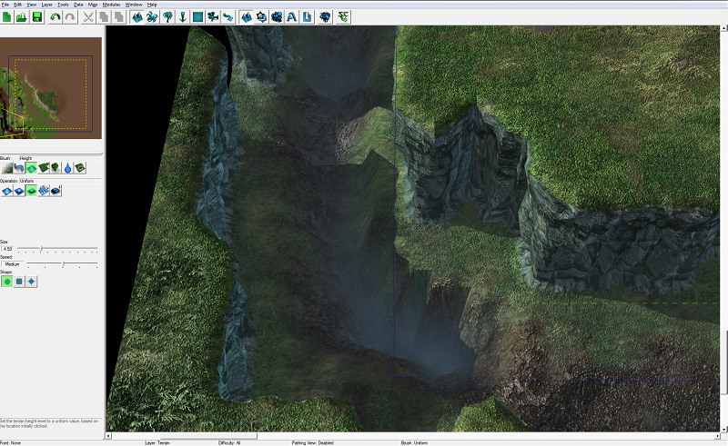

有时使用高度笔刷可能会留下不合意的锋利边缘。我们可以使用平滑操作来融合地形高度，以消除锯齿边缘。

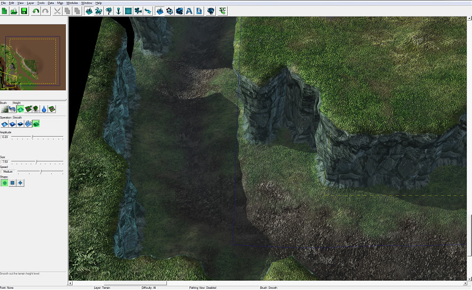

### 水

我们现在可以让水流过我们的沟渠。

选择水笔刷按钮，它看起来像一个大水滴。

## 翻译 E:\SC2Code\blizzard-tutorials-chinese\docs\Classic_Tutorials\01_Terrain_Module\1.md.part-1.md

水刷只有两种操作：加水和减水。选择加水操作（即使已经突出显示）以查看可用的不同类型的水。

在我们在峡谷中创建沟渠的地方放一些水。

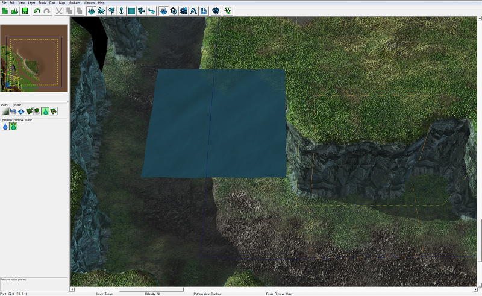

水可能漂浮在峡谷的上方。为了解决这个问题，使用“编辑水”按钮打开一个充满水设置的新窗口。我们目前关注的设置是高度设置。使用滑块调整水的高度，直到它舒适地坐落在沟渠中，不再漂浮在上方。有许多不同的选项可供设置。当水看起来完美时，按下“确定”关闭窗口。

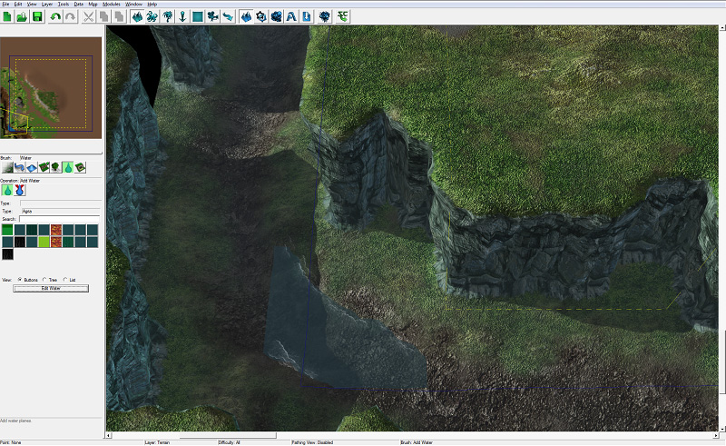

继续放置水，直到沟渠被填满水。

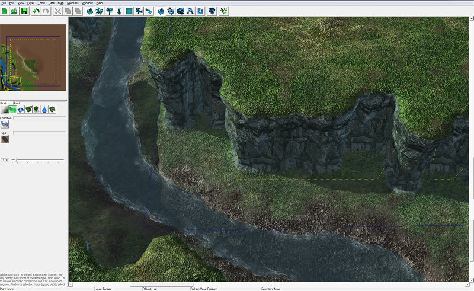

### 道路瓷砖

我们的军事基地将通过一条四车道高速公路可达。为了建造这条高速公路，我们将使用道路刷。

选择道路刷，在“高度刷”按钮的左侧。

目前每个图块集只有一个操作和一个类型。

左键单击鼠标将放置一个道路点。道路点将自动连接到附近的其他道路点。要放置一个不连接到附近道路点的道路点，请按住控制按钮再放置它。

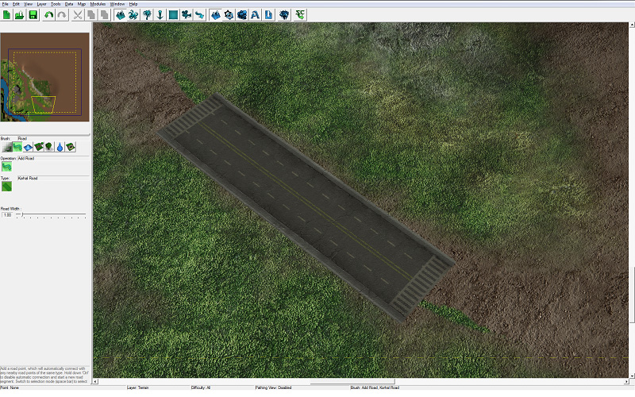

我们放置了足够的道路点，使道路蜿蜒并顺着峡谷走，然后在到达我们的军事基地时向左转并移动到地图边缘。

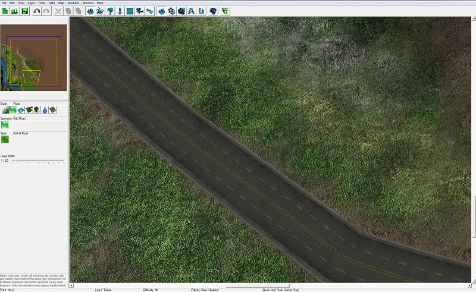

如果需要调整道路，可以进入“选择模式”并调整道路点。要进入选择模式，请按下[空格]键或[Escape]键。你应该看到道路点所在位置的绿色金字塔。要移动点，点击并拖动它们。要旋转点，选择您想要定向的点，按住[Control]和鼠标左键，拖动鼠标。

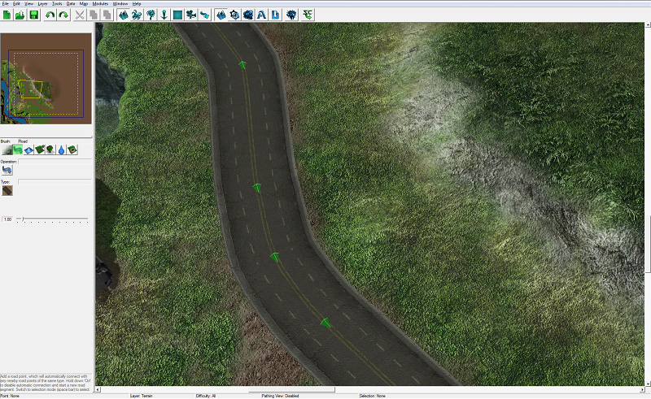

道路瓷砖不会显示在小地图上。为了向玩家显示道路的位置，我们在道路下面绘制了具体的纹理。

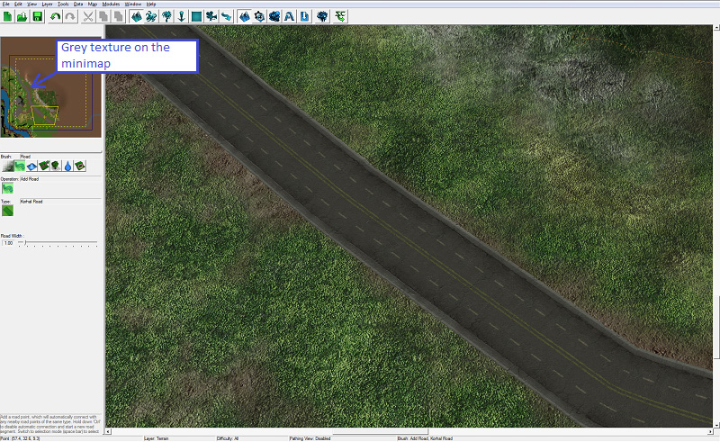

### 植被

我们几乎可以开始在地图上放置一些道具和单位了，但首先，我们要添加一些小植被。在编辑器中，像树木和灌木这样的较大植被是由设计者有意识地放置的，但像草和花这样的小植物是使用植被生成器放置的。这样做的好处是你不必自己放置成千上万的草地道具，但另一个重要的优势是以这种方式生成植被对游戏的处理要容易得多，因此游戏运行更流畅。

在我们开始之前，关于植被的一点说明：在低图形设置下植被是看不见的。具体来说，“地形质量”设置决定游戏中是否显示植被。

选择植被刷，看起来像一棵树，位于悬崖刷的右侧。

选择你希望植被的密度，然后按生成植被按钮。我们选择了密度为0.50。

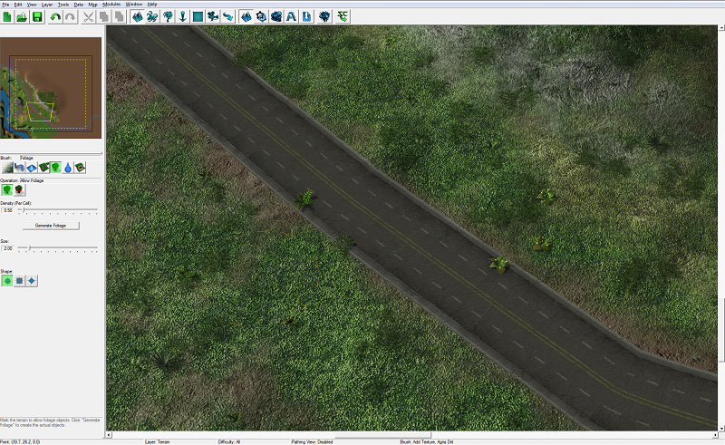

你可能注意到植被也被放置在我们的道路上。为了防止这种情况发生，我们需要使用“不允许植被”操作，并画出我们希望不出现植被的地方。

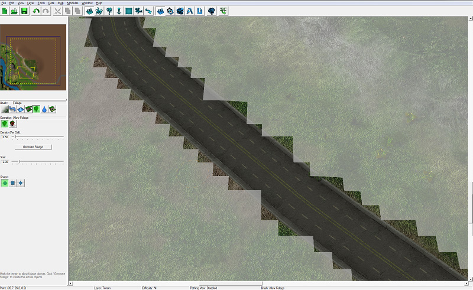

切换回“允许植被”操作，再次生成植被。现在植被已经在整个地图上生成，但不会出现在我们不希望出现的道路上。

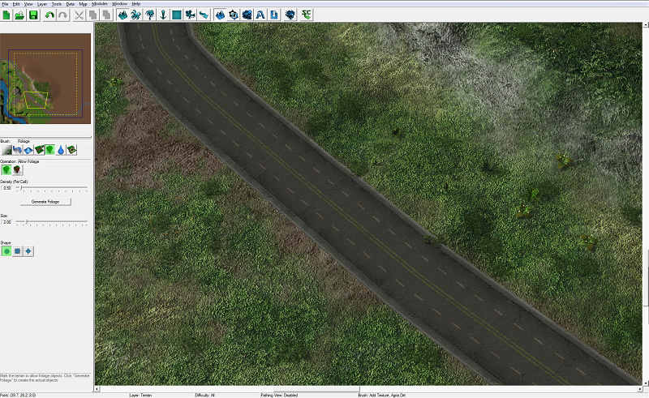

---
title: 第一部分
author: jrepp
category: 01_介绍

---
# 地形模块 - 第一部分

在这个三部分的教程中，您将熟悉星际争霸 II 编辑器提供的许多功能之一，同时制作一个类似《自由之翼》战役中第一关的小冒险地图。

我们将有一个起始区域，英雄们将在这里开始任务，包括英雄们自己、他们居住和工作的军事基地，以及周围的一些植被。

## 介绍

地形模块是默认启动编辑器时打开的第一个窗口。这是您创建环境的布局和外观的地方，您可以在其中放置游戏开始时创建的道具、单位和结构。

用于更改地形和放置单位的控件分为不同的控制“层”。有一个地形层，您可以在其中修改地图的布局和环境，一个单位层，您可以在其中放置单位，并且还有一些其他层，其中大部分将在这个教程中使用。

## 在开始之前

在 Agria 地图集中创建一个新地图（文件 > 新建...）。对于起始纹理，选择 Agria Dirt。当您创建新地图时，您可以选择地图具有哪些“依赖项”。您可以将依赖项视为一组单位、地图集和选项。在星际争霸 II 中有多个可用的依赖项。Melee（自由）依赖性包含标准多人游戏和排位赛中使用的所有单位和设置。战役（自由）包含战役中的所有内容，例如凯莉根、泽拉图和雷诺单位。我们将选择战役（自由）依赖性，以便可以访问战役中的所有单位和结构，以及一些在标准多人游戏中不可用的额外环境道具和装饰物。最后，将地图的宽度和高度设定为 112 x 112。

## 创建地形

我们将首先处理的是地形层，我们将在此修改地图地面纹理和地形。要进入地形层，请按 [T] 键或单击具有深蓝色双峰山图片的按钮：

### 悬崖

我们的英雄们工作的军事基地将位于一个大峡谷的边缘，因此我们需要使用“悬崖”工具为我们的峡谷创建一些悬崖：

在窗口左侧，紧挨迷你地图下方的是一排按钮，对应不同的地形“笔刷”。选择“悬崖”笔刷按钮。这是一个带有悬崖和绿色向上箭头图片的按钮。

在编辑器中，“笔刷”一词是用作比喻。在编辑器中，您选择的任何工具，包括添加、修改或移除地形、纹理、单位等的工具都被称为笔刷。

接下来，我们需要为我们的悬崖笔刷选择一个“操作”来执行。选择“下降悬崖”操作以通过将地形向下推动来创建悬崖。下降悬崖操作按钮上有一个悬崖和红色向下箭头。然后，您可以选择笔刷的大小和形状，并选择要绘制的悬崖类型。我们暂时选择了有机悬崖。

通过点击或按住左鼠标按钮在地形上使用笔刷，并通过按住右鼠标按钮并拖动鼠标来移动地图视图。如图片所示，我们将地图视图移动到了地图的左下部分，并在地图的左下方刻出一些悬崖。

接下来，使用“升高悬崖”操作创建一个伸向峡谷的凸起的人造悬崖。这将是直升机停机坪。

停机坪需要一个坡道，否则将无法进入。选择“添加坡道”笔刷。坡道只能绘制在悬崖边缘，而不能绘制在平地上。

在我们进一步之前，让我们保存地图。意外事件可能导致编辑器因自动更新强制计算机重新启动、电力中断和宠物意外拔掉计算机电源而关闭，从而导致您丢失进度。与其指责电力公司导致 5 小时的工作丢失，不如确保经常保存！

### 纹理

现在我们有了一些悬崖，我们可以想想我们想在地图上放置哪些纹理。我们不希望整个地图被覆盖在泥土上，因此我们还要种植一些草，铺设一些混凝土。

选择纹理笔刷，它是可用笔刷中最左边的按钮。

有许多不同的操作，包括添加纹理、移除纹理、混合、抹平、填充等。我们将对大多数纹理需求使用添加纹理操作，但可以随意尝试其他操作。还有许多选项可控制绘制纹理的速度，以及笔刷的形状、大小和样式：

增量 - 此选项控制按住左鼠标按钮时绘制纹理的速度。

大小 - 增加此选项的滑块以增加纹理笔刷的半径。

速度 - 与增量选项类似操作。

我们将选择混凝土纹理，并在直升机停机坪和坡道上涂画。

继续在基地周围绘制纹理。我们的英雄们现在在基地周围有了一些混凝土，供建筑和机库建造，以及一些草地和土路。

### 高度

峡谷通常是由水侵蚀形成的，因此我们将在峡谷底部放一条河。在放置水之前，我们将降低一些地形以形成水流的沟渠。我们可以使用高度笔刷来升高或降低地形而不形成悬崖。借助这个笔刷，我们可以制作山丘、山谷、火山口，并按需制作泥土或叶子堆。

选择高度笔刷按钮，它看起来像一个蓝色山丘，位于悬崖笔刷左边。

选择下降操作。

使用笔刷在峡谷中制造一条沟渠。

有时使用高度笔刷可能会留下不合意的锋利边缘。我们可以使用平滑操作来融合地形高度，以消除锯齿边缘。

### 水

我们现在可以让水流过我们的沟渠。

选择水笔刷按钮，它看起来像一个大水滴。
水刷只有两种操作：加水和减水。选择加水操作（即使已经突出显示）以查看可用的不同类型的水。

在我们在峡谷中创建沟渠的地方放一些水。

水可能漂浮在峡谷的上方。为了解决这个问题，使用“编辑水”按钮打开一个充满水设置的新窗口。我们目前关注的设置是高度设置。使用滑块调整水的高度，直到它舒适地坐落在沟渠中，不再漂浮在上方。有许多不同的选项可供设置。当水看起来完美时，按下“确定”关闭窗口。

继续放置水，直到沟渠被填满水。

### 道路瓷砖

我们的军事基地将通过一条四车道高速公路可达。为了建造这条高速公路，我们将使用道路刷。

选择道路刷，在“高度刷”按钮的左侧。

目前每个图块集只有一个操作和一个类型。

左键单击鼠标将放置一个道路点。道路点将自动连接到附近的其他道路点。要放置一个不连接到附近道路点的道路点，请按住控制按钮再放置它。

我们放置了足够的道路点，使道路蜿蜒并顺着峡谷走，然后在到达我们的军事基地时向左转并移动到地图边缘。

如果需要调整道路，可以进入“选择模式”并调整道路点。要进入选择模式，请按下[空格]键或[Escape]键。你应该看到道路点所在位置的绿色金字塔。要移动点，点击并拖动它们。要旋转点，选择您想要定向的点，按住[Control]和鼠标左键，拖动鼠标。

道路瓷砖不会显示在小地图上。为了向玩家显示道路的位置，我们在道路下面绘制了具体的纹理。

### 植被

我们几乎可以开始在地图上放置一些道具和单位了，但首先，我们要添加一些小植被。在编辑器中，像树木和灌木这样的较大植被是由设计者有意识地放置的，但像草和花这样的小植物是使用植被生成器放置的。这样做的好处是你不必自己放置成千上万的草地道具，但另一个重要的优势是以这种方式生成植被对游戏的处理要容易得多，因此游戏运行更流畅。

在我们开始之前，关于植被的一点说明：在低图形设置下植被是看不见的。具体来说，“地形质量”设置决定游戏中是否显示植被。

选择植被刷，看起来像一棵树，位于悬崖刷的右侧。

选择你希望植被的密度，然后按生成植被按钮。我们选择了密度为0.50。

你可能注意到植被也被放置在我们的道路上。为了防止这种情况发生，我们需要使用“不允许植被”操作，并画出我们希望不出现植被的地方。

切换回“允许植被”操作，再次生成植被。现在植被已经在整个地图上生成，但不会出现在我们不希望出现的道路上。

