# 地形模块 - 第二部分

## 放置一些装饰物

是时候添加一些道具了！现在，我们的英雄军事基地看起来还不怎么样。我们将开始通过添加一些飞机库、箱子和围栏来装扮这个地方。我们还会在直升机停机坪上添加一些装饰来让它看起来像一个真正的停机坪。

在《星际争霸 II 编辑器》中，装饰物被称为“doodads”。到目前为止，我们一直在地形模块的地形层中工作。然而，要放置doodads，我们需要切换到doodads层。在顶部按钮栏中找到一个看起来像树的按钮，或按下[D]。

## doodad 控制和筛选/搜索特定的doodads

有成百上千种可用的doodads，找到你想要的可能会有些困难。幸运的是，你可以设置筛选器，并且有一个搜索栏，如果你想要非常具体的话。

我们将在地图上添加的第一个doodad是一个车库。让我们使用一些筛选器来帮助我们找到它。

定位doodad筛选器。所有doodad搜索筛选器都位于屏幕左侧，就在doodads列表的上方。

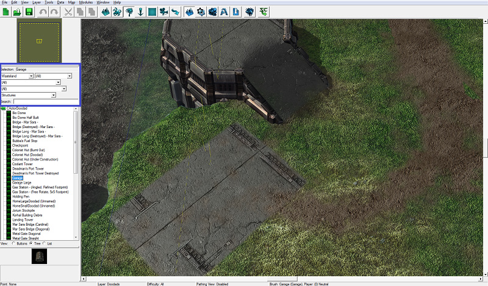

从第一个下拉菜单中选择Wasteland。

从最后一个下拉菜单中选择Structures。

仅通过选择这两个筛选器，我们就将数百个列表减少到了大约50个。如果你想要更具体地搜索，可以使用搜索栏输入doodad的名称，或名称的一部分。

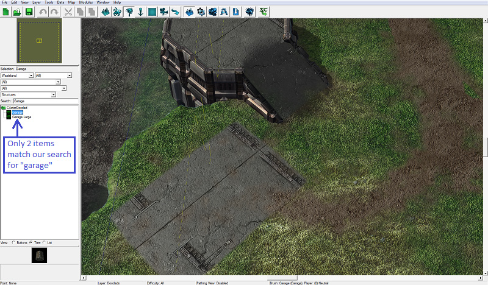

请注意，如果你设置了筛选器以查找特定类型的doodads，你可能找不到你要找的doodad。例如，如果你将其中一个筛选器设置为专门查找Environment doodads，那么车库doodad就不是Environment doodad，所以它不会出现在列表中。

在doodads列表中找到并选择车库doodad。

在地图底部的某个地方放置车库。

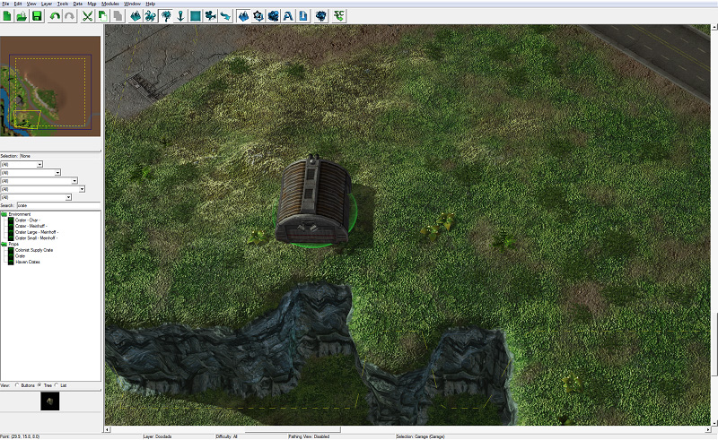

车库面朝南，这不理想，因为它是朝向悬崖边缘，而不是基地的中心。要旋转车库，按下[空格]键或[Escape]键进入选择模式，就像我们放置道路点时所做的一样。然后选中我们放置在地图上的车库。按住[Control]键，单击并按住鼠标左键在doodad之外的地面上，然后拖动鼠标，直到车库面向北。

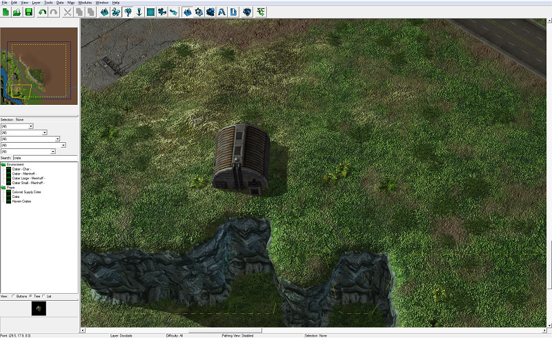

接下来，我们将在直升机停机坪上放置一些Decal doodads。

找到并选择Decal doodad。

在地图上车库附近放置几个Decal doodads。

同一种doodad可能会有多个变体，你可能会注意到我们刚刚放置的decals中有这种情况。如果你想要循环查看doodad的不同变体，进入选择模式并选择你想要更改的doodad。然后按[<]或[>]键循环浏览不同变体。

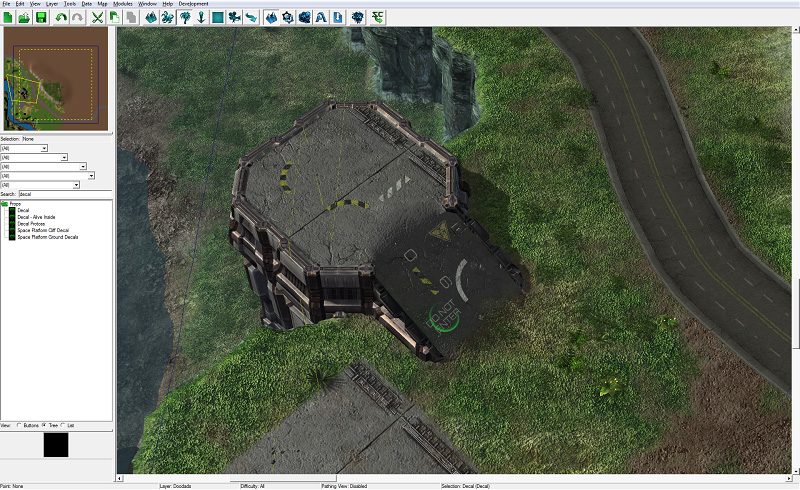

继续放置doodads，直到完成直升机停机坪的装饰。

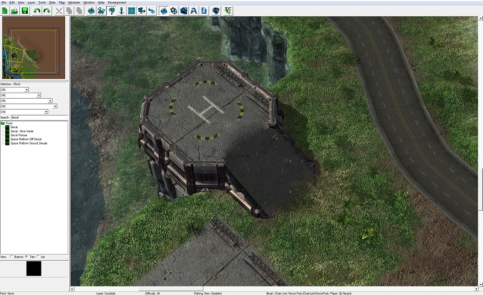

最后，我们将在水边的峡谷底部放置一些岩石doodads。

找到并选择Rock doodad。

尝试将岩石放置在峡谷底部时，你将注意到它们的放置图像为红色，无法放置。与单位类似，doodads也有特定的放置限制。将doodads放置在地形的最低级别是其中之一。幸运的是，当需要时，我们可以绕过这样的限制。

按住[Shift]键放置doodads将使它们“忽略放置”，这允许它们在任何地方放置，而不受放置限制的影响。通过这样做，你可以在峡谷底部放置岩石。

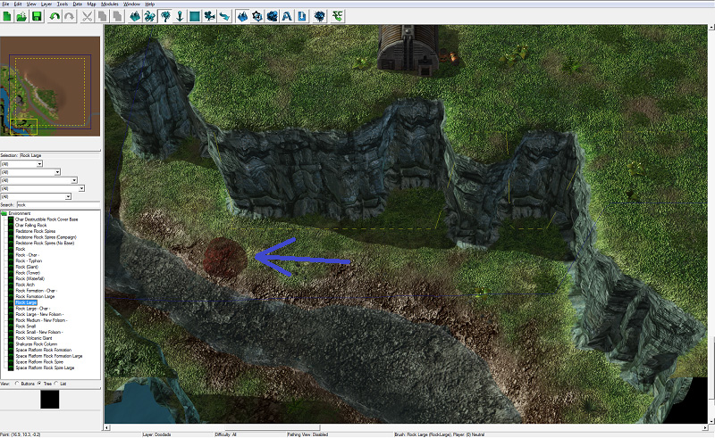

继续在基地周围和峡谷底部放置doodads，直到你满意为止。这就是我们设计的效果：

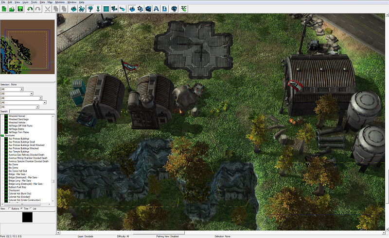

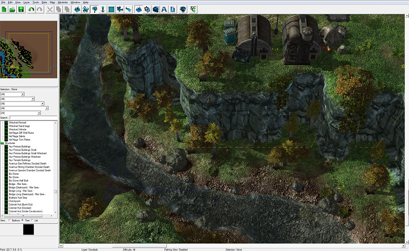

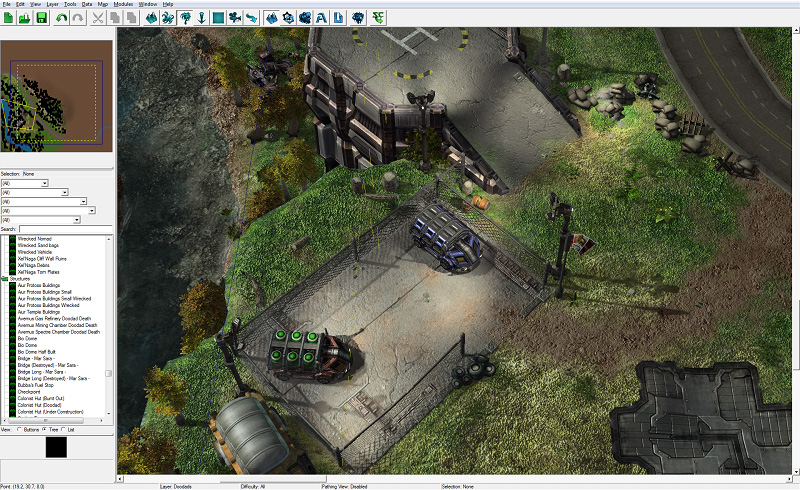

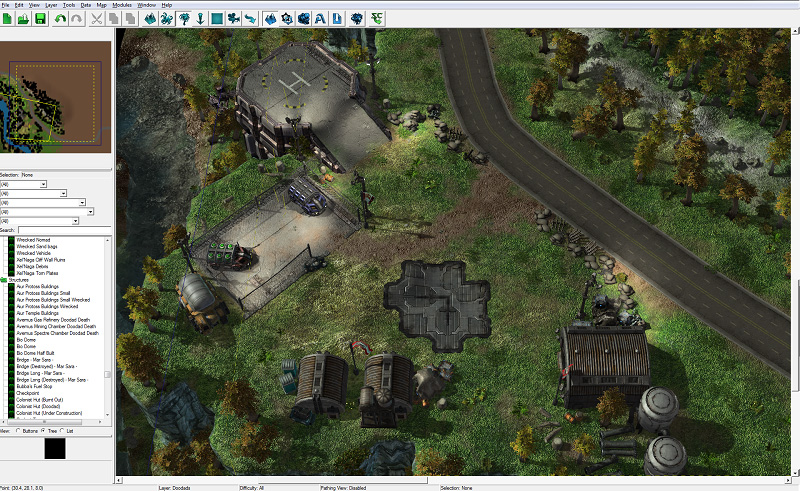

## doodad 属性

有许多选项可以修改地图上的doodads。双击放置的doodad将打开对象属性菜单，其中显示了各种可用选项，包括位置、高度、旋转和比例。