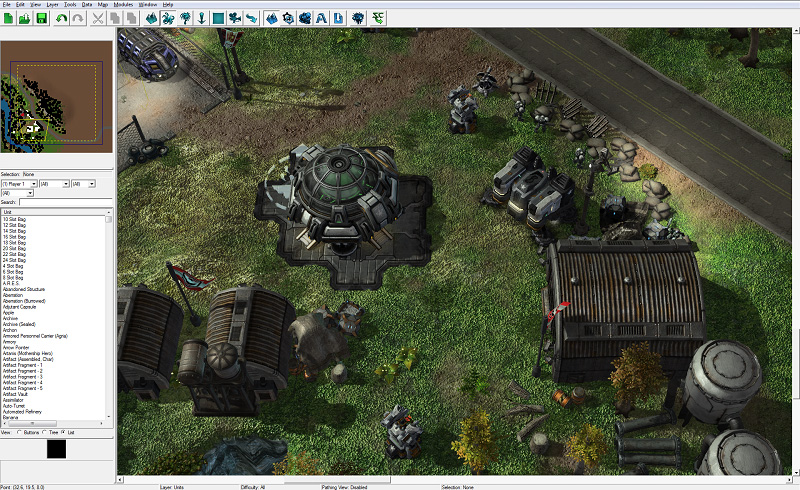
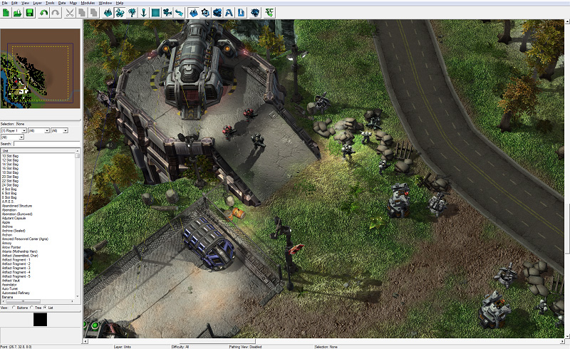
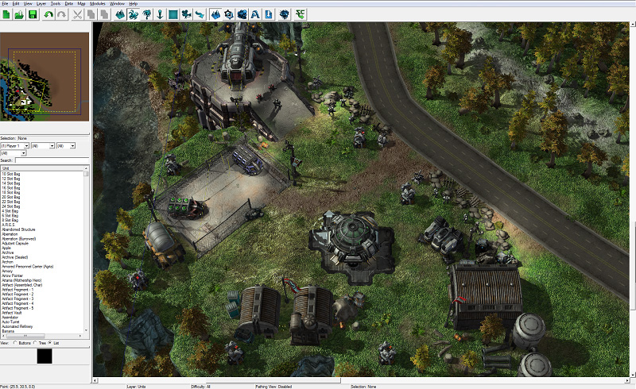

# 地形模块 - 第三部分

## 放置一些单位

现在我们已经建立好了基地，应该放置一些海军陆战队员来保护并使场地热闹起来。

导航至单位图层以添加单位。单位图层按钮上有一张兽人的图片，位于工具栏上地形和装饰图层按钮之间。您也可以通过按下[U]键来进入。

## 单位类型、过滤/搜索

与装饰物类似，当查找要放置的单位时，有几个过滤选项和搜索功能。总体而言，放置单位遵循与放置装饰物相同的规则。您可以放置、旋转、交换变体以及忽略位置。

放置单位和放置装饰物之间的一个显着差异是玩家编号。放置单位时，您必须选择拥有所放置单位的玩家是谁。您可以通过按下键盘上的任意数字键以及更改玩家过滤选项来更改玩家编号。

您可以在下面的图片中看到，我们在玩家0的位置放置了一些守卫路障的海军陆战队员、一些导弹炮塔、一个兵营和一个生物舱。我们还为玩家1放置了一些海军陆战队员和一位吉姆·雷诺（突击队员）。

## 单位属性

双击一个单位将打开其对象属性窗口，就像对装饰物一样。虽然可用选项有所不同，但理念是相同的。在此窗口中，您可以修改玩家编号、旋转、位置等。

一些选项稍微复杂，将在后续的词汇表文章或关于单位的更高级教程中进行介绍。