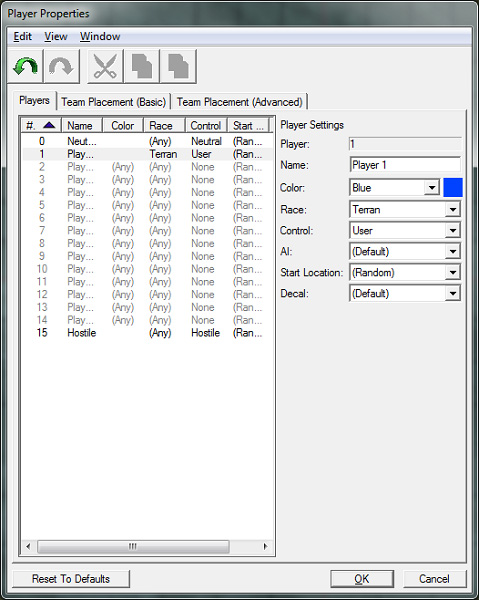

# 地形模块 - 第四部分

## 玩家属性

我们可以在“玩家属性”窗口中修改每个玩家的颜色、贴花、种族等。我们将使玩家1的单位变成蓝色，并且始终将玩家1设置为人类。

通过打开编辑器顶部的“地图”菜单选项并单击“玩家属性…”来打开“玩家属性”窗口。

在左侧列表中选择玩家1，然后将颜色选项从（任意）更改为蓝色。然后更改种族为人类。

在此窗口中还有一些其他选项可供设置。我们已将玩家1的种族更改为人类，但其他所有选项均保持不变。