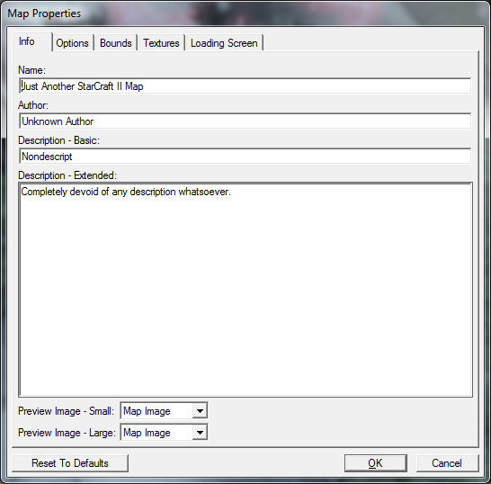
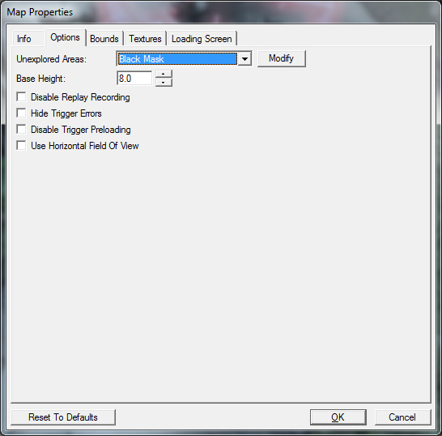
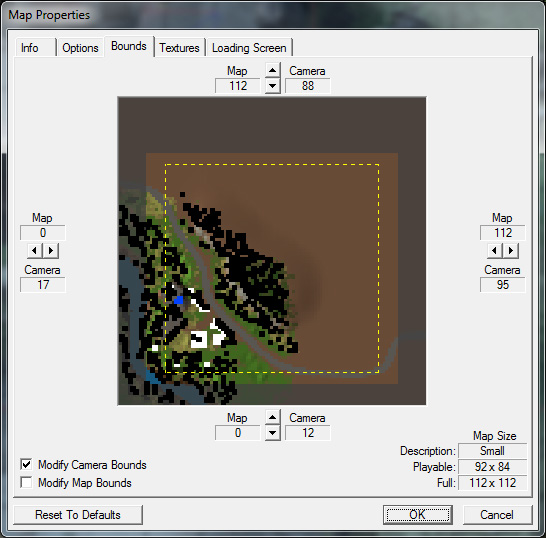
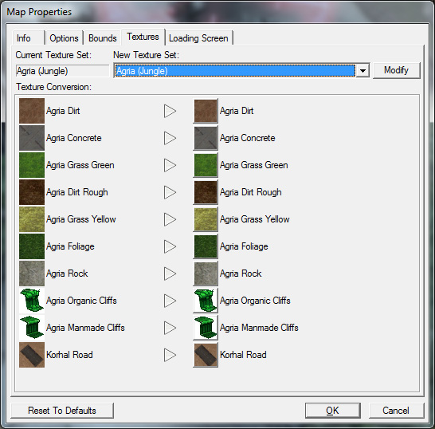
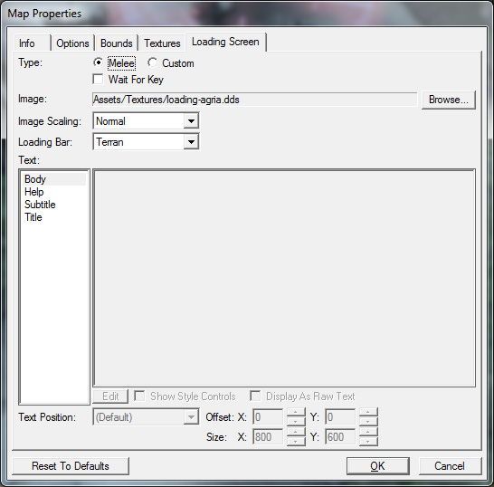

# 地形模块 - 第5部分

## 地图属性

在我们开始游戏并在地图中奔跑之前要修改的最后几个设置是地图属性窗口。要打开地图属性窗口，请转到编辑器顶部的"地图"菜单选项，然后选择"地图信息..."

地图属性窗口分为5个选项卡。每个选项卡提供不同的选项。

## 信息

此选项卡可让您设置有关您的地图的选项，在玩家在战网上查看您的地图时会显示这些选项。您可以更改地图的名称、作者、描述和预览图片。

## 选项

选项选项卡包含几个选项，目前最重要的是未探索区域或战争迷雾设置。这控制了您尚未看到的地图区域是变暗还是被遮挡。由于这将是一张冒险地图，我们将把设置从灰色遮罩（变暗）更改为黑色遮罩（被遮挡）。

## 边界

边界选项卡控制地图的大小。如果您发现您的地图有很多未使用的空间，或者需要更多空间，则可以在此处进行修改。

相机边界和地图边界控制您可以滚动相机或移动单位的距离，以及地图地形本身的延伸范围。目前，我们的地图大小合适，所以我们将保持不变。

## 纹理

纹理选项卡让您更改所使用的图块组，并允许您更换纹理。我们将保留我们的地图使用Agria图块组。

## 加载画面

加载画面选项卡包含用于编辑地图加载时显示的图像的控件。melee设置将自动生成一个带有地图名称和与地图上使用的星球图块组对应的图像的加载画面。对于我们的目的，这是可以的，所以我们将保持不变。

现在我们已经准备好测试我们的地图了！在测试地图之前，请确保保存地图。按下编辑器工具栏最右侧的"测试文档"按钮启动StarCraft II，并自动加载您的地图。该按钮下方有带有字母"SC"和一个箭头的标识。