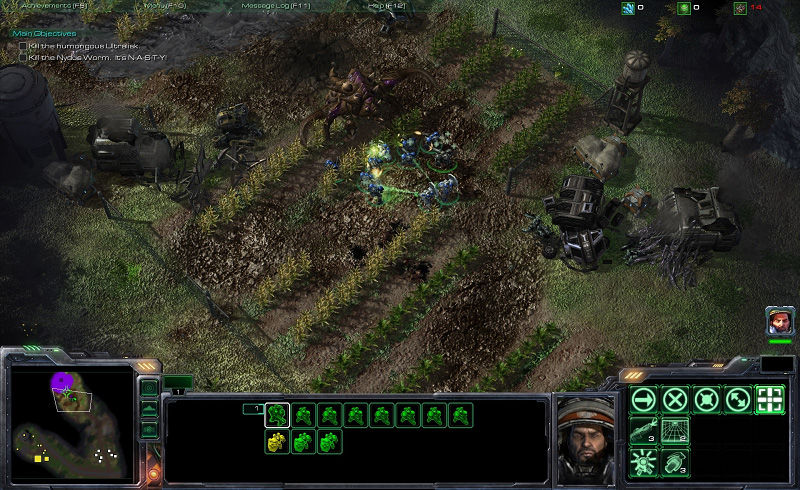
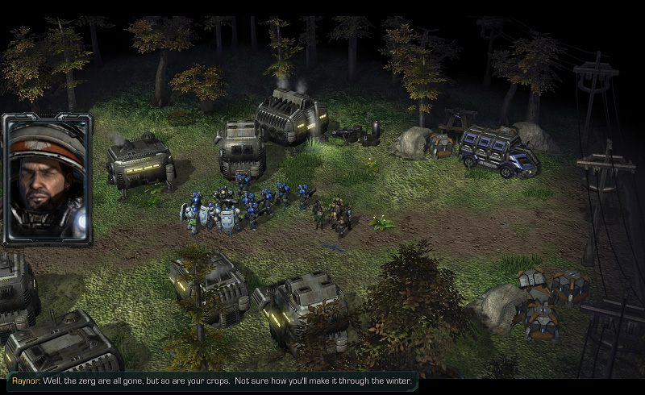
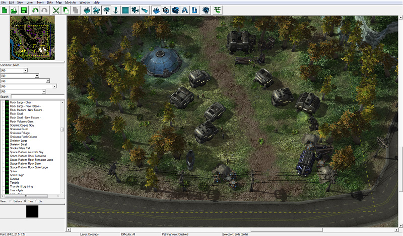
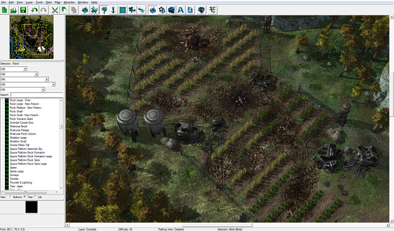
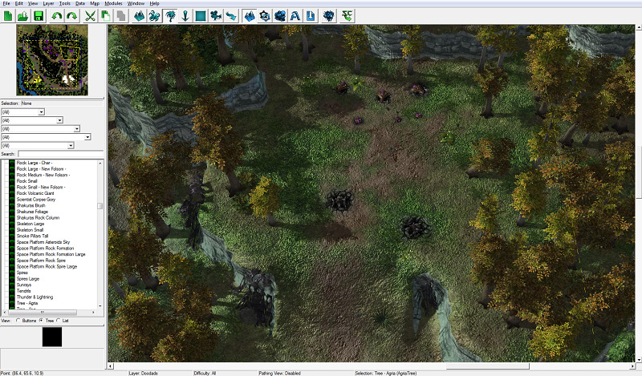
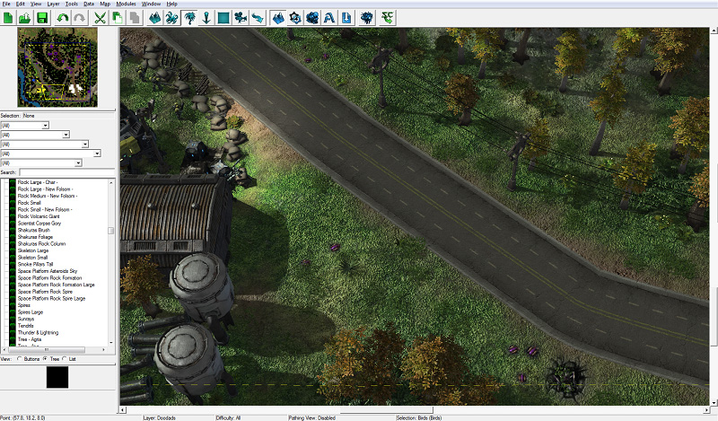
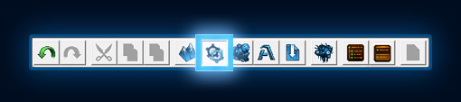
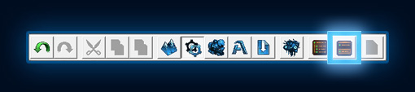
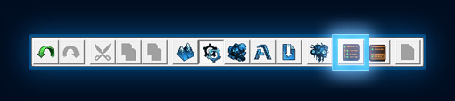

# 触发模块

在这个三部分的教程中，您将了解到《星际争霸 II 编辑器》提供的许多功能之一，同时制作一个类似《自由之翼》战役中第一任务的小冒险地图。

如果您还没有完成此教程的第一部分，请在[[这里](../terrain/1)]找到。

如果您想直接开始本教程而不必经过地形教程，您可以使用我们在该教程中制作的地图，位于[[这里](#finishedMap)]。

通过创建触发器来学习如何使用触发模块处理胜利、失败和游戏内脚本事件。

[下载触发模块 - 成品地图文件](https://web.archive.org/web/20130126143031/http://media.blizzard.com/sc2/game/maps-and-mods/tutorials/trigger/Trigger-Module-finished-product.SC2Map)

[下载触发模块 - 完善地形地图文件](https://web.archive.org/web/20130126143031/http://media.blizzard.com/sc2/game/maps-and-mods/tutorials/trigger/Trigger-Module-fleshed-out-terrain.SC2Map)

[下载触发模块 - 起始点地图文件](https://web.archive.org/web/20130126143031/http://media.blizzard.com/sc2/game/maps-and-mods/tutorials/trigger/Trigger-Module-starting-point.SC2Map)

## 最终结果

这是我们在本教程中要实现的最终结果：

我们将能够玩过一段探险风格的短任务，在这个任务中，我们的英雄将调查谁在摧毁和吃掉阿格里亚当地殖民地的作物的谜团。

## 介绍

触发模块是游戏玩法和叙事的发生地。在这里，您可以创建游戏内的影片，游戏中央出现单位，创建和追踪目标，等等。

触发器基本上可以看作是一组指令。当您希望游戏中发生某事时，您使用触发器告诉游戏何时发生以及如何发生。

1. 触发器由几个部分组成：

2. **事件** - 这是触发器运行的原因。如果我们希望设置一个触发器在英雄死亡时结束游戏，那么该触发器的事件将是“**当单位死亡时**”。
3. **条件** - 条件确保触发器仅在特定情况下运行。在上述示例中，当触发器因为单位死亡而运行时，我们会添加一个条件来确保**死亡的单位是英雄**。
4. **动作** - 动作是在运行触发器时执行的指令。在我们的示例中，当我们的英雄死亡时运行的动作是“**玩家1游戏结束**”。

## 开始之前

我们将继续使用本教程第一部分中的地图。在教程中，我们只完成了峡谷和军事前哨站的创建。在本教程中，我们使用了学习第一部分教程时掌握的所有概念来完成地图的其余部分。

如果您不想花时间装饰地图的其余部分，您可以使用我们制作的地图作为本教程的起点，位于[这里](https://web.archive.org/web/20130126143031/http://us.battle.net/sc2/en/game/maps-and-mods/tutorials/trigger/#finishedMap)。

我们添加了几个主要区域，我们的英雄将参观这些区域，您可以在下面的图片中看到：

我们在地图的东南部添加了一个小殖民地，就在路边。这些是那些作物被摧毁的可怜人们。

我们还添加了一个摧毁的农田区域，中心有一个异种虫（潜伏）。消灭这个单位是我们地图的目标。

我们还在殖民地的北部和作物的东部添加了一个小的可选区域。这里会有一些异虫单位。

最后，我们在地图各处散布了一些小型异虫单位，供玩家与之互动。

## I. 设置视图选项

如果还没打开，通过点击编辑器工具栏上的触发模块按钮或按下[F6]键来打开触发模块。

在我们深入了解触发器之前，让我们快速看一下如何设置触发模块窗口的不同方式。尽管您也被鼓励查看并尝试使用其他选项。

### A. 显示子视图

触发窗口包含地图上所有触发器的列表，这在左侧部分。地图默认已经创建了一个对战初始化触发器。

如果您想修改触发器中的任何事件、条件或动作，您必须双击该项目以打开一个窗口，在该窗口中您可以编辑事件、条件或动作。

但是，如果我们启用子视图，当我们单击项目以选择它时，其内容将显示在一个额外的部分中，该部分将显示在触发器内容下方。要切换“使用子视图”选项，请按窗口顶部工具栏上的“使用子视图”按钮。

### B. 隐藏库存

所有星际争霸 II 的事件、条件和动作都包含在“触发库存”中。用户可以创建自己的触发库存。但是，对于这个地图，我们不需要创建任何触发库存，所以我们将其隐藏。要切换触发库存，请在位于“使用子视图”按钮旁边的工具栏上按“显示库存”按钮。

### C. 更多选项

在窗口顶部的“视图”菜单中可以找到更多选项。目前我们保持不动，但是如果您愿意的话，随时可以尝试其他选项。

## II. 我的第一个触发器 - 胜利和失败触发器

让我们创建一些触发器！我们将首先创建的两个是简单的胜利和失败触发器，当玩家击败异种虫和奈德斯虫时，以及当玩家单位死亡时触发。