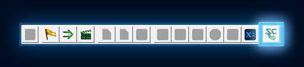

在我们进行操作之前，我们应该删除近战初始化触顺。近战初始化触发器包含了准备《星际争霸2》近战地图的动作；我们不需要它来制作我们的地图，因为我们要制作的是一个自定义地图，不需要像采矿或建造建筑这样的功能。您可以通过选择触发器并按[Delete]键，或右键单击它并选择“Clear”选项来删除触发器。

### A. 失败触发器

在我们的英雄死亡时应该运行失败触发器，这将导致玩家 1 失败。

#### 创建新触发器

1. 在触发器列表上右键单击并选择“新建>新触发器”，或按[Ctrl+T]创建一个新触发器。

2. 我们将为新触发器命名为“失败”。

3. 选择触发器以查看其内容。

#### 创建新事件

1. 要向触发器添加新事件，右键单击事件标签并选择“新建>新事件”，或单击事件标签并按[Ctrl+E]。

2. 在弹出的窗口中，选择“单位死亡”事件，然后按“确定”。

#### 创建新条件

1. 右键单击触发器内容列表并选择“新建>新条件”，或按[Ctrl+K]。

2. 弹出的窗口中包含条件类型列表。从列表中选择“比较条件”类型，并按“确定”。我们选择比较条件是因为我们想比较死亡的单位与我们的英雄单位。如果它们相同，则条件为真，触发器的动作将被执行。

3. 当您选择了刚刚创建的条件后，您可以在子视图部分看到其内容。子视图中应该包含“值 1”、“运算符”和“值 2”字段。

4. 双击“值 1”字段以弹出可供选择的条件列表，然后选择“触发单位”。触发单位指的是引发触发器运行的特定单位。在这种情况下，引发触发器运行的单位就是死亡的单位。

5. 运算符字段是我们选择条件两个值之间的关系方式。在这种情况下，只有两个选项：相等（==）或不相等（！=），因为我们比较的两个单位要么相同，要么不相同。没有“有点相同”的值。我们将保留运算符为“==”，因为我们希望在死亡的单位是英雄单位时运行触发器。

6. 双击“值 2”以再次打开条件列表。这次我们不会从列表中选择条件。相反，列表上方有一排单选按钮，用于控制您可以选择的条件值的类型。现在，我们正在查看条件功能列表。选择“值”单选按钮以显示地图上存在的单位列表。当我们制作地图地形并放置玩家 1 的单位时，我们放置了 2 名海军陆战队员和一个吉姆·雷诺（突击队）单位。在列表中找到吉姆·雷诺（突击队）并选择他，然后按“确定”。

#### 创建新动作

1. 右键单击触发器内容列表并选择“新建>新动作”，或按[Ctrl+R]。

2. 在弹出的动作列表中找到并选择“为玩家结束游戏”。在“查找”字段中键入您要查找的触发器的全部或部分内容也将有助于缩小搜索范围。

3. 选择动作后，将显示其内容，就像我们制作条件时一样。

4. 双击“类型”字段，将值从“胜利”更改为“失败”。

#### 测试一下！

我们已经完成了我们的第一个触发器！让我们进入游戏，测试我们的新触发器。

1. 按编辑器工具栏最右侧的“测试文档”按钮，或按[Ctrl+F9]。

2. 进入地图后，选择您的单位并命令它们攻击吉姆·雷诺。当他死亡时，您应该看到游戏结束菜单弹出，如下所示：

### B. 胜利触发器

接下来我们将制作一个简单的胜利触发器。这个触发器将在地图上放置的 Nydus Worm 和 Ultralisk 单位全部死亡时以玩家 1 的胜利结束游戏。

如果您尚未在地图上放置 Nydus Worm 和 Ultralisk（潜伏）单位，您应该立即进行这样的操作。有关如何在地图上放置单位的信息，请参阅本教程系列的第 1 部分，位于[地形模块](https://web.archive.org/web/20130126143031/http://us.battle.net/sc2/en/game/maps-and-mods/tutorials/terrain/3)的单位部分。我们已经将这两个单位放置在地图的农田区域：

在制作触发器之前，我们需要为我们在任务中要击败的这两个单位创建一个变量。

#### 变量！

星际争霸 II 编辑器中的变量工作方式与脚本和编程语言中的变量相同。

对于那些不熟悉此概念的人，变量是可以设置为某个值的标识符。例如，如果我们的变量是 a，那么我们可以说 a = 5。如果我们在等式中使用 a，则相当于在等式中使用数字 5，因此 a + 2 = 7。您可以随时更改变量设置的值。因此，我们可以在完成 a + 2 等式后将 a = 5 替换为 a = 6，以便在下次使用 a 时，我们使用数字 6 而不是 5。在星际争霸 II 编辑器中，我们可以有许多不同类型的变量，如单位、整数和文本。

#### 在触发器模块中制作变量

1. 在触发器列表中右键单击并选择“新建>新变量”，或按[Ctrl+B]。给您的新变量命名为 NydusWorm。