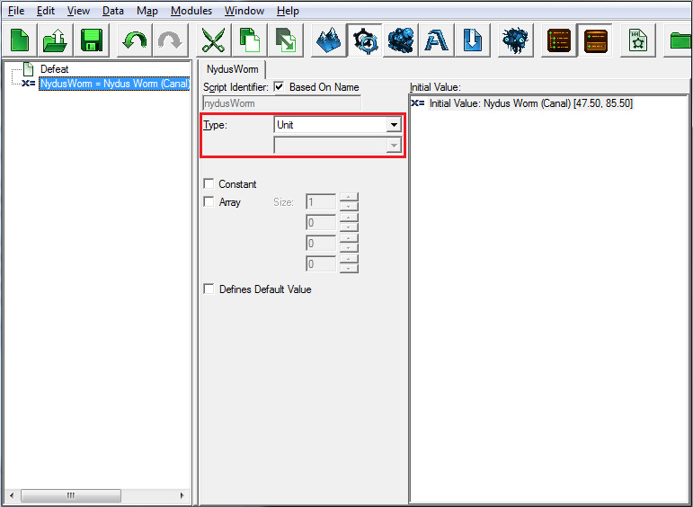
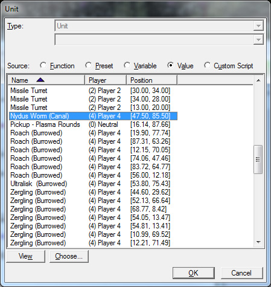
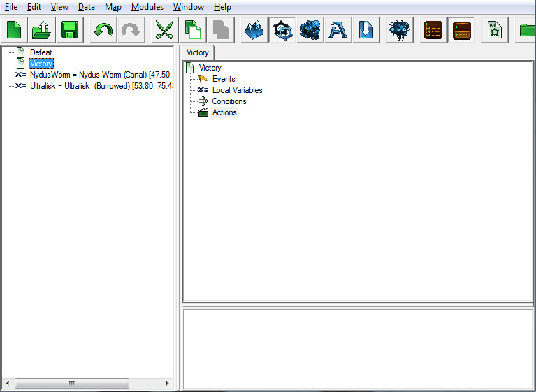
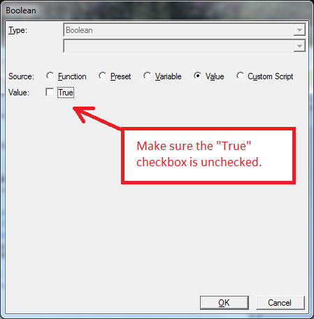
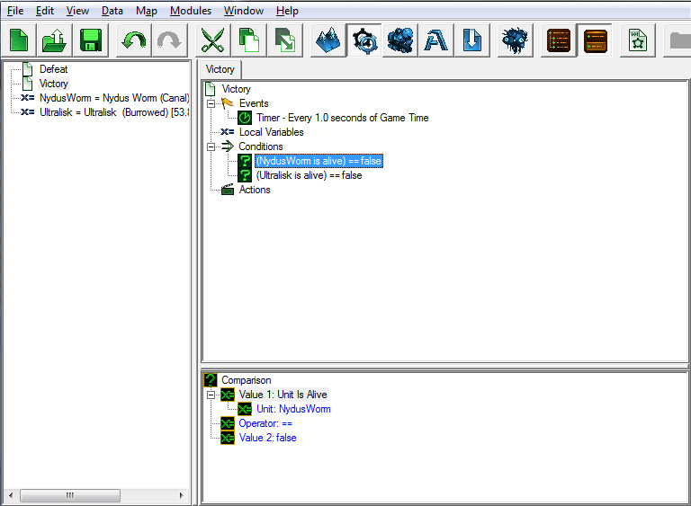
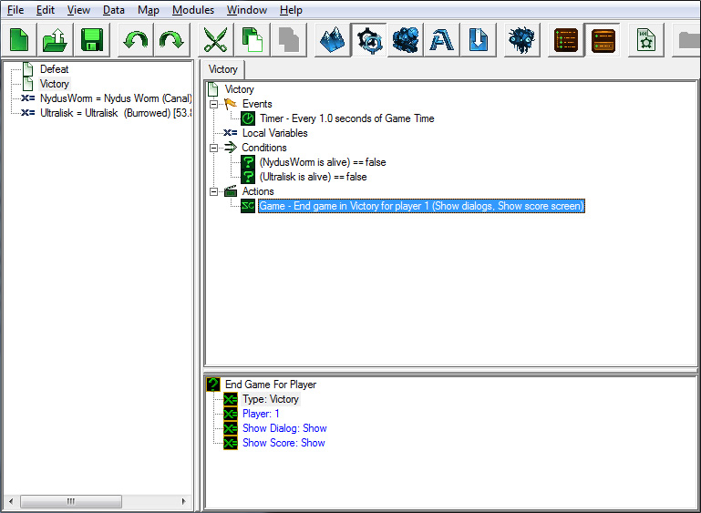
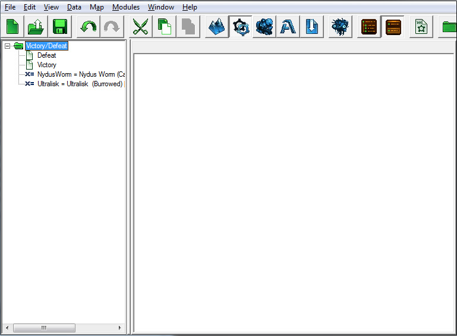

## 2. 当您选择变量时，可以在右侧看到其内容。每个变量都有一个类型。类型对应于变量可以存储的值类型。它们可以存储整数、实数、文本、单位等等。我们将把这个变量的类型设置为“Unit”，因为我们希望这个变量存储我们放置在地图上的具体 Nydus Worm（坑筑虫）单位。

## 3. 双击右侧部分的“初始值”字段。

## 4. 选择“值”单选按钮，然后找到并选择 Nydus Worm （Canal）单位。

## 5. 重复这些步骤，为 Ultralisk（猛犸虫）创建一个变量。

现在我们准备创建胜利触发器。开始创建触发器吧。

#### 事件

上一个触发器是每当一个单位死亡时运行的事件。这一次，我们将使用一个名为周期性事件的事件，使触发器以重复间隔运行。

1. 在触发器区域右键单击，选择新建 > 新建事件，或按 [Ctrl+E]。

2. 然后在弹出窗口中，从功能部分选择周期性事件。

3. 将持续时间的值从 5.0 更改为 1.0。

4. 将时间类型值保持为游戏时间。

#### 条件

对于这个触发器，我们需要两个条件：我们要检查的每个单位一个条件。

1. 右键单击触发器区域，选择新建 > 新建条件，或按 [Ctrl+K]。

2. 选择“比较”作为条件类型，并按确定。

3. 选择新条件以查看其内容在子视图部分。

4. 将值 1 更改为“单位存活”。

5. 将单位值更改为我们创建的 NydusWorm 变量。

6. 双击值 2 打开值 2 选择窗口，确保“真”复选框未选中，然后按“确定”。我们希望将值 2 设置为假，因为我们希望触发器在单位不存活时运行。

7. 对于 Ultralisk 重复步骤 1 到 6。通过复制第一个触发器并更改“Unit”变量，您可以节省一点时间，因为第二个触发器的其余部分将对两者都相同。

当一个触发器中有两个条件时，只有当两个条件均为真时触发器的行动才会运行。如果想要在两个条件中的任何一个为真时运行触发器，可以添加一个“或”条件，然后在“或”条件内创建条件。这样，如果“或”条件内的任何条件为真，则整个条件为真，触发器将运行。

在我们的例子中，为了完成任务，我们希望 Nydus Worm 和 Ultralisk 都死亡，因此我们不会使用“或”条件。

#### 动作

创建另一个“结束玩家游戏”动作，就像我们上一个触发器所做的那样，但这一次确保它是以胜利结束游戏，而不是失败。

### C. 文件夹

保持我们的触发器有序很重要，所以在移动到下一部分之前，我们将在触发器列表中创建一个文件夹，并将我们的胜利、失败和变量拖放到其中。

1. 右键单击鼠标在触发器列表中选择新建 > 新建文件夹，或左键单击鼠标在触发器列表中为该部分获得焦点，按[Ctrl+G]。

2. 将您的触发器和变量像在桌面上的任何其他文件或文件夹中一样拖放到文件夹中。

通过本教程，您会看到我们创建了多个文件夹，按照它们的功能对触发器进行分组：胜利和失败触发器、游戏过程触发器、目标触发器等。

导航至：

- [下一部分](../2)