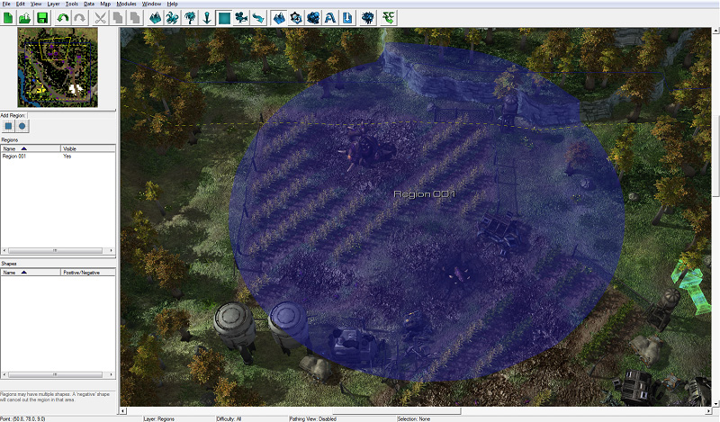
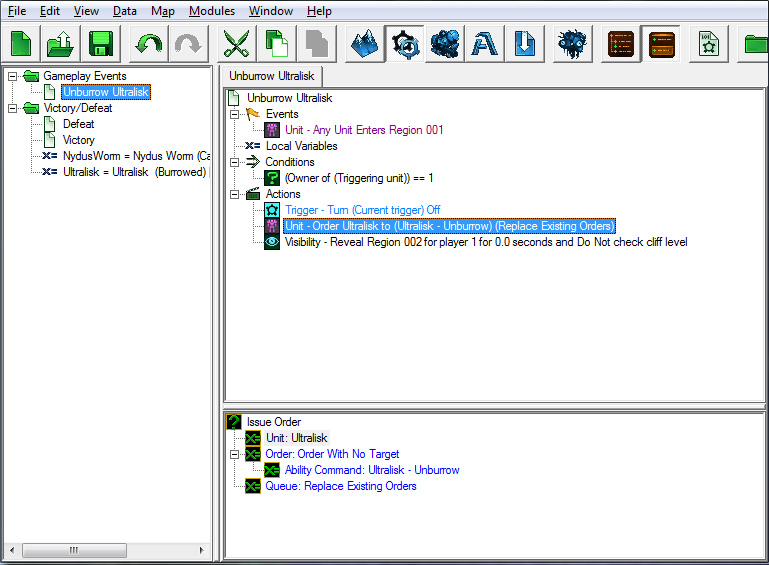
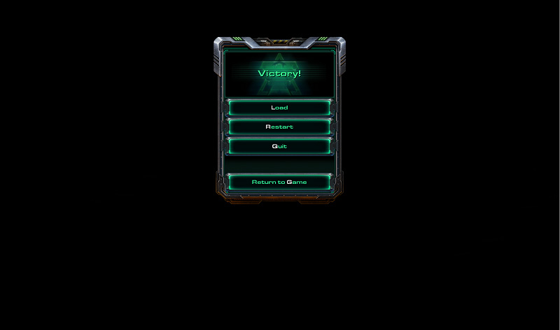
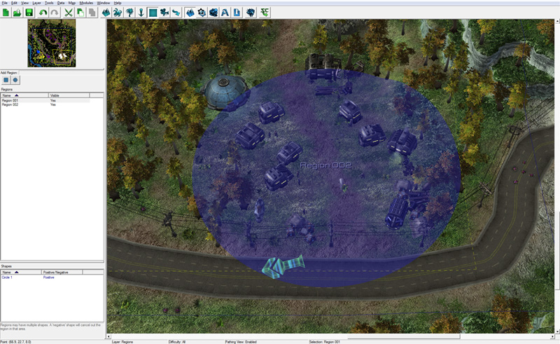
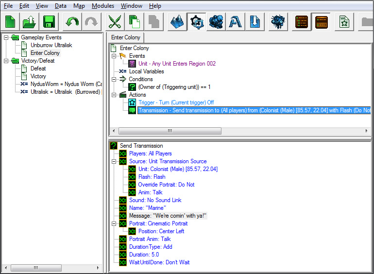

# 触发模块 - 第2部分

## 三. 使用区域的触发器

区域是地图上可以通过触发器引用的区域。您可以在单位进入或离开区域时运行触发器，向当前位于区域内的任何单位发布命令，在区域内的随机点创建单位等等。

在我们的地图中，当我们的单位进入殖民地所在的区域时，我们将创建一个触发器为玩家1创建额外单位，另一个触发器当我们的单位进入单位周围的区域时让超级兵取消潜伏状态。

### A. 放置区域

在我们的触发器中使用区域之前，我们需要将其放置在地图上。

1. 打开地形模块，并通过按[R]键选择区域图层。

2. 从小地图下面的按钮行中选择两种形状之一--正方形或圆形。

3. 将视图移动到农场区域，左键单击并拖动鼠标以在农场区域中心放置一个区域。

4. 如果要更改区域的名称，请从左侧的区域列表中选择该区域，然后按Enter键打开区域属性窗口。

5. 您可以通过双击小地图下方区域列表中的区域并在弹出窗口中输入所需名称来重命名一个区域。我们将保留区域的名称为"Region 001"，这是默认名称。

### B. 进入超级兵区域导致单位取消潜伏状态

除非超级兵取消潜伏状态，否则我们将无法消灭超级兵并赢得任务。使用我们的新区域，我们可以让他在我们的英雄靠近时取消潜伏状态。

让我们切换回触发器编辑窗口，通过按[Ctrl+G]热键创建一个名为“游戏事件”的新文件夹。在该文件夹中，使用[Ctrl+T]热键创建一个名为“取消潜伏状态的超级兵”的新触发器。然后，选择该触发器并添加以下事件、条件和动作：

#### 事件：

我们需要一个事件，在我们的单位进入我们刚刚创建的区域时触发。

1. 在触发器区域右键单击，选择新事件。

2. 然后在弹出窗口中，从功能部分选择“单位进入/离开区域”。

3. 将“区域”值更改为我们的新区域（截图中的Region 001）。选择区域时，“来源”应默认为“函数”，我们需要更改为“值”才能选择区域。我们还可以使用“选择”按钮在地形编辑器中查找并选择区域。

#### 条件：

对于这个触发器，我们需要两个条件：一个用于检查我们要检查的每个单位。

1. 在触发器区域右键单击，选择新条件，选择比较并按OK。

2. 将值1设置为“单位的所有者”。

3. 单位子值应为“触发单位”。

4. 值2应为1（指代玩家1）。

#### 动作：

对于这个触发器，我们将创建两个动作。首先，我们将命令超级兵取消潜伏状态。其次，我们将添加一个动作来揭示整个农场区域。

1. 在触发器区域右键单击，选择新动作。

2. 在弹出窗口中，选择“打开/关闭触发器”动作并按“确定”。

3. 确保“触发器”值设置为“当前触发器”，“状态”值设置为“关闭”。

这样可以使取消潜伏状态触发器只运行一次。如果我们不关闭这个触发器，那么触发器将会一遍又一遍地运行。

4. 创建一个“下达命令”动作。

5. 为该单位选择超级兵变量。

6. 选择“无目标命令”的命令。

7. 对于能力命令，选择“超级兵取消潜伏状态”。

8. 将队列字段设置为“替换现有命令”。

9. 创建一个“揭示区域”动作。

10. 将“区域”值设置为我们在事件中使用的区域。

11. 将持续时间设置为0.0。这样可以确保该区域永远保持揭示状态；没有掩盖区域的迷雾会在设置为揭示0.0秒的区域上出现。

12. 将玩家和检查悬崖级别保留在其默认值。

#### 保存！测试！

现在是一个好时机再次进入地图并测试我们的工作；同时现在也是保存工作的好时机[Ctrl+S]，以免丢失任何工作。

1. 点击编辑工具栏最右侧的“测试文档”按钮，或按[Ctrl+F9]。

2. 地图加载后，您的单位将受到黄色电脑玩家的攻击。我们稍后会解决这个问题。现在，请使用雷诺和他的两名海军陆战队员击败黄色电脑玩家，然后寻找并消灭殖民地农田区域中的超级兵和莱达斯虫。超级兵应该会取消潜伏状态，您应该能够消灭这两个单位以触发胜利画面：

如果没有，请返回检查您的触发器；可能存在遗漏的步骤或错误的数值设置。请查看步骤，检查触发器，然后重试！

### C. 进入殖民地区域导致殖民者发出关于调查庄稼和生成增援的传输

当我们进入殖民地时，殖民者应该通过传输解释他们的问题。

创建一个覆盖殖民地区域的新区域。

创建一个新的触发器，在您进入区域时发送传输。

#### 事件：

1. 创建一个单位进入/离开区域事件。

2. 将“区域”值从整个地图更改为您的新区域。

#### 条件：

1. 创建一个新的比较条件。

2. 将“值1”更改为“单位的所有者”。

3. 将“单位”子值更改为“触发单位”。

4. 将“操作”保持为“==”。

5. 将“值2”更改为“1”。

#### 动作：

1. 创建一个“打开/关闭触发器”动作，并确保触发器设置为当前触发器，状态设置为关闭。

2. 创建一个发送传输动作。

