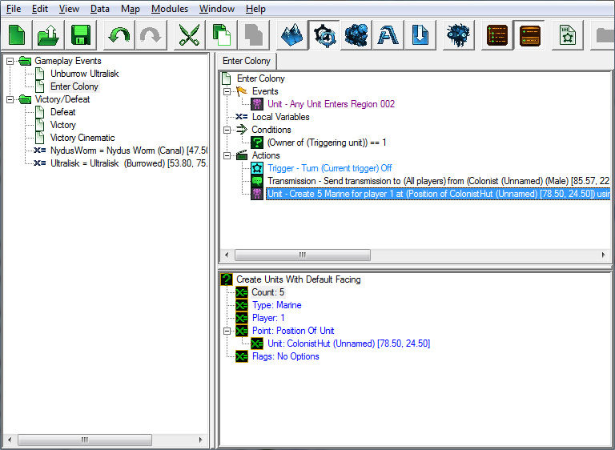
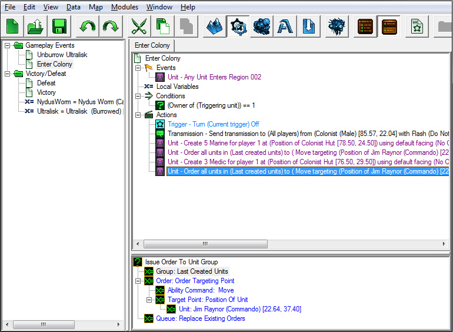
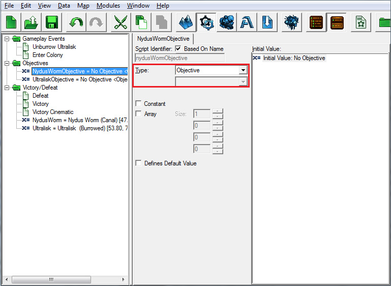
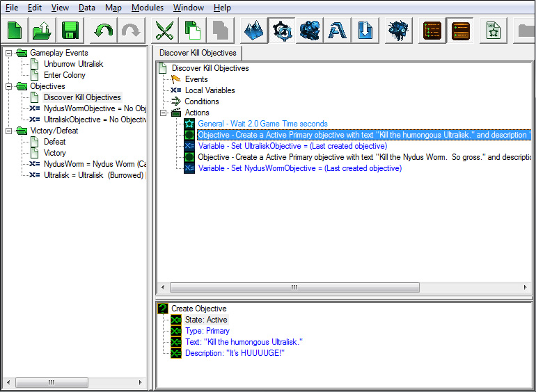
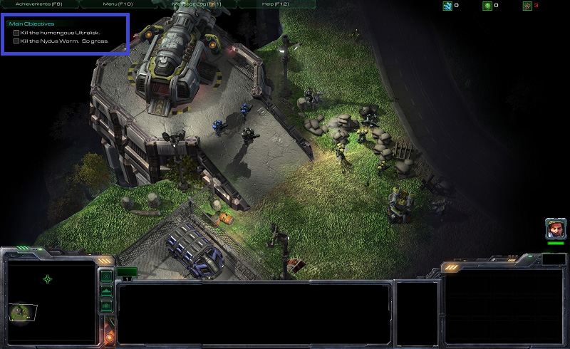
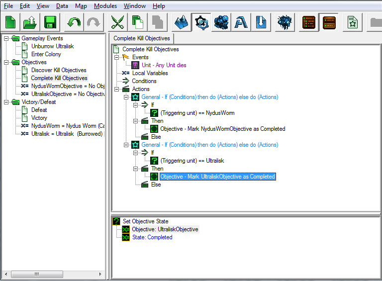

```markdown
3.	在发送传输时，您可以修改谁发送传输，播放什么声音文件，字幕是什么，等等。这些是我们设置的选项：

4.	接下来，添加一个“创建具有默认朝向的单位”动作。

5.	将“数量”值设置为5。

6.	将“类型”值设置为“Marine”。

7.	将“玩家”值设置为1。

8.	将“标志”值保持不变。

9.	我们希望海军单位出现在殖民者建筑物之一。为此，我们需要将“点”值设置为“单位位置”。

- 双击“点”值，选择“函数”单选按钮。从函数列表中选择“单位位置”，然后按“确定”。
- 将“点”值设置为“单位位置”会在“单位位置”下创建一个新的子值。
- 双击这个新的“单位”值，选择“值”单选按钮以查看地图上可用的单位。
- 选择其中一个殖民者建筑物，然后按“确定”。




完成后，动作将如下所示：

10.	创建一个“对单位组发布订单”动作。

11.	将“组”值设置为“最后创建的单位”，在弹出窗口的“来源”下找到。

12.	将“顺序”值设置为“订单目标单位”。

13.	将“能力”值设置为“移动”。

14.	将“单位”值设置为Jim Raynor（突击队员），在“值”来源下找到，因为他是我们地图上的一个单位。

15.	将“队列”值保持为“替换现有订单”。

16.	重复步骤4-6来创建一些医疗兵。




## IV. 完成触发器

除非我们给予玩家一个目标，否则玩家将不知道在地图中应该做什么，因此接下来要创建的触发器列表中的下一个触发器是发现目标和完成目标。

让我们通过右键单击触发器列表窗口并选择新建文件夹或使用[Ctrl+G]热键来创建另一个名为“目标”的文件夹。

### A. 发现目标

发现目标触发器将在屏幕左上方创建目标，并包含让玩家知道目标是什么的文本。此触发器将在游戏开始时运行。

#### 新变量：

我们需要添加一些变量来跟踪我们的两个目标。

1.	NydusWormObjective
到目前为止，我们所有的变量都是整数。将此变量的类型更改为“目标”。

2.	UltraliskObjective
类型：目标



创建一个名为“Discover Objective”的新触发器。

#### 事件：

1. 创建地图初始化事件。

#### 条件：

对于这个触发器，我们不需要设置条件，因为它需要在每次游戏开始时运行。

#### 动作：

1. 创建一个“等待”动作。这将使触发器暂停指定秒数。我们在这个触发器中使用等待，以便玩家有时间在我们向他们提供信息之前在地图上取得方向。他们将有时间看到环境并找到地图上的单位，然后他们将看到目标出现。我们将“时间”值设置为2秒。

2. 接下来，制作一个“创建目标”动作。保持“状态”和“类型”值设置为“激活”和“主要”，但将文本和描述更改为与杀死Nydus Worm相关的内容。

3. 添加一个“设置变量”动作。选择我们之前建立的“NydusWormObjective”变量，并选择第二个值为“上一个创建的目标”，以便我们可以通过调用该变量来引用我们的新目标。

4. 为Ultralisk目标重复步骤2和3。

完成后，您的触发器应如下所示：



#### 保存！测试！

现在当您开始游戏时，您会在屏幕上看到一些漂亮的目标！按[Ctrl+F9]来测试地图，看我们新的触发器是否起作用。



### B. 完成目标

这个触发器将在目标完成时触发，并将目标状态设置为“已完成”。

#### 事件：

1. 创建一个“单位死亡”事件。

#### 条件：

我们需要在这个触发器中设置条件，但我们不会将它们放在条件部分。相反，我们将使用一个特殊动作在动作部分中创建它们。

#### 动作：

有时，在触发器中，根据游戏情况选择不同的动作。对于这个触发器，根据死亡的单位是Nydus Worm还是Ultralisk，我们将更改一个目标或另一个目标的状态为“完成”。为此，我们可以使用一个“If Then Else”动作。

“If Then Else”动作包含用于条件的部分，并分为两个动作部分。如果条件为真，则执行第一组动作。如果条件为假，则执行第二组动作。

1. 创建一个“如果-则-否则”动作。

2. 在“如果”部分中，进行比较条件以检查触发单位是否为Nydus Worm（您需要将值1从“单位的所有者”更改为“触发单位”）。

3. 在“然后”部分中，创建一个“设置目标状态”动作，将Objective设置为我们的“NydusWormObjective”变量，并将状态设置为“已完成”。

4. 将“否则”部分留空。

5. 为Ultralisk重复步骤1-4。

现在，如果任何单位死亡，我们的“完成目标”触发器将触发；然后，我们的“If Then”动作将检查该死亡是我们两个目标中的哪一个；如果是，那么该目标的状态将设置为“完成”。



#### 保存！测试！

让我们再次测试我们的地图，确保在杀死适当单位时目标正确完成。

前往：

- [上一部分](../1)
- [下一部分](../3)
```