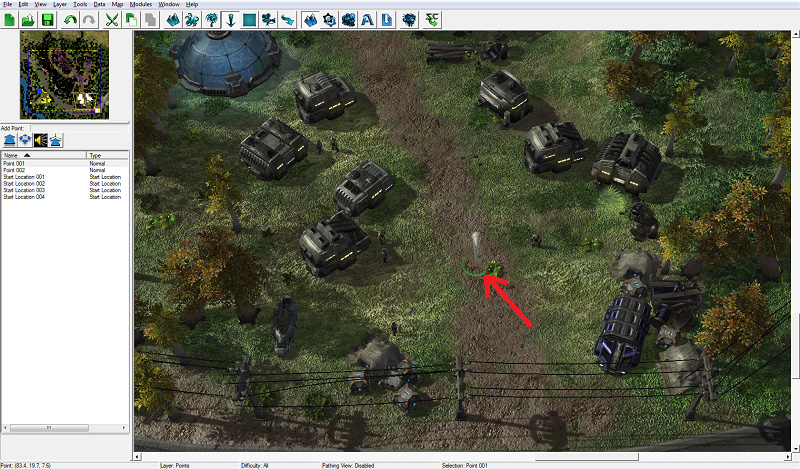
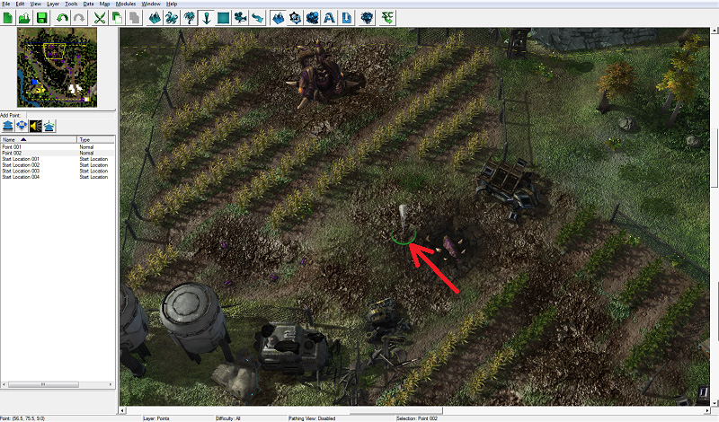
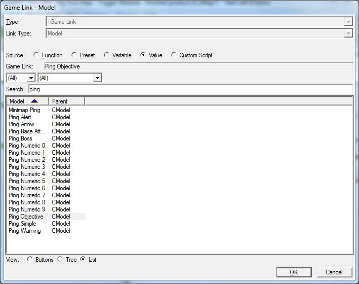
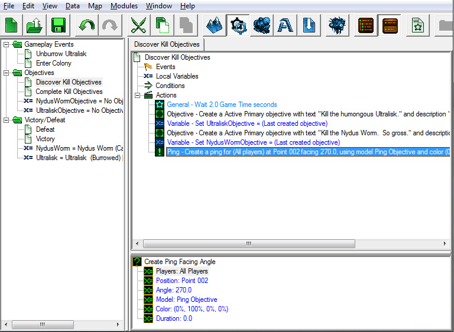
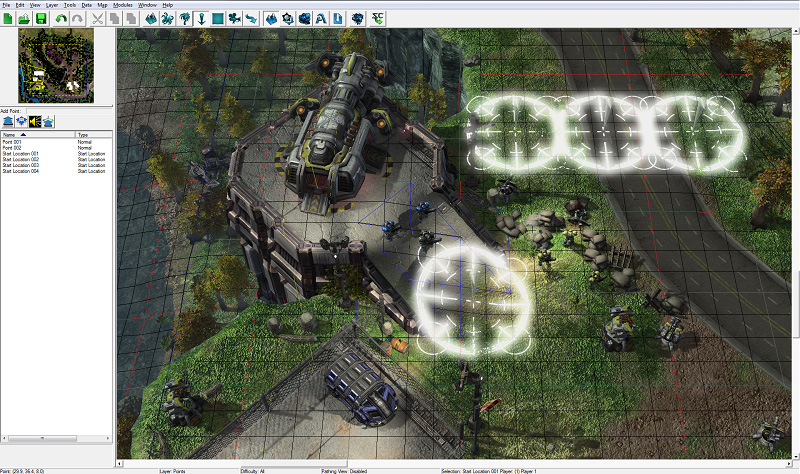
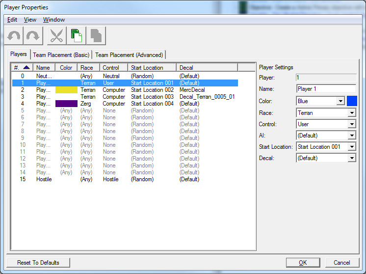
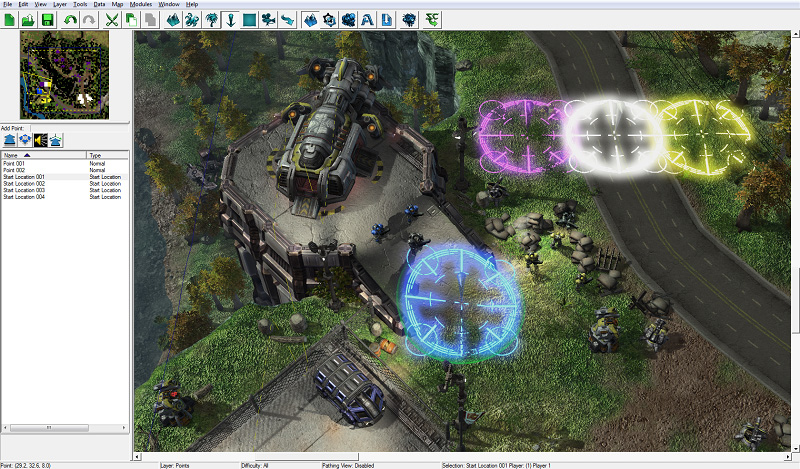
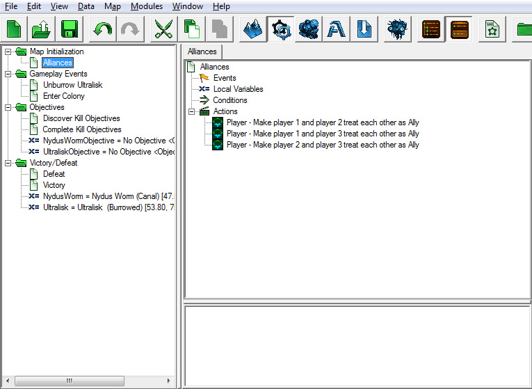

# 触发器模块 - 第三部分

## V. 使用点的触发器

点在触发器中被用于各种目的。它们被用作在一个点产生单位的参考，命令单位移动到特定位置，在地图上特定位置创建效果等。点在编辑器中可见，但在游戏中不可见。

放置和修改点的工作方式与放置和修改装饰物和单位的方式相同。

### A. 放置点

首先，我们需要放置一个点，以便在触发器中使用它。

1. 打开地形模块，并通过按下[P]键选择点层。

2. 从小地图下方的按钮行中选择看起来像一个大箭头的正常点按钮。它是该行中最左边的按钮。

3. 将视图移动到农场区域，并左键单击将一个点放置在农场区域的中心。

4. 如果您想要更改点的名称，请从左侧的点列表中选择该点，然后按Enter键以打开点属性窗口。

### B. 标记农作物 POI

现在我们有一个点，我们可以在触发器中引用它。

1. 切换回触发器模块，并选择“发现目标触发器”。

2. 在触发器末尾添加一个新的“创建朝向角度的标记”动作。

3. 对于“位置”值，请选择我们刚刚在地形模块中创建的点。请记住点击弹出窗口中的“值”单选按钮以查看地图上的点列表。

4. 对于“模型”值，请选择“标记目标”或“标记首领”。

在选择您的标记模型时，您可以在搜索框中输入“标记”以查看可用的标记模型列表。

5. 将“颜色”设置为任何看起来好看的值。将其保留为黑色将导致标记被隐藏，因为标记将用于未探索的迷你地图区域，而迷你地图上的未探索区域已经是黑色的。我们选择了绿色作为标记颜色。

6. 对于“持续时间”，选择任何您喜欢的值。我们将持续时间设置为0，这将导致标记永久存在，或直到我们使用触发器动作移除标记。

创建目标后，标记将出现并向玩家指示他应该前往的位置。

### C. 起始位置和玩家属性

起始位置是近战地图中具有特殊属性的点。制作近战地图时，玩家的大厅和工人将在起始位置创建，玩家的摄像机也将在游戏开始时居中。

我们将在玩家1单位的正上方放置一个起始位置。在接下来的部分中，我们将在触发器中使用它来在地图开始时将摄像机居中于此点。

同样，也为玩家2、3和4放置起始位置点：

接下来，我们将为我们的单位和计算机的单位设置一些玩家属性。我们可以在玩家属性窗口中修改每个玩家的颜色、标记、种族和起始位置。

1. 通过打开编辑器顶部的“地图”菜单选项并单击“玩家属性…”打开玩家属性窗口。

2. 对于此地图，我们将设置以下属性：

为AI玩家添加起始位置可以让我们为这些玩家启用剧情AI。在地图中启用剧情AI将使所有那些隐藏的异虫单位在我们的单位靠近时自动解除潜伏状态。稍后我们将更详细地讨论这个问题。一旦为计算机玩家设置了起始位置数值，您将注意到我们在地图上放置的起始位置点的颜色与相关玩家的颜色相匹配：

## VI. 地图初始化触发器

在本节中，我们将创建一些“地图初始化”触发器，在地图加载完成后运行，并在你首次启动任务时设置一系列不同的游戏选项和设置。这些触发器将使玩家的单位与殖民者以及军事前哨盟友，设置摄像机位置在任务开始时，打开我们的任务目标。

让我们首先创建一个文件夹来保存我们将要创建的所有触发器，就像我们迄今为止一直在进行的其他触发器一样。按[Ctrl+G]键创建一个新文件夹，并命名为“地图初始化”。

### A. 联盟

您可能已经注意到，在测试地图时，由计算机玩家2和3拥有的军事前哨和殖民者单位会在看到我们的英雄单位时对其发动攻击。将玩家1、2和3设置为盟友将阻止这种情况发生。

为此，我们需要在新创建的“地图初始化”文件夹中创建一个名为“联盟”的新触发器。

#### 事件：

为此触发器创建一个“地图初始化”事件，以便在地图开始时运行。

#### 条件：

无

#### 动作：

1. 创建一个“设置联盟”动作，将“源”设置为玩家1，将“目标”设置为玩家2。有几种不同的“联盟设置”值可供选择。我们将使用“盟友”以便与玩家2友好，但不会看到他们看到的内容；只有我们的单位会显示地图。

2. 创建另一个“设置联盟”动作，将“目标”值设置为玩家3，将“联盟设置”设置为盟友。

3. 为了以防万一军事单位和殖民者互动，我们还将玩家2和玩家3设置为盟友。

### B. 开启剧情AI以使异虫单位解除潜伏状态

除了深渊蠕虫和虫龙外，我们在地图上放置了许多其他异虫单位，包括潜伏的孢子虫、潜伏的蟑螂和潜伏的刺蛇单位。然而，如果我们现在让我们的单位在地图上四处走动，那么我们所要面对的唯一敌人就只有虫龙了，因为我们制作了一个触发器来使其解除潜伏状态。所有其他潜伏单位都会保持在潜伏状态。

我们可以为解除这些单位的潜伏状态创建一个触发器，但是如果我们打开剧情AI的话，那么当我们的单位靠近时，所有那些潜伏的敌人单位都会自动解除潜伏状态。

创建一个名为“启动剧情AI”的新触发器。

#### 事件：