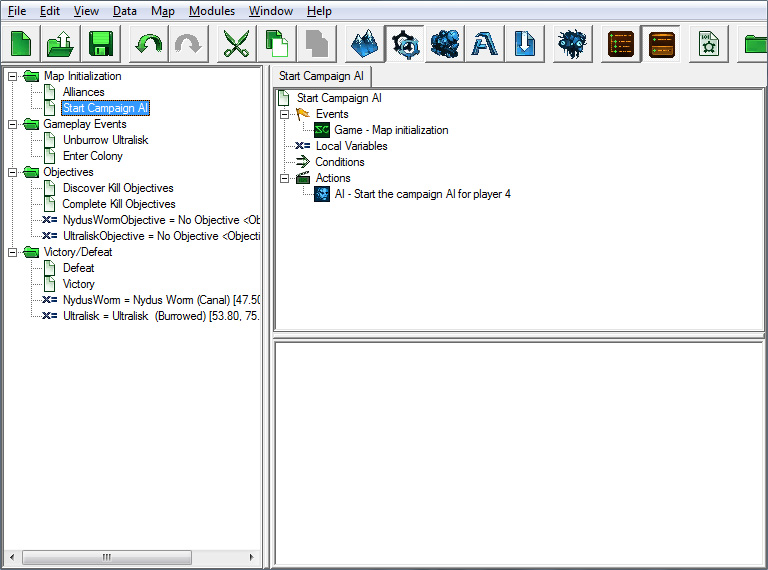
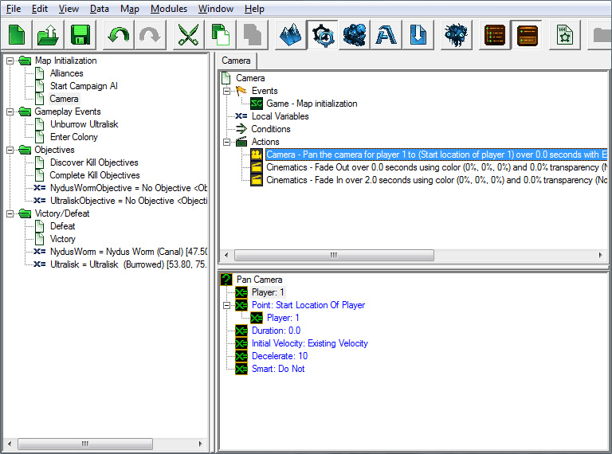
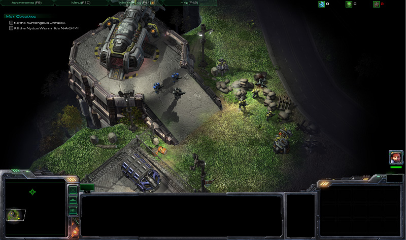

创建一个“地图初始化”事件用于这个触发器，以便在地图启动时运行。

#### 条件:

无

#### 动作:

创建一个“为玩家启动战役AI”动作，并将“玩家”值设为4。

当地图启动时，我们将把摄像头视角移动到我们单位的中心，并从黑色渐变显示，以产生戏剧效果。我们的新触发器将被称为“摄像头”。

### C. 渐变进入地图并将摄像头对准我们的英雄

#### 事件:

1.	地图初始化

#### 条件:

无

#### 动作:

1.	添加一个“平移摄像头”动作。将“点”设置为起始位置001（记住，你可以通过点击“值”单选按钮找到先前创建的点列表），并将持续时间设置为0.0。这将使摄像头立即切换到我们的起始位置，而不是在一段时间内平移到该位置。

2.	添加一个“淡入/淡出”动作。将“淡入”值设置为“淡出”，“持续时间”设置为0.0，将“颜色”设置为黑色（0%，0%，0%）。这将使游戏从黑屏开始，让我们逐渐淡入。

3.	添加另一个“淡入/淡出”动作，使其在2秒内淡入。

#### 保存它！测试一下！

现在我们已经设置好了地图初始化触发器，让我们再次进入游戏，看看它是如何运作的。

游戏开始时，我们应该与玩家2和3结盟，摄像头应该对准我们的英雄。当我们在地图上行走时，流浪的异虫单位应该解散地攻击我们。

跳到：

- [上一部分](../2)
- [下一部分](../4)