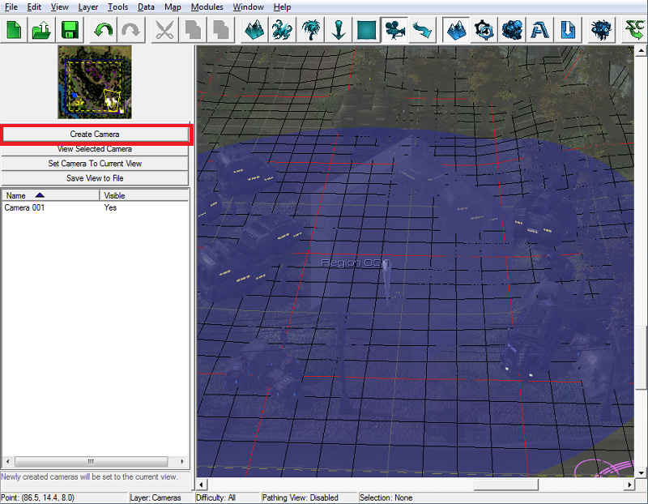
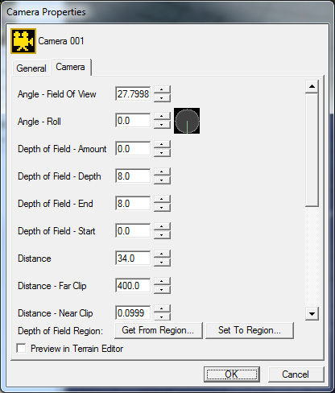
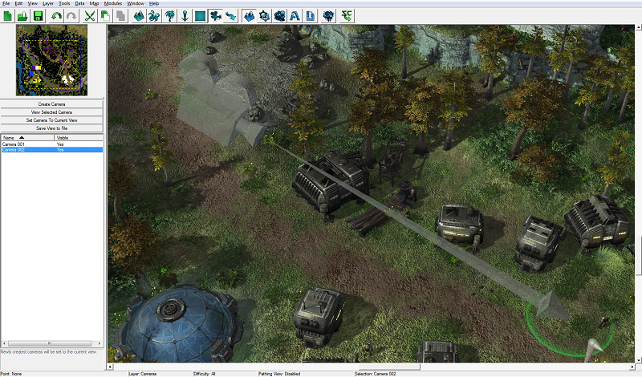
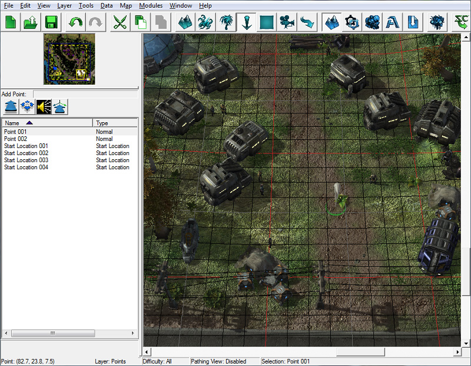
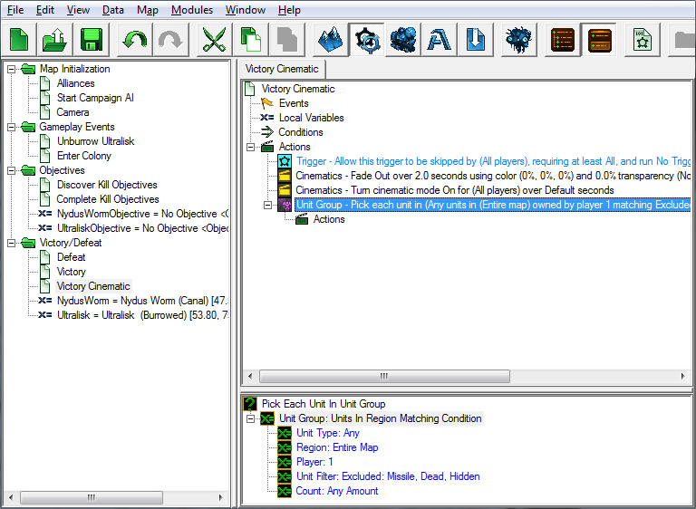
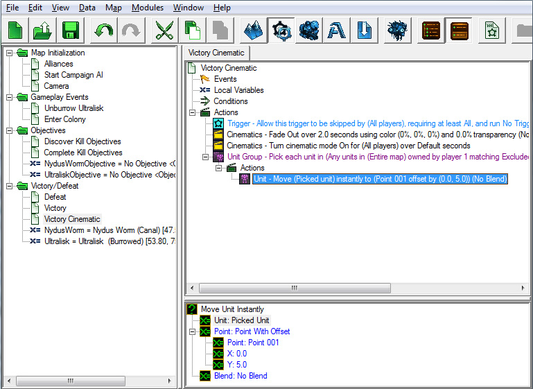
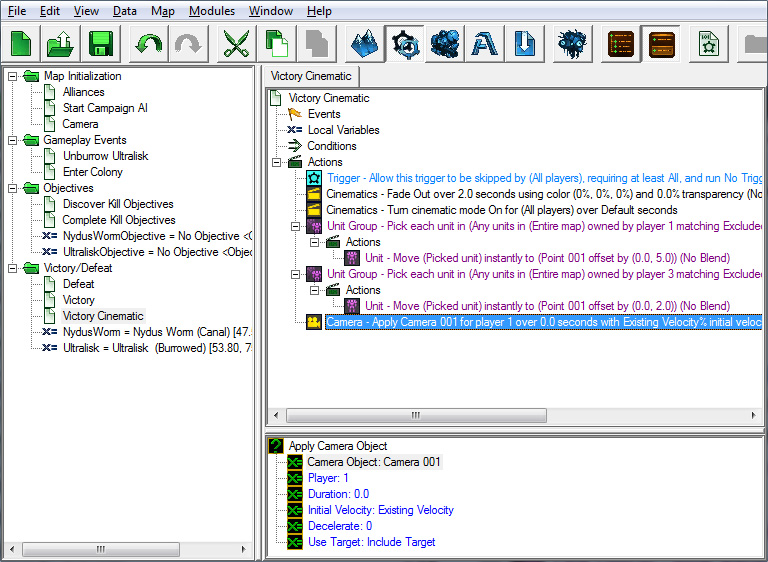
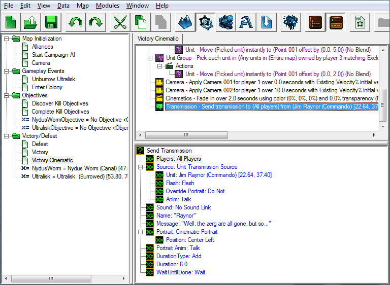
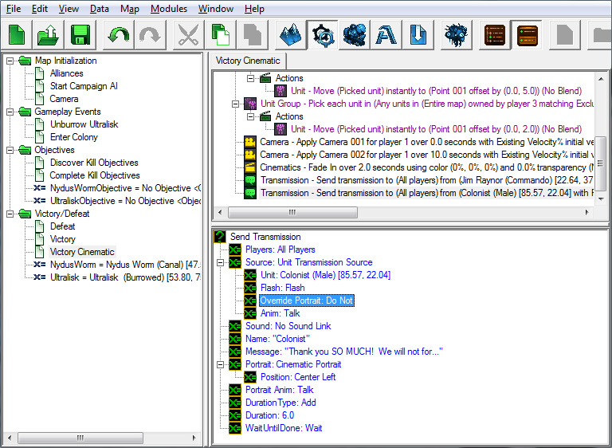
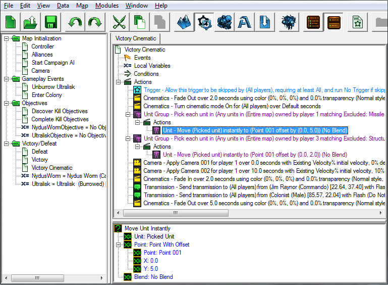

# 触发模块 - 第四部分

## VII. 使用摄像机的触发器 - 任务胜利影片（非常简单）

当任务结束时，我们应该展示一段小小的胜利影片，作为战胜敌人的奖励，同时也为我们讲述的小故事画上一个完美的句号。为此，我们将学习并放置几个我们可以在影片中使用的“摄像机”。

在《星际争霸 II》编辑器中，摄像机位于地形编辑器中。每个摄像机都包含一个摄像机瞄准的点，与该点的距离，以及摄像机查看该点的角度。每个摄像机还包含一系列关于曝光、景深效果等方面的设置。

### A. 放置摄像机

您可以在地形模块的摄像机图层中放置和管理摄像机。

1.	切换到地形模块中的摄像机图层。要执行此操作，按下[C]键并在使用地形模块时，或选择图层>摄像机菜单选项。

2.	将编辑器摄像机移动到您想要的位置。按住[Ctrl+右键单击]并拖动鼠标以调整摄像机的俯仰和偏航角。按住[右键单击]并拖动以调整摄像机的目标点。

3.	按下“创建摄像机”按钮来创建您的第一个摄像机。我们已经将我们的摄像机放置在殖民地的中心，因为这里将是我们的影片发生地点。

4.	右键单击您在地形模块窗口左侧摄像机列表中刚刚创建的摄像机，然后选择“修改属性”。您可以在属性窗口中修改摄像机设置。在本教程中，我们将保留所有摄像机的默认设置。

参考：

- **视野角度**：调整摄像机的视野范围。将此值设置高于 35 可以获得鱼眼镜头效果。对于长焦镜头效果，请将此值设置为小于 20。
- **翻转**：如果您想使摄像机倾斜或翻转，可以调整此值。
- **景深效果**：这些值定义了查看此摄像机时焦点的位置。如果您希望所有物体都保持焦距，则希望大的“Amount”、”Depth”和“End”值，以及一个较低的“Start”值。
- **远裁剪 / 近裁剪**：远裁剪和近裁剪之间的所有地形不会绘制在屏幕上。不绘制所有地形将提高性能。
- **目标**：摄像机在地面上所看的点：摄像机的中心和焦点。

5.	创建第二个用于影片的摄像机。我们已经将我们的第二个摄像机放置在殖民地，但这次是从不同的角度观察殖民地。

### B. 播放影片

现在我们已经放置了几个摄像机，我们可以着手制作胜利影片触发器。

我们将在胜利 / 失败文件夹中创建名为“胜利影片”的新触发器。

#### 事件：

无 - 我们将直接从我们的胜利触发器中运行触发器。

#### 条件：

无

#### 动作：

1.	“允许跳过触发器”动作使玩家可以通过按[Esc]键跳过触发器的剩余操作。这在过场动画中很有用，因为玩家并不总是想观看整个过场动画，尤其是如果他/她已经看过。

2.	创建一个“淡入 / 淡出”动作。将“淡入”值设置为“淡出”，持续时间为 2 秒。

3.	添加“影片模式”动作，将影片模式打开。在影片模式中，用户界面被隐藏，屏幕的顶部和底部有黑色的信封条，使动作看起来更“影片化”。

4.	在殖民地中心放置一个点。我们将移动我们的单位到这个点进行影片制作。

5.	为移动我们的单位，我们将创建一个“挑选单元组中的每个单位”动作。对于“单位组”值，请选择“与条件匹配的区域内单位”（在“功能”下），然后将“玩家”字段设置为“1”（选择“值”单选按钮并输入“1”）。这一动作类似于 For 循环，选中地图上符合这些条件的每个单位，从而使我们可以对它们执行操作。

6.	在“挑选单元组中的每个单位”动作的“动作”部分中，创建一个“立即移动单位”动作。对于“单位”值，请选择“挑选的单位”。这将使用当前与“挑选单元组中的每个单位”动作选定的单位。将“点”值设置为我们放置在殖民地中心的点。

7.	重复步骤 4 和 5，但针对玩家 3 的单位，以便殖民者也被移动到殖民地中心进行影片制作。

8.	双击“单位筛选器”值，并确保选择“值”单选按钮。在列表中找到“建筑物”，将其状态从“允许”更改为“排除”。这将使得玩家 3 控制的建筑物不会移动到影片中的点。

9.	接下来，添加一个“应用摄像机对象”动作。我们将持续时间设置为 0，以便立即应用摄像机。将“摄像机对象”设置为我们创建的第一个摄像机。

10.	添加另一个“应用摄像机对象”动作，并将“摄像机对象”设置为我们的第二个摄像机。将此动作的持续时间设置为 10 秒。这将在地图上两个我们创建的摄像机之间进行 10 秒的摄像机平移。

11.	添加另一个“淡入 / 淡出”动作，将“淡入”值设置为“淡入”，持续时间为 2 秒。

12.	创建一个“发送传输”动作，让雷诺表示完成了任务。这是我们设置的选项：

13.	创建另一个“发送传输”动作，以便殖民者感谢雷诺。这是我们设置的选项：

14.	再添加一个“淡入 / 淡出”动作，并将其设置为“淡出”，持续时间为 5 秒。

我们现在拥有一个完整的胜利影片！

