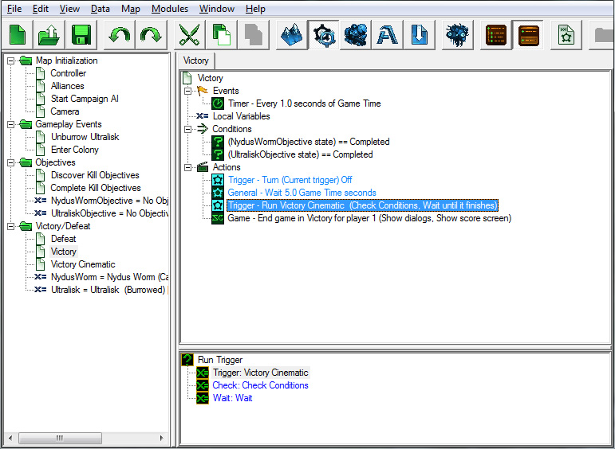

我们快要完成了。我们电影的最后一步是在胜利触发器中进行操作。

1. 添加一个“打开/关闭触发器”动作，这样胜利触发器只会运行一次。请记住，如果我们不关闭这个触发器，那么胜利触发器将会一遍又一遍地运行。

2. 添加一个“等待”动作，并将“持续时间”设为5秒。这将给玩家一些时间来陶醉于胜利之中，然后胜利的电影将开始播放。玩家将能够看到Ultralisk和Nydus Worm单位完全倒下并死亡，这对玩家来说是一种令人满足的观看体验。

3. 添加一个“运行触发器”动作。将“触发器”设置为我们的胜利电影触发器，并确保将其设置为“等到完成”。否则，游戏会在剧情动画播放完毕之前结束。

我们的触发器现在已经完成。我们应该能够进入地图，四处奔跑，杀敌，完成一些目标，观看我们的胜利电影并赢得这场任务。

导航至：

- [上一部分](../3)
- [数据模块](../1)