# 数据模块 - 第一部分

在这个三部分的教程中，您将熟悉星际争霸2地图编辑器提供的许多功能之一，同时制作一个类似《自由之翼》战役中第一个任务的小冒险地图。

如果您尚未完成本教程的第一部分，请到[[这里](../terrain/1)]找到它。

如果您尚未完成本教程的第二部分，请到[[这里](../trigger/1)]找到它。

如果您想直接开始本教程，而不必经过地形和触发器教程，请使用我们在这些教程中一直在进行的地图，位于[[这里](https://web.archive.org/web/20130814095747/http://us.battle.net/sc2/en/game/maps-and-mods/tutorials/data/1#finishedMap)]。

## 目标：

通过编辑单位、能力、效果和武器的现有数据，熟悉数据模块。

## 结果：

当我们完成本教程时，我们将拥有一个已修改的吉姆·雷诺（突击队员）单位，具有额外的生命值、护甲、不同的能力和修改后的武器。

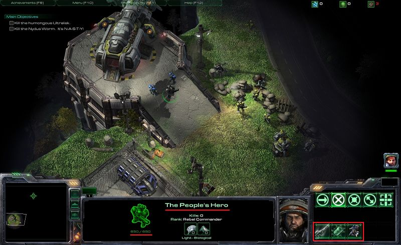

## 介绍

《星际争霸II》带有数百个预设单位、装饰物、地形和技能。但是，如果我们想要创建一个拥有全新单位或技能的地图呢？或者一个暗影刺客能够闪烁、大型巡洋舰没有护甲但拥有疯狂的生命值的地图呢？数据模块就是我们可以设置所有这些的地方。事实上，数据模块让我们几乎可以修改《星际争霸II》的所有内容。

在本教程中，我们将介绍修改现有数据的方法，包括修改单位生命值、护甲、起始能量，向单位添加和移除现有能力，以及修改武器开火速率和伤害。

### I. 导航数据编辑器

要打开数据模块，按[F7]或从任何其他编辑器模块顶部的工具栏中单击数据模块按钮。数据模块按钮上有一个蓝色陆战队员的图片。

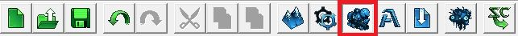

第一眼看到数据模块窗口可能让人望而生畏。有很多用小字体写着的单词表和带有许多选项的下拉菜单，其目的可能并不那么直观。然而，一旦我们解释了组织方式，就不会感觉那么艰巨。

#### A. 数据树

我们可以将《星际争霸II》中的数据想象为一棵树。《星际争霸II》中的每个地图至少有一个与之关联的“Mod”，其中包含有关该地图上可用的单位、能力、武器、地形、效果、用户界面等的信息。

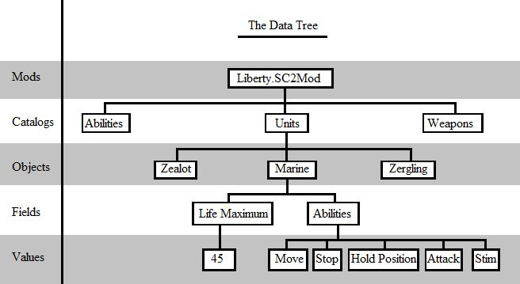

##### 1. 目录

   这个主干分成不同的数据“目录”。 “单位”是一个目录。“能力”是一个单独的目录。这些目录共同组成整个游戏数据。

##### 2. 对象

每个目录包含“对象”，这些是该目录中的具体条目。在单位目录中，“陆战队员”是一个对象。“追猎者”是另一个对象。

##### 3. 字段

每个对象包含与它关联的“字段”列表。这些是定义每个单位的信息类型。对于陆战队员对象，“最大生命值”是一个字段。“能力”是另一个字段。

##### 4. 值

每个字段具有一个或多个“值”。有些是一个单一的值，比如“最大生命值”。陆战队员的最大生命值为45。有些具有值列表，比如“能力”，因为每个单位可以有多个能力。

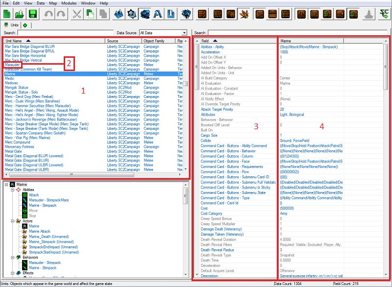

#### B. 设置我们的工作空间

在我们开始工作之前，我们将设置几个选项，就像我们在触发器模块教程中做的一样。请记住，我们要设置的所有选项都是为了跟随本教程中的图片。设置编辑器工作的方式并没有对错之分；所以尝试一下，看看哪种方式最适合您。

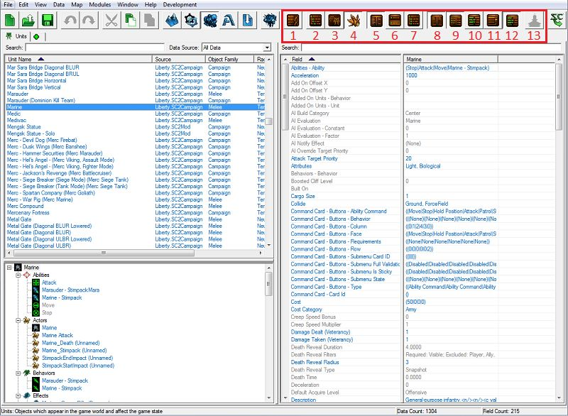

##### 1. 查看原始数据

我们将关闭此选项。每个对象都有一个ID，用于引用它，并且有一个相关的文本值作为其名称。以我们将要修改的单位吉姆·雷诺（突击队员）为例。他的ID是Raynor，但他的名称是吉姆·雷诺（突击队员）。显示原始数据将让我们查看Raynor而不是吉姆·雷诺（突击队员）。

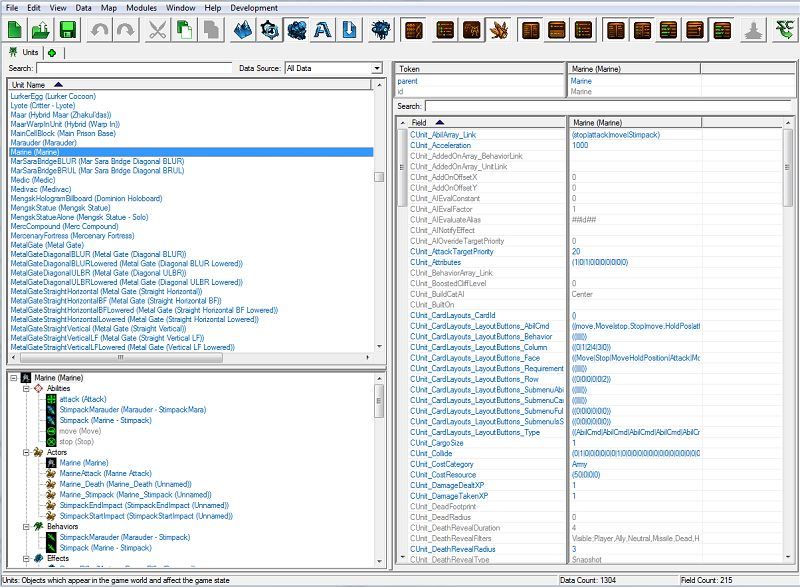

##### 2. 将对象列表显示为树

我们将关闭此选项。显示对象列表将根据类别将对象列表组织成文件夹，这样您可以像在计算机上查看文件夹时一样查看对象列表。

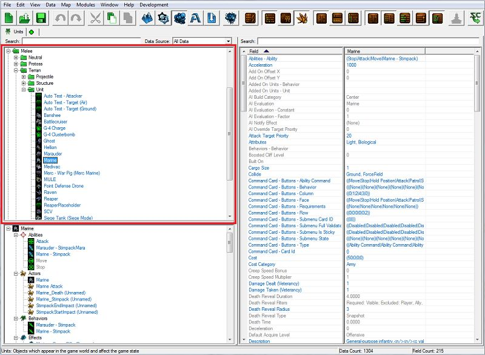

##### 3. 显示所有对象源

我们将关闭此选项。当我们修改数据时，我们不会修改整个游戏的游戏数据；我们只会修改特定地图的数据。这些新数据存储在我们正在制作的地图中。将此选项设置为开启将会显示原始数据作为一个条目，然后将我们的新修改数据作为另一个条目，当我们修改现有的单位时。由于我们关闭了此选项，当我们修改单位吉姆·雷诺（突击队员）时，我们将不会看到该单位的两个条目，而只会看到一个。

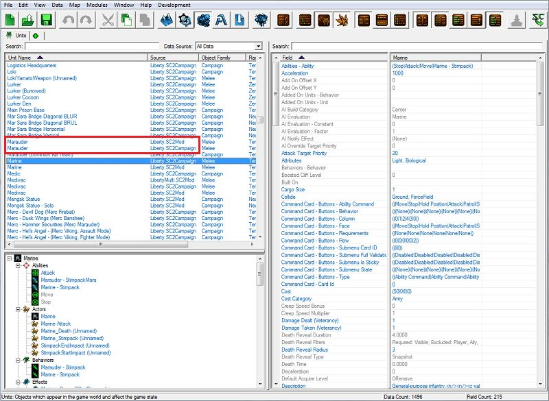

##### 4. 显示对象资源浏览器

我们将打开此选项。资源浏览器视图很适合向您展示数据中相互连接的对象。如果我们正在查看吉姆·雷诺（突击队员）并且想快速查看他的武器数据，我们可以在资源浏览器部分找到他的武器，并选择它以显示其数据，而不必导航到武器选项卡并在游戏中的武器列表中找到他的武器。

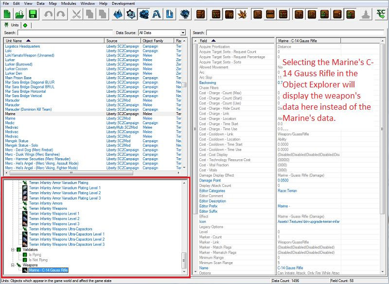

##### 5. 表格视图
我们要将此选项打开。当此选项打开时，我们会看到一个表格，左侧是对象字段列表，右侧是字段值。双击字段或值将打开一个新窗口，其中包含编辑值的控件。打开此选项将自动关闭详细视图和 XML 视图。

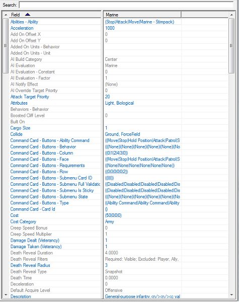

##### 6. 详细视图
我们要将此选项关闭。当此选项打开时，我们不会看到字段和值列表的表格，而是会看到用于编辑这些值的所有控件。打开此选项将自动关闭表格视图和 XML 视图。

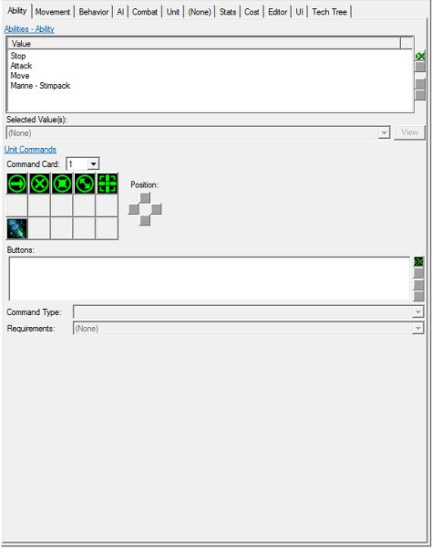

##### 7. XML 视图
我们要将此选项关闭。当此选项打开时，我们会看到以 XML 格式排列的数据的文本编辑器视图。星际争霄 II 中的所有游戏数据都以这种格式存储和读取。数据模块的主要目的是使不熟悉 XML 的人更容易阅读和修改这些数据。我们将在另一个教程中详细介绍这个视图。打开此选项将自动关闭表格视图和详细视图。

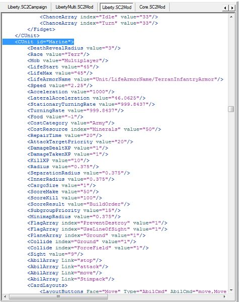

##### 8. 显示默认值
我们要将此选项打开。为了节省空间，我们并不存储每个单位的每个字段的每个值，而是为一些对象存储一些默认值，然后设置新的对象，使其从这些首个或父对象“继承”值。在编辑器中，这些默认值显示为灰色，并且可以通过切换此选项打开/隐藏。如果我们正在查找一个未明确设置给单位的值，这可能会让我们感到困惑，因为这个值对我们来说是隐藏的。

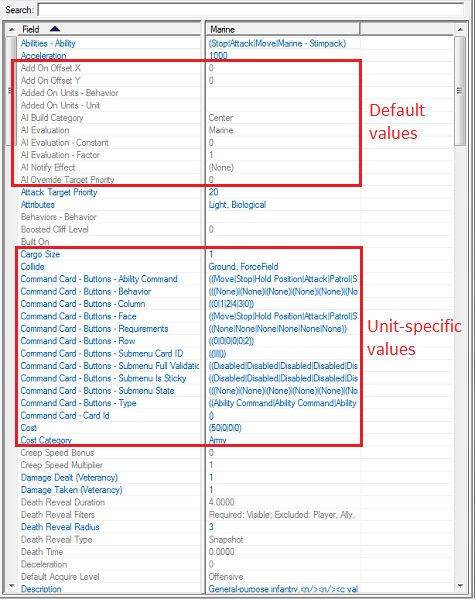

##### 9. 显示高级值
我们要将此选项打开。默认情况下，某些需要详细了解游戏数据的字段是隐藏的。有经验的用户可能需要使用这些字段来实现更高级的功能。切换此选项将显示这些字段。
##### 10. 显示字段类型名称
我们要将此选项关闭。字段按“字段类型”组织，以便所有与单位行为或单位能力相关的字段都在表格视图中分组在一起。有时这有助于查找字段，但有时如果不知道所需字段所属的字段类型，可能会感到困惑。目前我们会将其关闭。

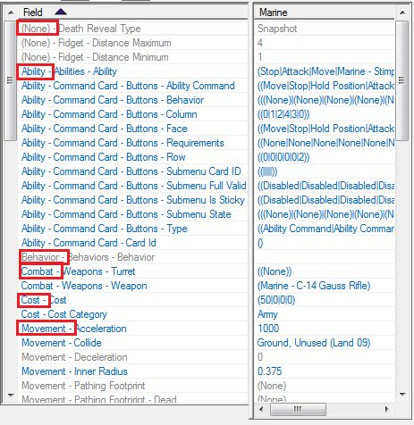

##### 11. 合并结构值
我们要将此选项打开。一些对象字段是相关的。双击相关字段中的任何一个将打开相同的窗口，其中包含所有相关字段的控件。其中一个例子是单位命令卡字段。打开此选项将在表格视图中将所有这些字段合并为一个字段，并在字段名称后加上“+”符号。

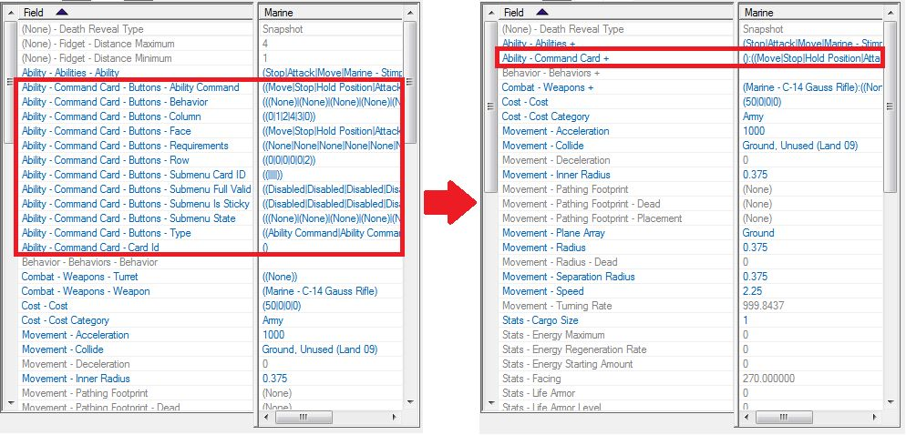

##### 12. XML 语法高亮显示
我们要将此选项打开。一些对象字段是相关的。双击相关字段中的任何一个将打开相同的窗口，其中包含所有相关字段的控件。其中一个例子是单位命令卡字段。打开此选项将在表格视图中将所有这些字段合并为一个字段，并在字段名称后加上“+”符号。
##### 13. 提交 XML 更改
除非在 XML 视图中工作时有未提交的 XML 数据更改，否则此按钮将被禁用。在本教程中我们不使用 XML 视图，所以我们不会使用此按钮。

前往：

- [下一部分](../2)