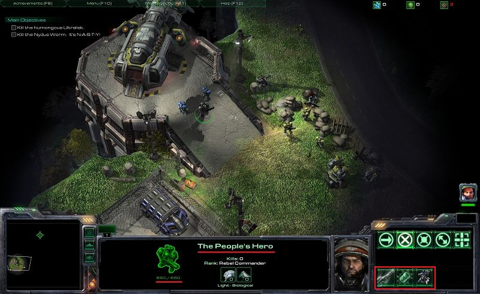
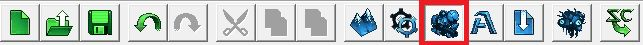
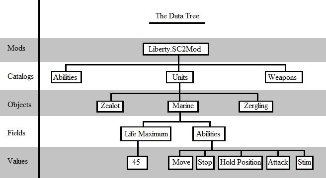
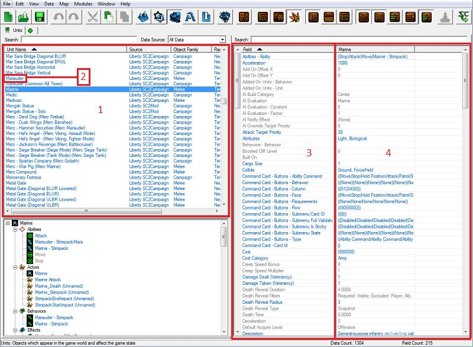
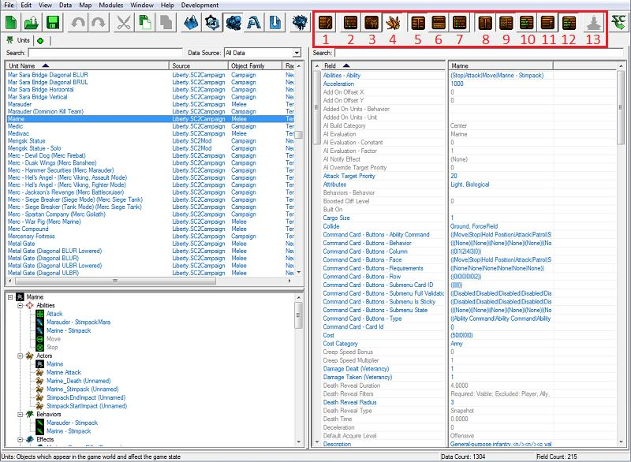
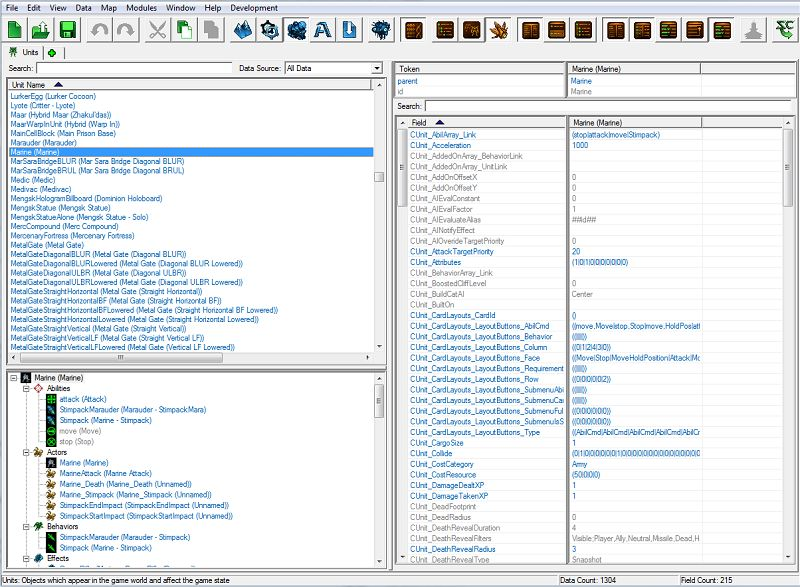
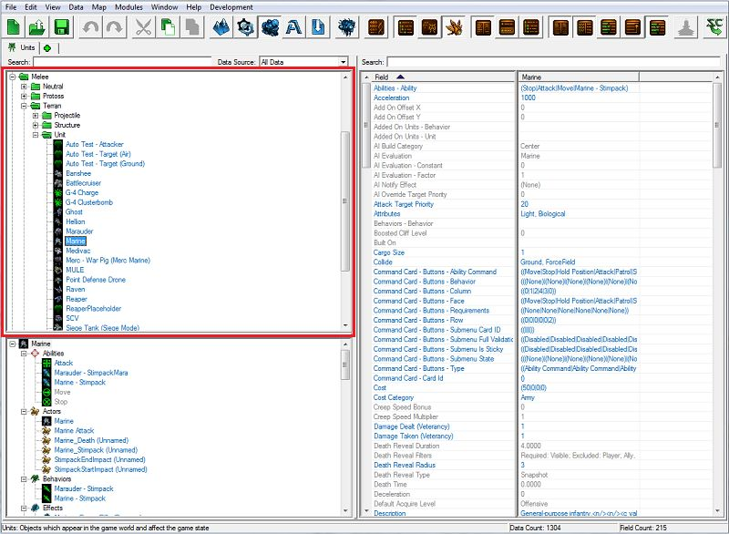
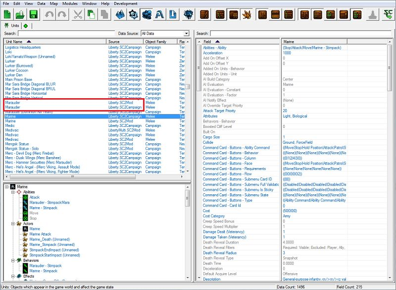

# 数据模块 - 第一部分

在这个三部分的教程中，您将熟悉星际争霸2地图编辑器提供的许多功能之一，同时制作一个类似《自由之翼》战役中第一个任务的小冒险地图。

如果您尚未完成本教程的第一部分，请到[[这里](../terrain/1)]找到它。

如果您尚未完成本教程的第二部分，请到[[这里](../trigger/1)]找到它。

如果您想直接开始本教程，而不必经过地形和触发器教程，请使用我们在这些教程中一直在进行的地图，位于[[这里](https://web.archive.org/web/20130814095747/http://us.battle.net/sc2/en/game/maps-and-mods/tutorials/data/1#finishedMap)]。

## 目标：

通过编辑单位、能力、效果和武器的现有数据，熟悉数据模块。

## 结果：

当我们完成本教程时，我们将拥有一个已修改的吉姆·雷诺（突击队员）单位，具有额外的生命值、护甲、不同的能力和修改后的武器。

## 介绍

《星际争霸II》带有数百个预设单位、装饰物、地形和技能。但是，如果我们想要创建一个拥有全新单位或技能的地图呢？或者一个暗影刺客能够闪烁、大型巡洋舰没有护甲但拥有疯狂的生命值的地图呢？数据模块就是我们可以设置所有这些的地方。事实上，数据模块让我们几乎可以修改《星际争霸II》的所有内容。

在本教程中，我们将介绍修改现有数据的方法，包括修改单位生命值、护甲、起始能量，向单位添加和移除现有能力，以及修改武器开火速率和伤害。

### I. 导航数据编辑器

要打开数据模块，按[F7]或从任何其他编辑器模块顶部的工具栏中单击数据模块按钮。数据模块按钮上有一个蓝色陆战队员的图片。

第一眼看到数据模块窗口可能让人望而生畏。有很多用小字体写着的单词表和带有许多选项的下拉菜单，其目的可能并不那么直观。然而，一旦我们解释了组织方式，就不会感觉那么艰巨。

#### A. 数据树

我们可以将《星际争霸II》中的数据想象为一棵树。《星际争霸II》中的每个地图至少有一个与之关联的“Mod”，其中包含有关该地图上可用的单位、能力、武器、地形、效果、用户界面等的信息。

##### 1. 目录

   这个主干分成不同的数据“目录”。 “单位”是一个目录。“能力”是一个单独的目录。这些目录共同组成整个游戏数据。

##### 2. 对象

每个目录包含“对象”，这些是该目录中的具体条目。在单位目录中，“陆战队员”是一个对象。“追猎者”是另一个对象。

##### 3. 字段

每个对象包含与它关联的“字段”列表。这些是定义每个单位的信息类型。对于陆战队员对象，“最大生命值”是一个字段。“能力”是另一个字段。

##### 4. 值

每个字段具有一个或多个“值”。有些是一个单一的值，比如“最大生命值”。陆战队员的最大生命值为45。有些具有值列表，比如“能力”，因为每个单位可以有多个能力。

#### B. 设置我们的工作空间

在我们开始工作之前，我们将设置几个选项，就像我们在触发器模块教程中做的一样。请记住，我们要设置的所有选项都是为了跟随本教程中的图片。设置编辑器工作的方式并没有对错之分；所以尝试一下，看看哪种方式最适合您。

##### 1. 查看原始数据

我们将关闭此选项。每个对象都有一个ID，用于引用它，并且有一个相关的文本值作为其名称。以我们将要修改的单位吉姆·雷诺（突击队员）为例。他的ID是Raynor，但他的名称是吉姆·雷诺（突击队员）。显示原始数据将让我们查看Raynor而不是吉姆·雷诺（突击队员）。

##### 2. 将对象列表显示为树

我们将关闭此选项。显示对象列表将根据类别将对象列表组织成文件夹，这样您可以像在计算机上查看文件夹时一样查看对象列表。

##### 3. 显示所有对象源

我们将关闭此选项。当我们修改数据时，我们不会修改整个游戏的游戏数据；我们只会修改特定地图的数据。这些新数据存储在我们正在制作的地图中。将此选项设置为开启将会显示原始数据作为一个条目，然后将我们的新修改数据作为另一个条目，当我们修改现有的单位时。由于我们关闭了此选项，当我们修改单位吉姆·雷诺（突击队员）时，我们将不会看到该单位的两个条目，而只会看到一个。

##### 4. 显示对象资源浏览器

我们将打开此选项。资源浏览器视图很适合向您展示数据中相互连接的对象。如果我们正在查看吉姆·雷诺（突击队员）并且想快速查看他的武器数据，我们可以在资源浏览器部分找到他的武器，并选择它以显示其数据，而不必导航到武器选项卡并在游戏中的武器列表中找到他的武器。