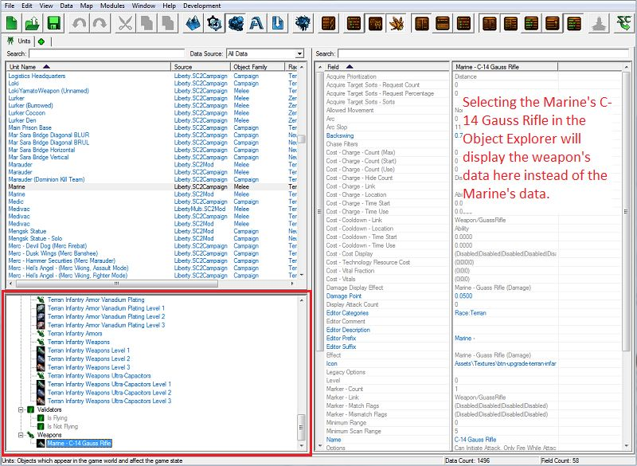
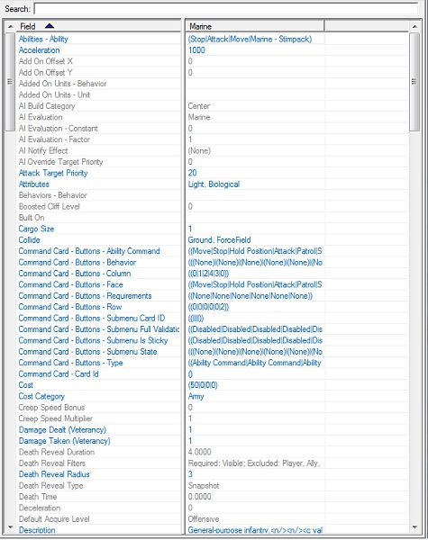
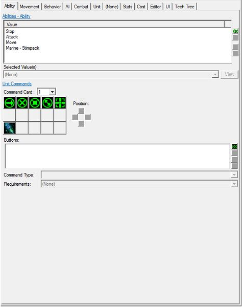
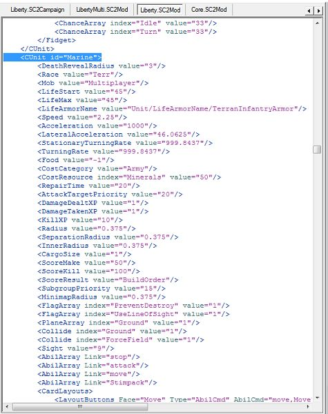
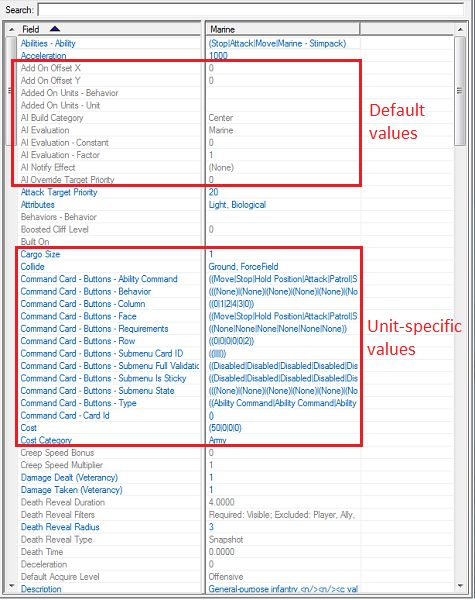
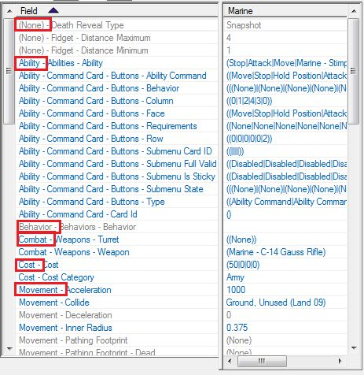

##### 5. 表格视图
我们要将此选项打开。当此选项打开时，我们会看到一个表格，左侧是对象字段列表，右侧是字段值。双击字段或值将打开一个新窗口，其中包含编辑值的控件。打开此选项将自动关闭详细视图和 XML 视图。

##### 6. 详细视图
我们要将此选项关闭。当此选项打开时，我们不会看到字段和值列表的表格，而是会看到用于编辑这些值的所有控件。打开此选项将自动关闭表格视图和 XML 视图。

##### 7. XML 视图
我们要将此选项关闭。当此选项打开时，我们会看到以 XML 格式排列的数据的文本编辑器视图。星际争霄 II 中的所有游戏数据都以这种格式存储和读取。数据模块的主要目的是使不熟悉 XML 的人更容易阅读和修改这些数据。我们将在另一个教程中详细介绍这个视图。打开此选项将自动关闭表格视图和详细视图。

##### 8. 显示默认值
我们要将此选项打开。为了节省空间，我们并不存储每个单位的每个字段的每个值，而是为一些对象存储一些默认值，然后设置新的对象，使其从这些首个或父对象“继承”值。在编辑器中，这些默认值显示为灰色，并且可以通过切换此选项打开/隐藏。如果我们正在查找一个未明确设置给单位的值，这可能会让我们感到困惑，因为这个值对我们来说是隐藏的。

##### 9. 显示高级值
我们要将此选项打开。默认情况下，某些需要详细了解游戏数据的字段是隐藏的。有经验的用户可能需要使用这些字段来实现更高级的功能。切换此选项将显示这些字段。
##### 10. 显示字段类型名称
我们要将此选项关闭。字段按“字段类型”组织，以便所有与单位行为或单位能力相关的字段都在表格视图中分组在一起。有时这有助于查找字段，但有时如果不知道所需字段所属的字段类型，可能会感到困惑。目前我们会将其关闭。

##### 11. 合并结构值
我们要将此选项打开。一些对象字段是相关的。双击相关字段中的任何一个将打开相同的窗口，其中包含所有相关字段的控件。其中一个例子是单位命令卡字段。打开此选项将在表格视图中将所有这些字段合并为一个字段，并在字段名称后加上“+”符号。

##### 12. XML 语法高亮显示
我们要将此选项打开。一些对象字段是相关的。双击相关字段中的任何一个将打开相同的窗口，其中包含所有相关字段的控件。其中一个例子是单位命令卡字段。打开此选项将在表格视图中将所有这些字段合并为一个字段，并在字段名称后加上“+”符号。
##### 13. 提交 XML 更改
除非在 XML 视图中工作时有未提交的 XML 数据更改，否则此按钮将被禁用。在本教程中我们不使用 XML 视图，所以我们不会使用此按钮。

前往：

- [下一部分](../2)