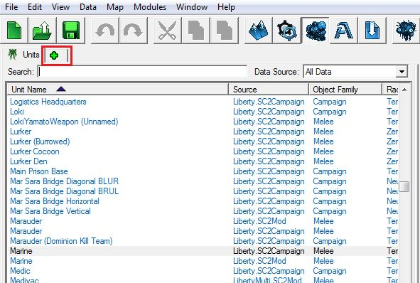
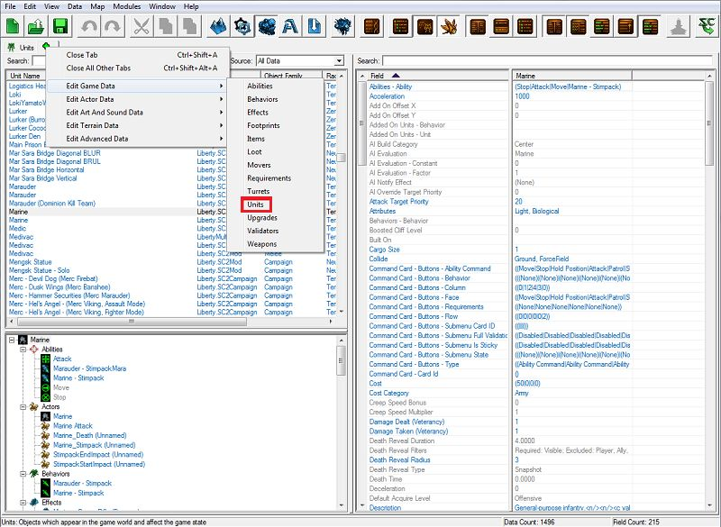
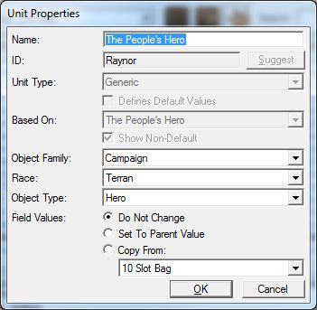
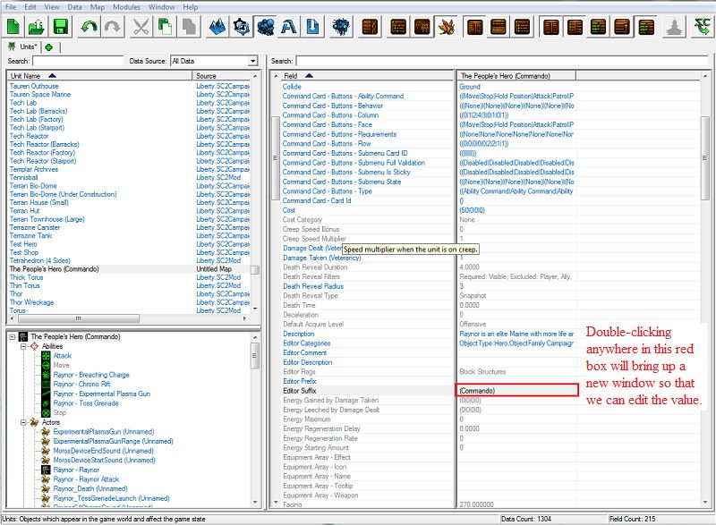
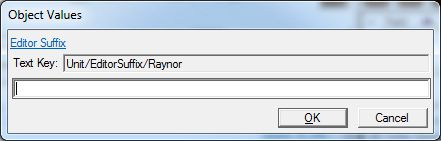
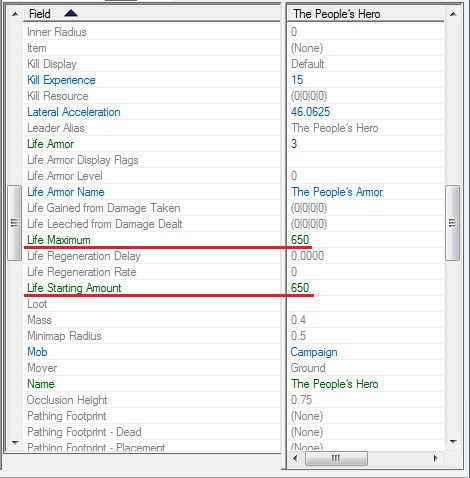
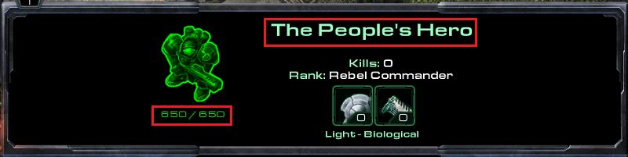
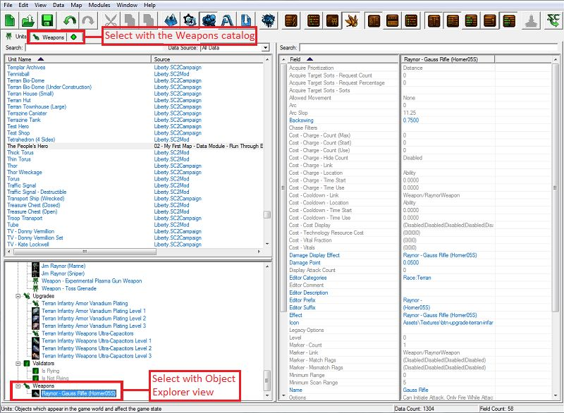
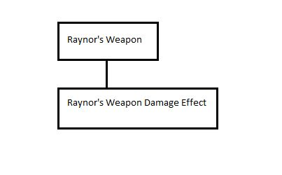
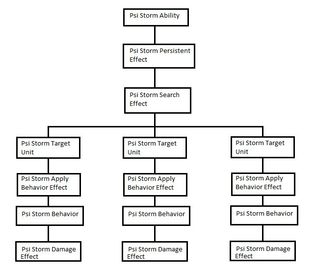

# 数据模块 - 第二部分

## 二、改变单位名称/生命值/护甲/能量

是时候修改一些数据了！我们将要修改的第一批数据将是简单的、单值字段，只是为了入门。我们将要修改吉姆·雷诺（司令）的名称、生命值、护甲和能量。

### A. 打开单位目录：

1. 单位目录应默认打开，但如果没有打开，请点击工具栏下的“+”选项卡以打开可用目录的上下文窗口。
2. 

3. 选择“编辑游戏数据”，然后选择“单位”。
4. 

5. 单位选项卡将出现在我们用来打开单位目录的“+”选项卡的同一组选项卡中。您打开的任何目录都会添加选项卡。

### B. 名称

1. 滚动列表或使用单位对象列表上方的搜索栏，找到并选择吉姆·雷诺（司令）。
2. 在对象上右键单击，选择“修改单位...”或直接按[Enter]键选择对象。
3. 输入您想要的单位名称。我们将使用"人民的英雄"。
4. 

5. 您会注意到旧名称的一部分仍然存在：“（司令）”。这是因为这不是单位的名称的一部分；这是单位名称的后缀。每个对象都可以附加一个前缀和后缀，该前缀和后缀会显示在编辑器中，但不会显示在游戏中。这样可以更容易地区分在编辑器中使用的两个共享相同名称的不同对象。在这种情况下，我们有3个在战役各个任务中使用的不同吉姆·雷诺单位。我们使用不同的后缀来区分它们。
6. 要删除单位后缀，确保在对象列表中选择了该单位，然后查看字段列表，找到“编辑器后缀”字段。双击字段值以打开一个窗口，让我们修改单位的后缀。
7. 

8. 删除"(司令)"文本，然后按“确定”。
9. 

您可能注意到，我们的单位对象在编辑器中的颜色从蓝色变成了绿色。这是因为这个单位包含了特定于我们当前工作的地图的数据。基本的色彩方案是：

- 灰色：基本的、默认的、核心游戏数据
- 蓝色：来自暴雪依赖或模组的数据，例如自由或战役数据
- 橙色：来自自定义依赖或模组的数据
- 绿色：来自您当前工作中的地图文件的数据。

C. 生命值

接下来，我们将要修改雷诺的生命值。我们需要修改2个字段的值：最大生命值和起始生命值。我们将这两个值都修改为650。

### D. 护甲

护甲值列在生命护甲字段下。我们将雷诺的护甲值更改为3。我们还将生命护甲名称更改为"人民的护甲"。

### E. 能量

最后，我们将要修改雷诺的能量值。我们需要修改2个字段的值，就像我们为雷诺的生命值所做的那样："最大能量"和"起始能量"。我们将更改他的技能，使他使用不消耗能量的技能，因此我们将这两个值都设置为0。

### F. 测试

现在我们已经更改了一些单位数据，让我们保存工作并运行地图以查看我们的更改。在开始游戏并选择我们修改后的单位时，我们应该看到他有一个新的名称、生命值、护甲、护甲名称，并且不再具有能量：

## 三、改变武器射击速率和伤害

我们将假设雷诺没有一把比其他海军陆战队士兵更强大的特殊枪械；他只是需要更多时间来瞄准并击中目标的致命部位。为了让它看起来像是发生了这种情况，我们将更改雷诺武器的射击速率，使其比正常情况下慢，并增加武器造成的伤害。

### A. 射击周期

单位的攻击信息并不直接存储在单位数据中。有时，我们希望单位具有不止一种攻击方式，就像血吞虫或蟑螂，它们既有近战又有远程攻击。

因此，要更改武器的射击速率，我们需要在武器目录中选择雷诺的武器。我们可以像之前一样从“+”选项卡选择目录显示武器目录，然后在列表中找到雷诺的武器（名为雷诺 - 高斯步枪(Horner05S)），或者我们可以使用“资源管理器”部分找到雷诺的武器：

选择武器后，找到周期字段并将其值更改为1.92，大约是通常速度的两倍慢。我们还将武器的名称从高斯步枪更改为“人民的枪”。

### B. 武器伤害效果

武器的数据存储在两个不同的位置。关于武器如何使用的信息存储在武器数据本身中。关于单位开火/使用武器时武器的效果被存储在效果目录中。

效果是数据中的推动者和变革者。每当某物作用于其他事物时，它都是通过效果来实现的。能力、行为和武器都可以触发效果。宿主风暴能力触发一组宿主风暴效果。母舰隐身行为定期触发一个搜索单位以隐身的效果。武器在开火时也会触发效果。

我们不会在本教程中详细介绍效果的工作原理。它是一个非常多功能的系统，但因此也有很多需要解释的内容。

- 效果以一系列事件的方式展开，就像一棵树一样。
- 一个效果可以触发一个或多个其他效果，每个效果都有其特定功能。
  - 有些比较简单。雷诺的武器调用一个单一效果，对我们用武器瞄准的单位造成伤害。
  - 

  - 有些则更为复杂，比如宿主风暴。宿主风暴调用一个效果，持续几秒钟，然后定期调用另一个效果，在一个小范围内搜索单位。这种搜索效果在找到每个单位时会调用一个对该单位造成伤害的效果。
  - 
- 还有不同类型的效果。
  - 有些仅用于调用其他效果。
  - 有些用于造成伤害。
  - 有些用于在区域内搜索单位。

### C. 测试