# 数据模块 - 第三部分

## IV. 修改单位的法术组

接下来，我们将修改我们的英雄能够释放的技能。设置单位的能力有两个步骤：将能力添加到单位，并在命令卡上添加一个按钮，链接到该能力。

### A. 能力数组

如果我们的英雄没有相应的能力，我们将无法将能力命令添加到他的命令卡中，因此在修改命令卡之前，我们需要查看他的能力列表。

1. 在单位目录打开的情况下，选择人民英雄。
2. 定位“能力 +”字段，并双击值部分。在打开的窗口中，我们将看到单位具有的能力列表。
3. 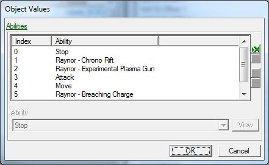

在添加我们想要英雄拥有的能力之前，我们应该删除我们不希望他拥有的那些。

1. 要删除一个能力，请选择它，然后按窗口右侧的红色“x”按钮。
2. 重复步骤1，删除列表中所有能力，除了停止，攻击和移动。这三个对于我们的单位执行正常功能（如移动，巡逻和攻击）至关重要。
3. 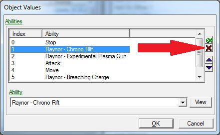

现在我们只剩下基本的能力，我们将添加我们想要单位具有的特殊能力。

1. 在相同的“能力 +”窗口打开的情况下，按刚刚按过的红色“x”按钮正上方的绿色“x”按钮。
2. 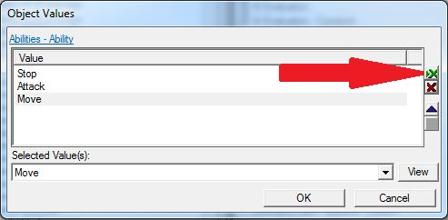
3. 在打开的弹出窗口中，打开下拉菜单，选择雷诺突击队 - 火炮狙击能力。
4. 重复步骤1和2，添加泰克斯 - 投掷手榴弹和斯旺 - 放置炮塔的能力。在所有能力添加完毕后，按“确定”按钮关闭窗口。
5. 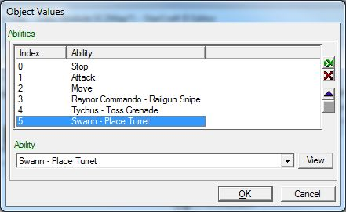

现在我们的能力准备就绪，可以将它们放在单位的命令卡上。

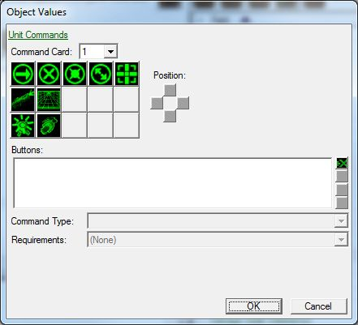

### B. 移除命令卡按钮

与能力列表一样，我们应该先移除不需要的命令卡按钮，然后再添加新的按钮。

1. 选择位于命令卡按钮区域左下角的按钮。
2. 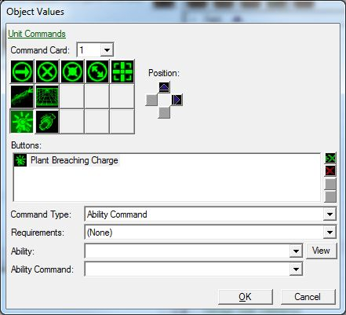
3. 您会注意到按钮区域下方的字段发生变化，显示的是该特定按钮的设置。我们可以看到按钮称为“种植破坏装置”，命令类型是“能力命令”，等等。由于我们刚刚从单位中删除了此按钮引用的能力，因此能力和能力命令部分都为空。

4. 要删除此按钮分配及其相应的能力信息，请按命令卡区域下方按钮部分右侧的红色“x”按钮。
5. 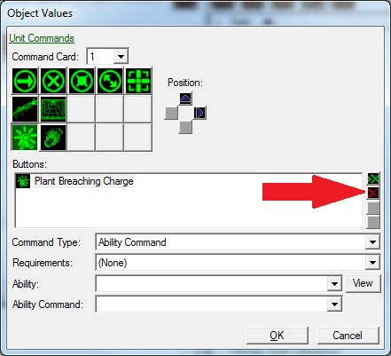

6. 重复步骤1和2，删除手榴弹，时间裂隙设备和实验等离子枪按钮。

现在我们可以添加新的按钮和命令，让我们的英雄使用。

1. 选择底部左侧的按钮位置。
2. 按照用于删除按钮的红色“x”按钮正上方的绿色“x”按钮。
3. 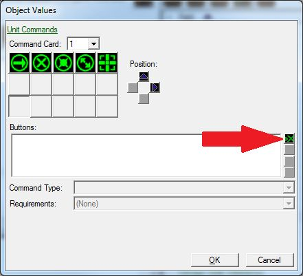

4. 在弹出窗口中，找到并选择穿透者子弹（雷诺）按钮，然后按“确定”。
5. 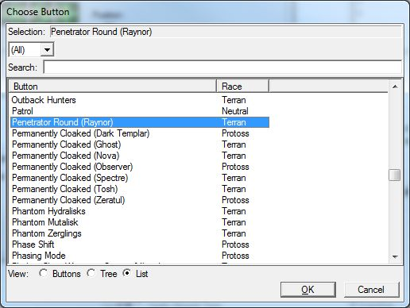

6. 在命令类型下拉菜单中，选择能力命令。能力命令允许我们将此按钮与单位拥有的能力之一关联起来。
7. 将要求保持为（无）。要求部分帮助确定何时显示或隐藏此按钮，何时启用或禁用，并灰暗显示。我们希望此能力始终可用，并且始终显示。
8. 对于能力部分，请从能力列表中选择雷诺突击队 - 火炮狙击。
9. 对于能力命令，请选择雷诺的穿透者子弹。

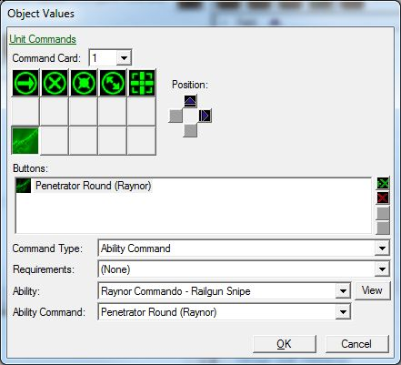

重复这些步骤，为泰克斯 - 投掷手榴弹和斯旺 - 放置炮塔的能力添加命令按钮：

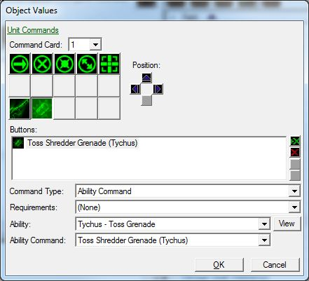

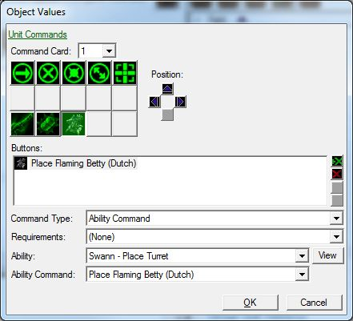

### C. 测试一下

现在我们的单位——人民英雄，拥有了一套新的能力，让我们跳入游戏中测试一下！不要忘记先保存您的工作。

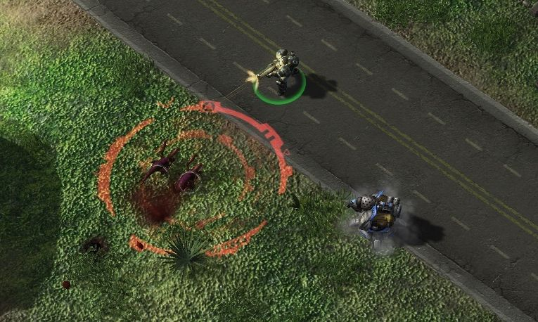

导航到：

- [上一部分](../2)
- [下一部分](../4)