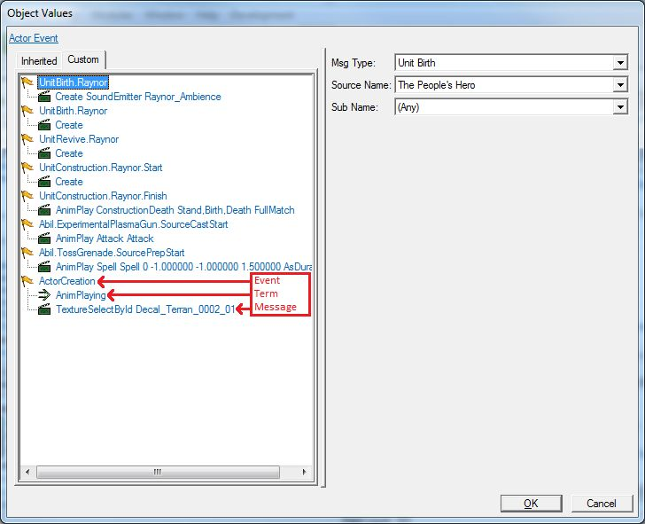
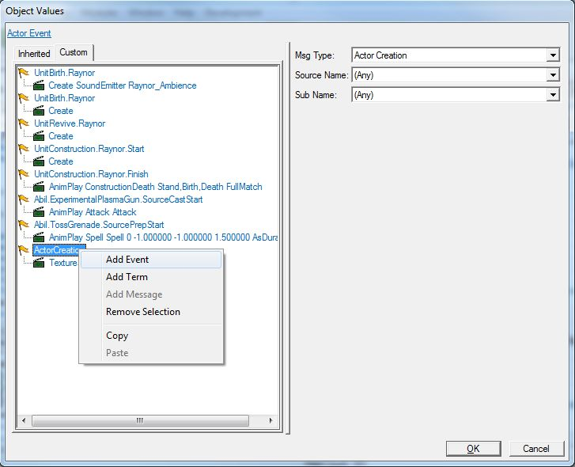
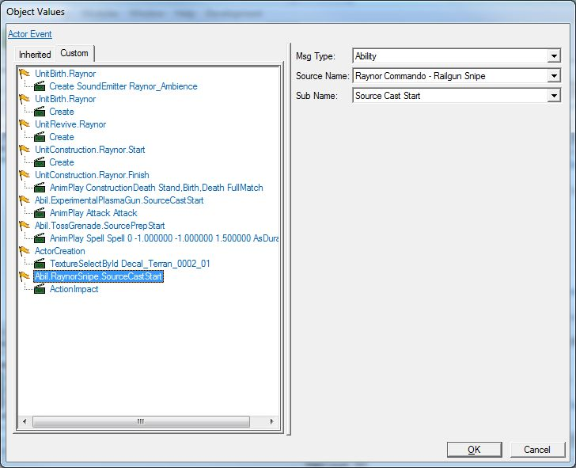
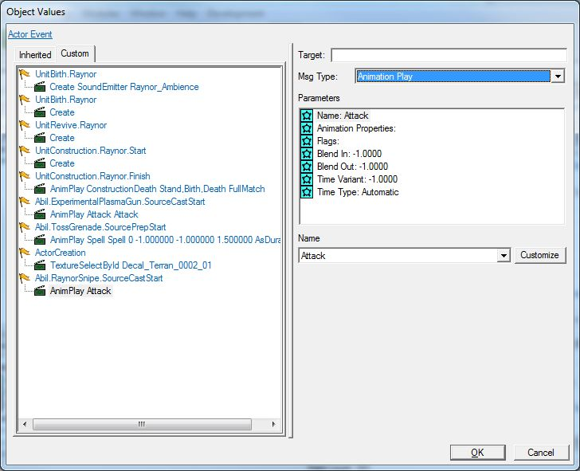

# 数据模块 - 第四部分

## V. 为单位添加动画

在测试能力时，您可能已经注意到，人民英雄在使用能力时就像一个傻瓜站在那里一样。当然，他仍然使用这些能力，但他并没有动手使它们发生。就好像他能够从肚脐射出手榴弹，创建炮塔，让虫族单位仅凭思想就爆炸。为了使人民英雄在使用能力时正确地执行动画，我们必须深入了解 Actor 目录。与 Effects 目录一样，Actor 是一个非常多才多艺但复杂的系统。

- 虽然单位、能力、效果和其他目录定义了在星际争霸 II 中发生的事情，然而 Actor 目录则是定义了当这些事情发生时，它们是什么样子和听起来是什么样子的。您在游戏中看到的每个单位、效果和能力都与一个 actor 相关联。
  - 关于单位如何运作的所有信息都存储在 Units 目录中：
    - 生命值
    - 能量
    - 能力
    - 移动速度
  - 所有关于单位外观的信息都在 Actor 中：
    - 模型
    - 动画
    - 单位图标
    - 声音
- 与效果一样，actor 也有不同类型。Actor 可以用于控制：
  - 单位
  - 导弹
  - 声音
  - 效果
  - 等等
- 我们使用 Actor Messages 来告诉 actor 做什么以及何时做。每个 Actor Message 都有一个事件、零个或多个术语和一个消息。
  - 事件 - 我们等待游戏中发生的某些事件，这些事件将触发我们希望发送给 actor 的消息。例如，我们等待地狱火单位攻击某物。
  - 术语 - 这类似于触发器中的条件。当事件发生时，我们会检查确保某些游戏条件为真。例如，当地狱火单位攻击某物时，我们会检查它是否拥有升级攻击或否。
  - 消息 - 当事件发生时，我们希望发生什么是消息。例如，当地狱火单位执行攻击时，我们告诉它播放其攻击动画。

- 打开 Actor 目录。

- 选择雷诺 - 雷诺。

- 查找并双击 “Events +” 字段值以打开 Actor Messages 窗口。您可以看到之前解释过的事件、术语和消息的概念在实践中的应用。

  

对于这个能力，我们将指示雷诺角色播放他的攻击动画，因为这将使他的枪指向能力的方向，并看起来像他正在射击 Penetrator Round。

### 创建事件

1. 要创建新事件，请在 Actor Messages 列表中的任何位置右键单击鼠标，然后选择 “添加事件” 选项。

   

2. 选择刚刚创建的新动作，我们可以在 Actor Messages 窗口的右侧看到其事件选项。

3. 对于 Msg Type，请从列表中选择 Ability。

   1. 有许多不同类型的消息，从单位创建、使用能力、单位死亡、向单位添加或移除行为等。
   2. 从此列表中选择 Ability 将让我们选择一个将触发 Actor Message 的能力。

4. 对于 Source Name，请选择雷诺突击队 - Railgun Snipe。

   1. 由于我们选择了 Ability 作为我们的消息类型，因此 Source Name 选项列出了游戏中的所有能力。

5. 对于 Sub Name，请选择 Source Cast Start。

   1. 由于我们选择了 Ability 作为我们的消息类型，因此 Sub Name 列出了能力可能具有的所有不同阶段。这样我们就可以确定在能力执行期间的具体时间点，我们的 Actor Message 将会触发。

   2. 一些能力阶段的示例包括：能力开始施法时，完成施法时，开始或停止通道时，开始或停止准备施法时等。

   3. Source Cast Start 意味着当来源（我们的单位）开始施放能力时。因此，当人民英雄开始使用 Railgun Snipe 能力时，该 Actor Message 将触发。

      

### 创建术语

对于这个 Actor Message，以及我们将在本教程中制作的其他 Actor Message，我们不需要创建任何术语。我们将在以后的教程中介绍如何创建术语。目前可以简单地说，它们与创建事件和消息类似。

### 创建消息

1. 当我们创建事件时，在其下方自动创建了一个默认消息。选择该消息，并可以在 Actor Messages 窗口的右侧看到其选项。

2. 将目标字段留空。目标是我们想要发送此消息的 actor。因为我们想要将此消息发送给此 actor，所以我们不需要目标。

3. 将 Msg Type 字段更改为 Animation Play。

   1. 有许多不同类型的 actor message 类型。

   2. 我们可以更改角色大小、角色颜色/色调、角色透明度，我们可以更改该角色使用的模型。我们甚至可以在 actor messages 中创建其他 actor。

   3. 当我们完成对它们的使用时，我们也使用 actor messages 来销毁 actor，因此如果我们的事件是 “单位死亡”，我们的消息可以是 “销毁 actor”。

      

4. 在参数部分，选择 Name 字段。在参数部分下方，您将看到一个名称下拉菜单。在该下拉菜单右侧，您将看到一个自定义按钮。将名称下拉菜单选项更改为任何可用的下拉菜单选项，或按“自定义”按钮创建自己的名称。

   1. 动画的名称并不影响动画本身；它只是让我们在其他 actor messages 中引用它。
   2. 例如，我们可以在一个消息中说“开始播放动画 FunTimes”，然后在另一个消息中说“停止播放 FunTimes 动画”。

5. 仍然在参数部分中，选择 Animation Properties。在参数部分下方，您将看到一个 Animation Properties 下拉菜单。从列表中选择 Attack。

   1. 这包含了游戏中的所有可用动画名称的列表。并非每个模型都具有每个动画。要查看特定 actor 可用哪些动画的列表，请右键单击对象列表中的 actor，并选择“预览 actor”。