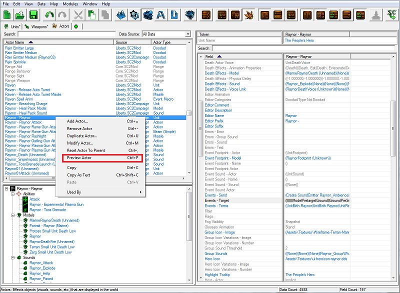
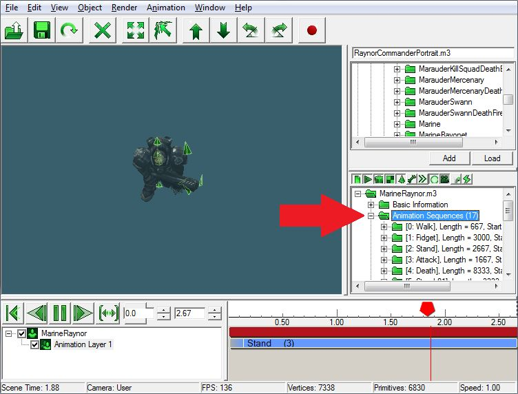
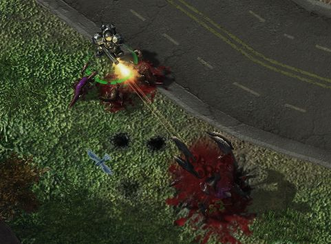
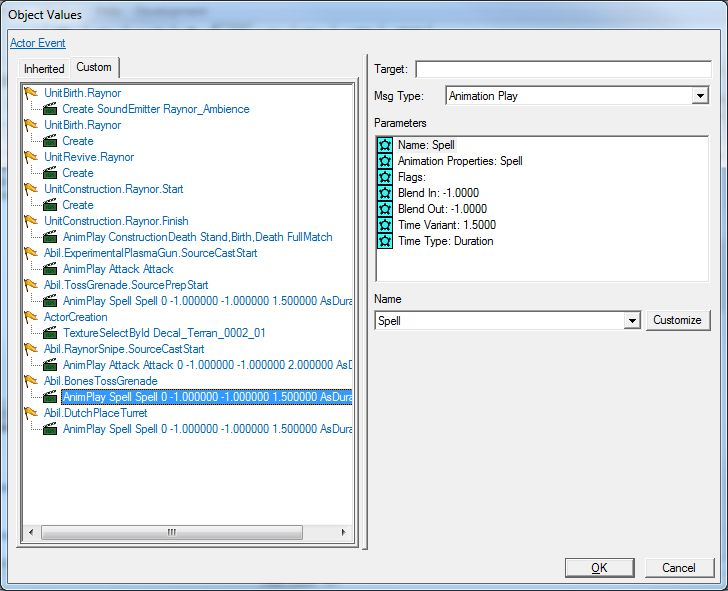
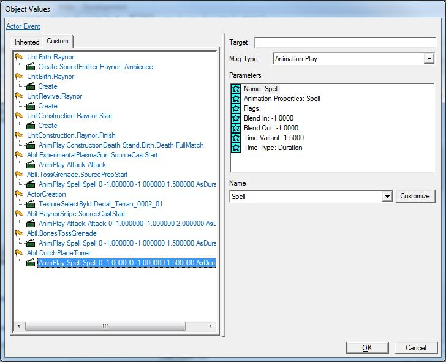
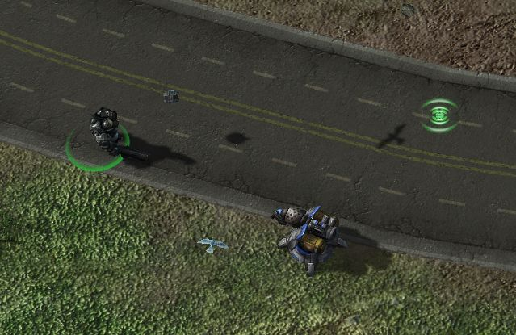

```markdown
      

      这将打开预览窗口（我们将在未来的教程中详细介绍），并显示我们角色的模型和信息。在预览器窗口的右侧中部是一个文件夹列表。展开"动画序列"文件夹，您将看到可用于查看的角色模型的动画。

      

   2. 当您从下拉菜单中选择一个选项时，第二个下拉菜单将出现，让您添加更多的修改器到动画中。在这种情况下，我们不需要任何修改器。

6. 在"参数"部分，将“时间类型”从“自动”更改为“持续时间”，将“时间变体”从-1更改为2。这将使动画在2个游戏时间秒内播放完毕。如果我们将这些选项保持为默认值，动画将以默认速度播放然后停止，这比能力施法所需的时间更快。

7. 我们将保持在"参数"部分中其他内容不变。



## B. 投掷手榴弹

对于这个能力，我们将告诉Raynor角色播放他的“法术”动画，这将使Raynor角色做出一次上举投掷动作，看起来像在扔手榴弹。当角色消息全部设置好时，应该是这样的：



对于这个能力，我们将告诉Raynor角色像我们在扔手榴弹能力中所做的那样播放他的“法术”动画，这样他看起来像在扔炮台。当角色消息全部设置好时，应该是这样的：



现在，我们已经将英雄的其余能力动画都连接好了，让我们保存我们的工作并在游戏中进行测试。



就是这样！我们已经设置好了我们的自定义英雄“人民英雄”，具有新的生命值、护甲和能源值，修改后的武器以及新的能力。在这三个教程的过程中，您已经熟悉了星际争霸II编辑器。虽然我们只是触及了表面，但希望这一系列教程已经开始为您探索地形、触发器和数据打下坚实基础。在未来的教程中，我们将更多地了解数据、高级触发器概念等。不要忘记，游戏和Battle.net上有大量现有的模组和地图，它们展示了如何为您自己的自定义地图创建地形、触发器和数据的示例。期待下一次，愉快编辑！

转到：

- [上一部分](../3)
```