# 能力创建基础知识1：带有数据收集的简单火雷霆术

!!! info
    以下教程旨在面向完全初学者，假定编辑器的能力有限或几乎没有。

在本教程中，我们将逐步介绍制作一个简单的弹道攻击能力的所有步骤 - 我们将向目标敌人发射导弹，它在命中时造成伤害。与星际争霸2中大多数默认基于弹道的武器相同。

## 最终结果

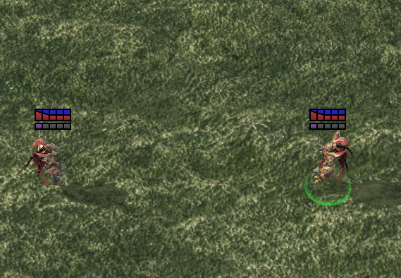

## 简介

!!! warning
    在继续之前，请确保您的编辑器设置与以下设置匹配：

**数据编辑器设置**

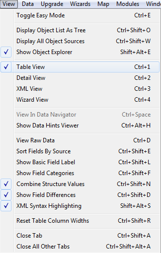

**文档依赖项**

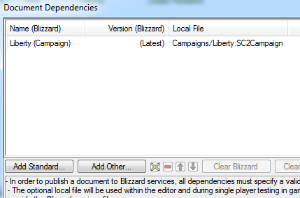

## 步骤0：准备/数据收集
作为编辑器的新手，我们将不是从零开始创建事物，而是复制/复制现有内容，直到我们对自己的实验感到自信。为了帮助我们正确复制和组织事物，我们将使用5.0中引入的新功能 - 数据收集！

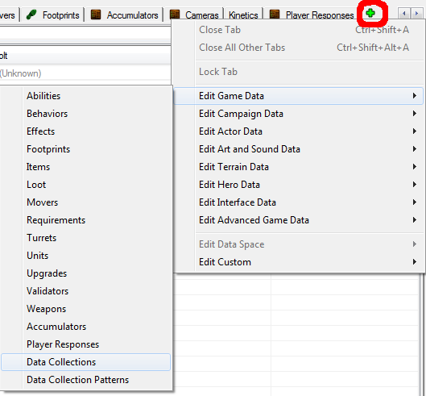

打开数据编辑器，点击小加号`+`，然后转到`编辑游戏数据` -> `数据收集`。

让我们创建一个名为“**火法师 - 火雷霆术**”的数据收集，然后点击“建议”按钮，以便编辑器自动为我们命名ID。

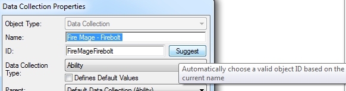

### 数据收集 - 是什么意思

在处理数据收集时有一些微妙之处。其中一个想法是为我们提供能够将新创建的数据分组到收集中的能力，使得我们创建的数据自动放入一个特殊文件夹以便组织和访问。

要将新创建的数据识别为数据收集的一部分 - 该数据的ID必须以数据收集的名称作为前缀。好的，我们该怎么做呢？

首先，我们需要了解“ID”是什么。编辑器中的所有数据字段都有名称和ID。名称对其没有限制，用于使编辑器可读，而ID值是后端代码中使用的内容。它们有一些规则，例如不能有空格并且必须是唯一的。

通常，当我们创建一个新元素时，我们会为其提供一个名称，然后建议为其生成ID。在上面的示例中，“火法师 - 火雷霆术”建议的ID是“FireMageFirebolt”。

因此，当创建新数据时，知道我们要利用数据收集，我们会将我们的数据命名为以下方式 - “**数据收集名称 @ 数据元素名称**”（或者对于我们的示例，“**火法师 - 火雷霆术 @ DataElement**”），然后单击建议并完成。然而，当编辑器看到元素的ID中的收集前缀并将其识别为数据收集的部分时 - 它将还会为该元素添加自己的前缀。因此，我们将得到以下结果：

  “Fire Mage – Firebolt @ Fire Mage – Firebolt @ DataElement”

|Fire Mage – Firebolt @|Fire Mage – Firebolt @|DataElement|
| ------------- | ------------- |------------- |
|编辑器自动生成的数据收集的前缀|我们在为其命名以便包含在数据收集中时添加的前缀|数据元素名称|

嘛... 由于编辑器会添加自己的前缀，那么我们添加的就不再必要了。难道我们只是再次打开每个元素并删除我们的前缀吗？

这是与数据收集相关的唯一不便之处。当我们命名事物时，建议元素ID后，我们将不得不手动删除我们的前缀。

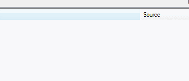

或者作为替代，我们也可以直接将数据收集的ID复制粘贴到元素的ID中。使用您喜欢的任何方法。

---

另外，请打开我们将要使用的其余标签：

- `编辑游戏数据` -> `能力`
- `编辑游戏数据` -> `效果`
- `编辑游戏数据` -> `单位`
- `编辑角色数据` -> `角色`
- `编辑艺术和声音数据` -> `按钮`

## 步骤1：导弹

如果我们要发射抛射物 - 那么我们首先需要制作一个抛射物。或者复制一个现有的并更改其模型以符合要求。我选择复制Karass的武器的抛射物。前往单位数据选项卡，在“武器 - Karass”单位中找到，右键单击，复制单位。标记其单位和角色，这两者总是相互关联的，由于我们将修改视觉效果 - 还需标记用于复制的模型。

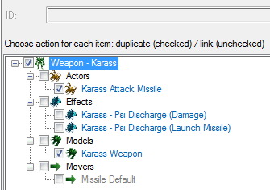

现在最重要的部分开始了 - 明确命名事物，以免以后变得令人头痛。将单位重命名为“projectile”，添加数据收集的前缀（FireMageFirebolt@）到单位的ID，将角色重命名为“Missile”，将数据收集的前缀添加到角色的ID，将模型重命名为“Model”，将数据收集的前缀添加到模型的ID。我再次强调，每次制作新的数据元素时 - 我们将添加数据收集的ID。这可能需要一些时间适应。

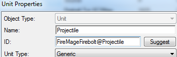
*单位*

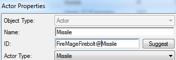
*角色*

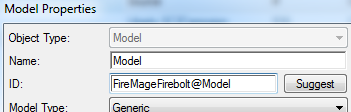
*模型*

---

!!! warning
    命名模式非常重要 - 到达此步骤后，您应该看到的结果如下图所示。

    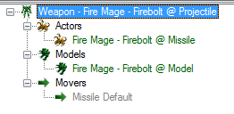

如果我们点击该模型，我们将能够查看模型数据。在其中双击“**模型**”字段，点击“**浏览**”。让我们选择`FrenzyMissile.m3`作为我们的导弹模型。这是我们需要在此更改的所有内容。

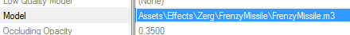

## 步骤2：能力

为了制作我们的简单火雷霆术能力，我们需要以下数据：

1. **能力** - 包含有关我们法术的一般信息的数据项（例如范围、成本、杂项属性如施法时间、有关能力目标的信息、自动施法属性等）。  
1. **按钮** - 包含图标、工具提示、可见于玩家的法术名称以及我们在单位命令卡上看到的相关信息的数据项。  
1. **效果** - 构成能力逻辑的数据条目。  
1. **角色** - 创建视觉和声音效果以及通常控制屏幕显示的数据条目。

### 准备能力和按钮

让我们逐步进行。首先 - 在能力数据选项卡中，创建一个新的“**效果 - 目标**”类型的能力。由于数据收集处理命名，我们可以将此条目简单称为“能力”。目前我们无法做太多。