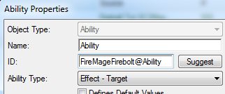

接下来让我们制作一个按钮！在按钮数据选项卡中创建一个按钮，将其热键设为 Q，并将图像设置为您认为最适合的图标。我觉得 `ui_tipicon_campaign_zerus03-yagdrafireball.dds` 对于这个能力来说是一个不错的图标选择。

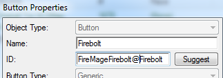

按钮创建完成后，让我们将其添加到该能力的命令列表中。返回到该能力，在其“**Commands+**”字段中，双击它，并将其设置为“**Execute**”命令的默认按钮。

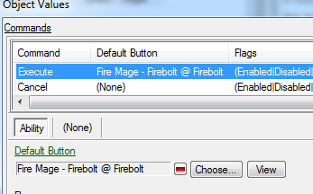

---

### 将能力添加到单位中

尽管现在我们的能力没有任何作用，但仍然可以将其添加到一个单位中。我们可以通过这种方式来检查在开发的不同阶段它是如何工作的。我们可以使用 Karass（星际争霸II：自由之翼中的高阶圣堂武士英雄）作为我们的施法者。

进入单位的“**Abilities+**”字段，并通过点击小绿色`+`按钮将我们的能力加入其中。

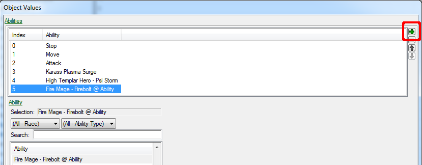

之后进入单位的“**Command Card+**”字段，
1. 点击您希望放置按钮的按钮插槽
1. 点击小绿色`+`按钮以添加一个按钮
1. 选择我们之前创建的按钮
1. 在“**Command Type**”中选择“Ability Command”
1. 在“**Ability**”中选择我们的能力。单位拥有的能力通常位于列表顶部，因此您无需搜索它们。

|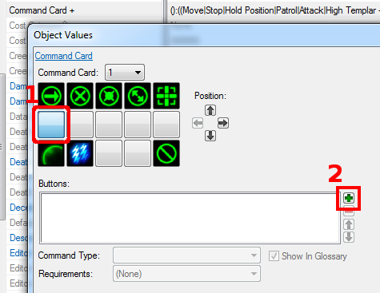|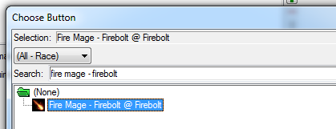|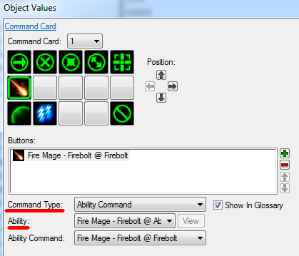|
| ------------- | ------------- |------------- |

---

## 步骤 2-1：效果

好了——是时候构建驱动该能力的逻辑了。

这个能力有两个作用：
1. 从施法者发射导弹到目标。
1. 撞击目标时对其造成伤害。

首先，我们需要发射一个导弹。前往效果数据选项卡，创建一个新的“**Launch Missile**”效果。

这个效果正如其名，使用我们提供的设置来发射导弹。

目前我们只需设置应该发射哪种导弹。找到“**Ammo Unit**”字段，并将其设置为我们在第一步中复制的弹药单位。

|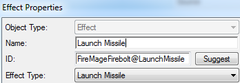|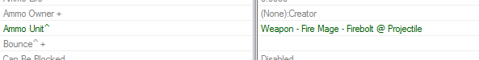|
| ------------- | ------------- |

为了让导弹在撞击时造成伤害，我们还需要一个伤害效果，让我们开始吧。

创建一个新的“**Damage**”效果。

将“**Amount**”字段设置为 20，并将“**Death**”字段设置为“**Fire**”。这样，如果此效果杀死敌人-它将使被击杀的单位播放火焰死亡动画（如果有的话）。

此外，找到“**Response Flags+**”字段，并勾选“**Acquire**”和“**Flee**”。这将导致敌人对这种伤害效果做出反应，否则他们会像大木头一样被打击而不动。

|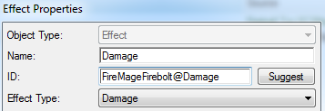|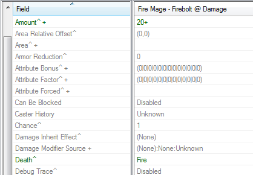|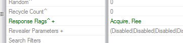|
| ------------- | ------------- |------------- |

为使发射的导弹在撞击时造成伤害，将我们的伤害效果放入发射导弹效果的“**Impact Effect**”字段中。

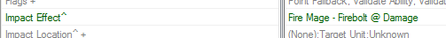

现在我们已经制作了我们需要的两个效果，我们可以将我们的发射导弹效果添加到该能力中。因此，前往能力数据，找到“**Effect+**”字段，并将我们的发射导弹效果放在那里。我们还需要在“**Range+**”字段中指定该能力的射程。让我们将其设置为 10。

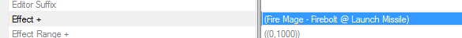

---

## 步骤 2-2：演员

如果现在我们测试该能力，它会执行游戏逻辑——导弹从施法者飞向目标并在撞击时造成 20 点伤害。但它会从施法者的脚下飞出，落在敌人的脚下，没有任何音效、爆炸或其他视觉效果。

我们将利用演员将我们的逻辑包装成漂亮的视觉效果。

|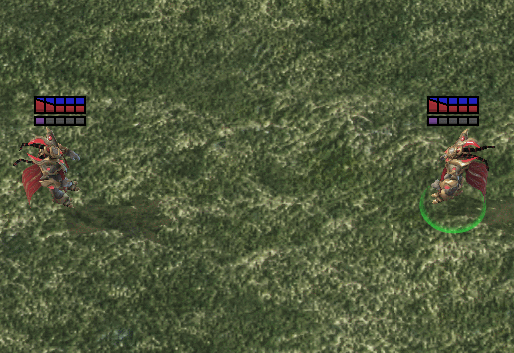*游戏逻辑*|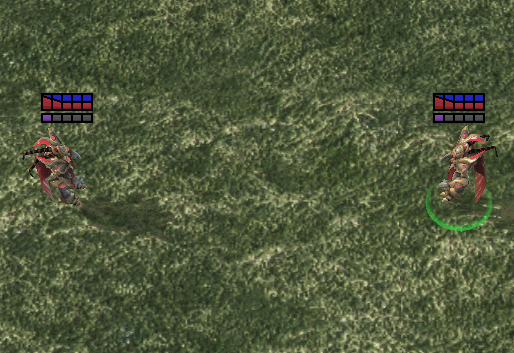*游戏逻辑 + 演员*|
| ------------- | ------------- |

#### 射程演员（次要修饰，不必要但好看）
首先，由于我们刚刚设置了能力的射程，让我们添加一个射程演员。该演员负责在我们目标能力或在单位上移动光标时创建射程指示器。

我们可以复制一个或从头开始创建一个。射程演员没有太多内容，因此让我们直接创建一个。

我们将创建“**Range**”演员，并将其父级设置为“**Range Abil**”。这样做后，编辑器将为我们提供令牌字段（屏幕底部），在其中我们可以放置我们的能力，编辑器在一定程度上将调整演员的数据以适用于所指定的能力。

|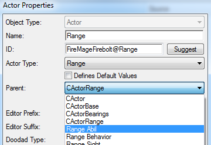|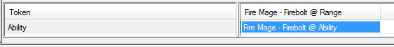|
| ------------- | ------------- |

在填写能力令牌后，找到“**Events+**”字段，右键单击，悬停在“**Reset To Parent Value**”上，并选择“**Range Abil**”。这样将重置演员的事件，但同时也会调整它们使其适用于我们在令牌能力字段中指定的能力。

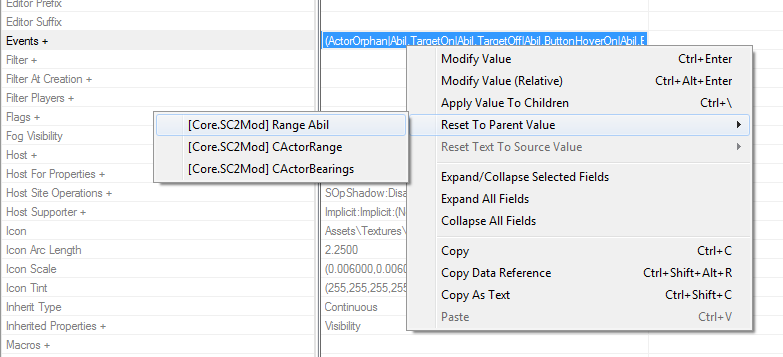

#### 攻击演员

现在让我们让我们的导弹行为就像星际争霸II大多数其他导弹一样-从单位的武器射向目标的身体。为此，我们将需要一个“**Action**”演员。

!!! 信息
    动作演员控制所有与视觉/声音相关的事物，这些事物在常规攻击期间发生。在简单的层面上，它是用来确保攻击正确发射和撞击，考虑到在目标具有护盾时显示攻击击中护盾，而不是直接击中单位。

让我们复制“Karass Attack”，它已经有一个听起来像法术发射的不错的音效。像往常一样，当复制时，我们会标记我们想要更改的东西（除了那些我们已经制作的，比如导弹）。

复制完成后，注意底部的令牌字段。用我们的效果替换“**Impact Effect**”和“**Launch Effect**”。