|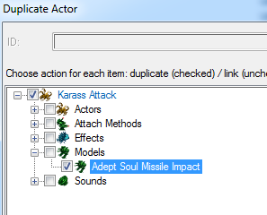|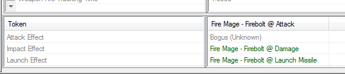|
| ------------- | ------------- |

!!! info
    在填充令牌时，演员的“**事件+**”字段将自动调整到它们（不像以前我们在范围演员填充时那样），因此无需重置“**事件+**”字段。

在攻击演员中找到“**导弹**”字段，并用我们的投射物替换它。

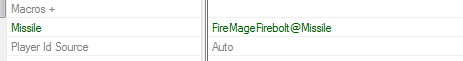

我们现在已经完成了演员字段，让我们改变我们复制的模型。转到模型数据中，将“**模型**”字段更改为某种爆炸效果。
`MiraHorner_Wraith_Coop_Missile_Impact.m3` 效果很好。

现在我们的导弹应该能够如预期地运作并发出声音。但是使用该技能的单位会怎么样？

#### 动画/演员事件
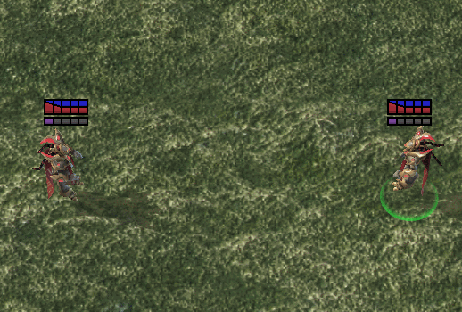

如果我们测试文档，我们会发现尽管武器从施法者的手中发射并击中目标的身体，就像所有其他抛射物一样—卡拉斯一直站在原地，而咒语却在进行。我们需要给卡拉斯的演员一个指示——如果卡拉斯施放我们的咒语——则播放特定动画。

通常情况下，我们会进入单位演员的“**事件+**”字段并将新事件添加到单位默认事件的大列表中。但是还有另一种更有组织的方法。我们创建一个类型为“**事件宏**”的演员，向其中添加我们的事件，然后将该宏添加到单位演员使用的宏列表中。这样，我们就无需浏览其他事件，而且我们始终知道在哪里查找/编辑特定能力的演员消息。

创建一个类型为“**事件宏**”的演员。

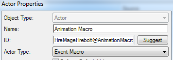

打开它的“**事件+**”字段并添加以下内容：

对于事件

|||
| ------------- | ------------- |
|**消息类型：**|**能力**|
|**来源名称：**|选择我们的能力|
|**子名称：**|**源开始施法**|

对于消息

|||
| ------------- | ------------- |
|**消息类型：**|**播放动画**|
|**名称：**|任何您想要的名称，如果您尚未使用过此字段，请手动添加动画名称。这些可以是任何值，因此以对您有用的方式命名它们。我通常将我的Q咒语的动画命名为“SpellQ”|
|**动画属性：**|**咒语**，**A**|

|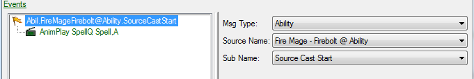|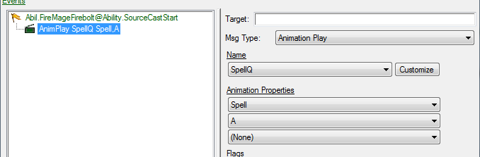|
| ------------- | ------------- |

然后将“**时间类型**”设置为“**时间比例**”，将“**时间变体**”设置为“1.0”。

这将使动画以您在模型查看器中看到的速度播放（您可以在教程末尾找到有关此内容的信息）。

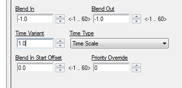

接下来，转到单位演员，找到名为“**宏+**”的字段，并将我们的宏添加到该列表中。

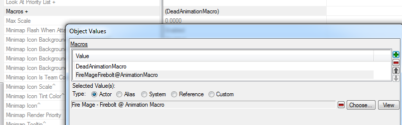

---

## 步骤 2-3：其他内容

### 按钮工具提示

让我们为我们的按钮添加一个适当的工具提示。返回到我们在按钮数据选项卡中创建的按钮。我们将添加一个关于“使用火焰箭击中目标，造成20点伤害”的一般描述。

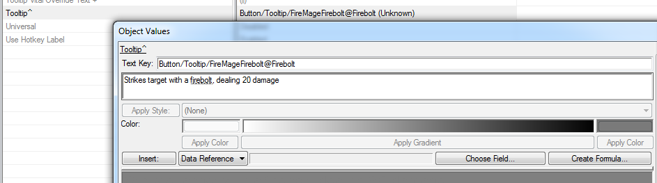

但是等一下！我们可以直接在工具提示中引用各种数据字段，因此让我们直接从伤害效果中提取伤害值。

请注意，文本窗口下有各种不同的按钮。点击“**选择字段...**”。对于“**类型**”，选择“**效果**”，找到我们的伤害效果，选择伤害值，然后点击“确定”。现在我们的引用将显示在“**数据引用**”下方。可以通过点击“**插入：**”按钮在文本中的任何位置插入它。

|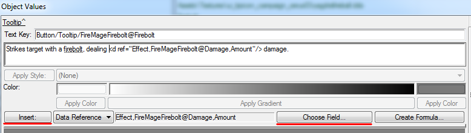|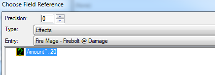|
| ------------- | ------------- |

---

#### 最后的润色

一切现在应该都运作正常。但是如果我们仔细观察，会发现动画与能力不太同步——导弹飞出得太早了。让我们通过简单地在能力中将“**施法开始时间**”设置为0.5来延迟第一个效果的执行。（或者我们也可以通过让动画快进来解决，但这是另一天的信息）。

#### 总结

我们的数据工作完成了。让我们返回到数据集合选项卡，选择我们的数据集合，然后单击“**数据集合**” -> “**自动填充数据集合**”。通过这种方式，我们可以查看我们制作的所有元素，并且如果需要，复制所有元素。更改数据集合的名称还将重命名其所有元素。

|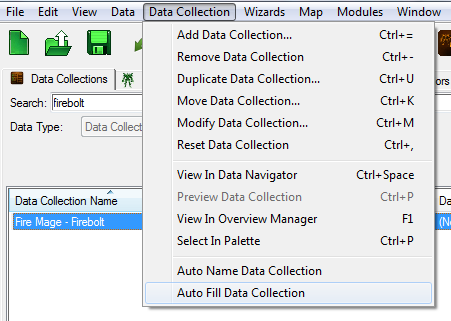|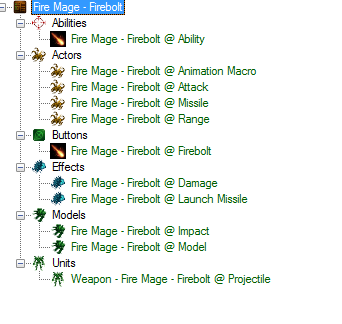|
| ------------- | ------------- |

!!! warning
    重命名数据集合时，文本中的引用不会更新，因此如果我们重命名我们的数据集合，我们将不得不手动更新所有文本引用，例如我们在按钮工具提示中引用伤害效果的地方。

||
| ------------- | 
|*火焰箭完成！*|

# 奖励 1：制作一个更酷的火焰箭（技能级别——基本）

现在我们有了基本的发射-命中能力，让我们让它变得更有趣。我们不再发射一个，而是要使我们的能力连续发射15枚导弹。

但首先，我们需要做出决定。我们是继续更改我们的能力，还是制作一个新技能？

也许我们将来会想使用原始能力，或将其保留作为其他简单抛射物技能的模板。

因此，让我们将我们更酷的火焰箭制作为一个新技能。

打造更酷火焰箭的第一步是重复我们为简单火焰箭所做的步骤，因此让我们复制我们以前的工作。

## 步骤 1：数据集合复制

在数据集合选项卡上右键单击我们的火焰箭数据集合，然后选择“**复制数据集合...**”

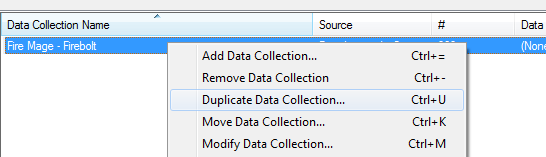

编辑器将打开一个窗口显示要复制的所有元素 + 为数据集合提供新 ID 建议（现在只是“FireMageFirebolt2”）

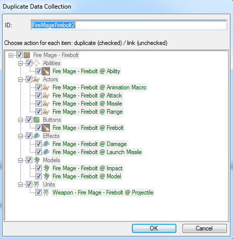