```markdown
点击“确定”，现在我们有两个相同的数据集合。但是我们新复制的数据集合ID末尾有一个“2”（通常我们看不到）。我们需要双击元素查看其ID，或者通过按Ctrl+D切换到原始数据视图，或者通过"**View**"->"**View Raw Data**"。

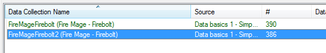

让我们为新的数据集合更改名称，怎么样叫做“火法师 - 召唤”（并像往常一样建议一个新的ID，以适应我们的名称）。

完成后，我们需要手动执行一些操作：
1. 将按钮名称更改为“召唤”（因为复制只会影响数据集合的名称，而不会影响作为元素名称的文本）；
2. 修复召唤按钮工具提示中的伤害参考；
3. 将复制的动画宏演员添加到卡拉斯单位演员；
4. 将召唤能力添加到卡拉斯；
5. 将召唤能力添加到卡拉斯的命令卡中。

完成所有这些操作后，我们可以进行测试文档，并观察我们的卡拉斯能够施放两次相同的能力。

!!! 信息
    虽然数据集合复制窗口看起来类似于普通复制窗口，但无法取消选中单个元素以进行复制。如果我们想仅复制集合的部分内容，则需要手动进入数据集合中的"**Data Record**"字段并在那里删除不需要的元素。复制完成后，它们可以使用通常的自动填充功能重新添加回去。

---

## 步骤2：附加效果

### 创建持续型

为了多次执行我们的“**发射导弹**”效果，我们将利用“**创建持续型**”效果（当您想重复某事时，例如：高隐士的心灵风暴中每个刻度的伤害）。

创建一个“**创建持续型**”效果，并命名为“**启动持续型**”。

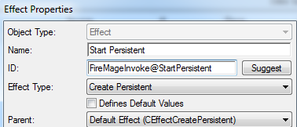

将“**位置**”设置为“**目标单位**”。

将“**周期计数**”设置为15。

将“**周期持续时间**”设置为0.125。

将“**周期效果**”设置为“火法师 - 召唤 @ 发射导弹”。

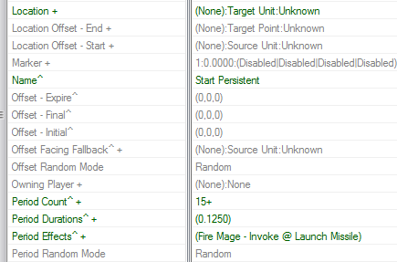

在“**标志+**”中选中“**持续引导**”和“**引导中**”。这将使施法者不得不专注于攻击，以便任何方式移动或取消能力都将停止持续效果。

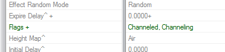

!!! 信息
    没有这两个标志技能也能正常工作。如果您想要能够发射能力并立即逃跑 - 请随意不使用它们。

### 能力

接下来，转到能力，并将其效果更改为我们的新持续效果。

通过这样做，我们可以测试文档并查看该能力确实起作用。

---

## 步骤3: 收尾/杂项

#### 按钮

让我们为我们的新技能选择一个更具表现力的按钮图像 - `btn-ability-tychus-odin-barrage.dds` 应该可以。

之后，在按钮的工具提示中反映我们对能力所做的更改。

"`使用 <d ref="Effect,FireMageInvoke@StartPersistent,PeriodCount"/> 发射火箭，每个火箭造成 <d ref="Effect,FireMageInvoke@Damage,Amount"/> 伤害。`"

#### 演员

在动画宏中 - 将动画属性更改为“**法术**”。

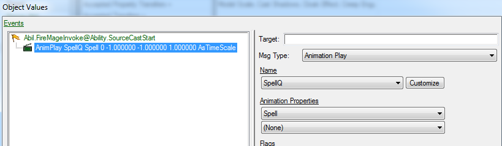

### 更炫 Launch Missile

在我们的发射导弹效果中，转到“**移动器+**”字段，并添加“暴风导弹”。这将在通过该效果发射导弹时覆盖导弹的默认移动器。

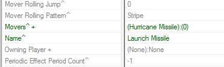
 
 
## 步骤4: 运行地图，放置一些敌人，用火箭炮炸掉他们。
|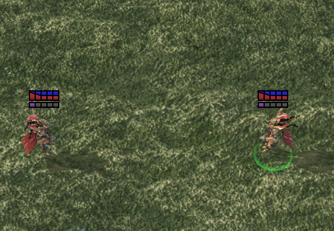|
| ------------- | 
|*更酷的火箭炮完成！*|

* [数据入门1 - 简单火箭炮.SC2Map](Assets/DataPrimer1-SimpleFirebolt.SC2Map)

---

# 附赠2: 查找模型动画和附着点

当我们为能力设置动画属性时，我们如何知道要指定什么，为什么“法术，A”表示投掷动作，而只有“法术”会使卡拉斯把手放在一起？

要了解可以在这里使用什么，我们需要在**剧情编辑器**中查看模型。

让我们返回到单位数据选项卡。点击卡拉斯。在链接元素中，我们可以看到这个单位的主演员。点击它。找到“**模型**”字段。这是模型数据元素的名称。我们可以通过链接的元素导航到它，就像我们导航到这个演员一样。

|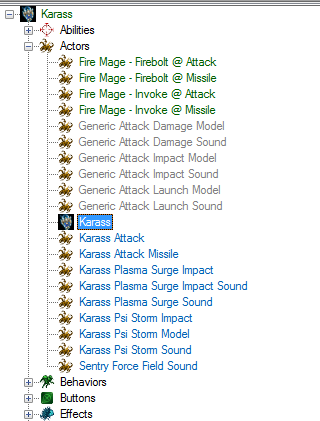|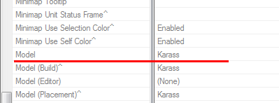|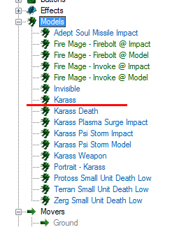|
| ------------- | ------------- | ------------- | 

这次，我们很容易找到我们正在寻找的内容，但我还是想展示一下它们如何连接起来，以防有必要。

进入模型数据后，点击模型字段。然后点击“**查看剧情编辑器**”。

我们会看到类似下面的内容。

|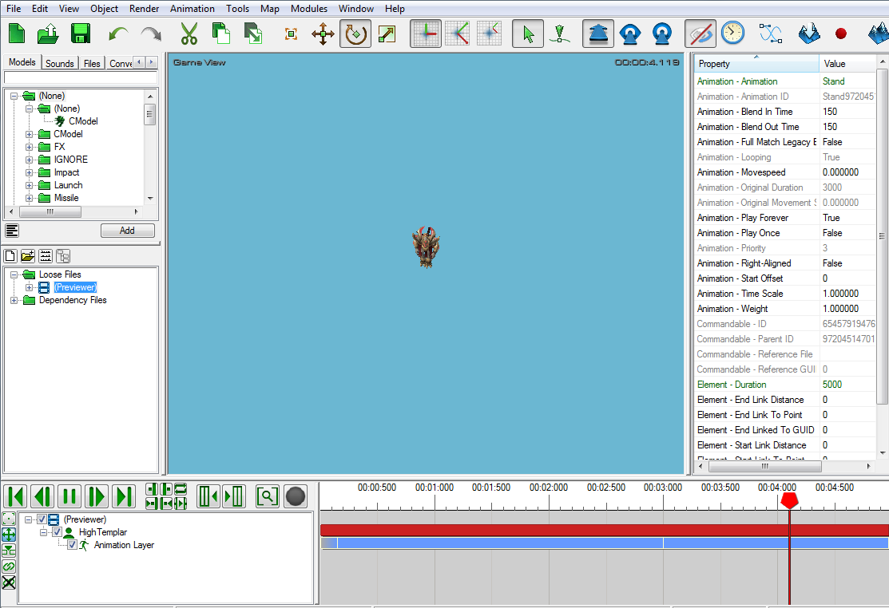|
| ------------- |

### 查找模型动画

右键单击右下角的蓝线，选择“**更改动画**”。现在我们可以查看并预览模型的动画。

|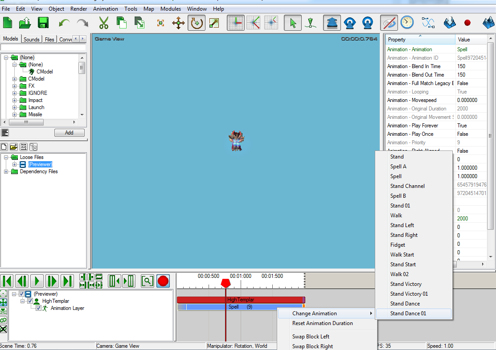|
| ------------- |
---

### 查找模型附着点

- “**渲染**” -> “**显示几何**” -> “**附着点**”（或只需按“A”键切换此）
- “**对象**” -> “**模型数据**”（或只需按“Shift+D”）

在模型数据窗口中选择附着点会使其在剧情编辑器中闪烁。

|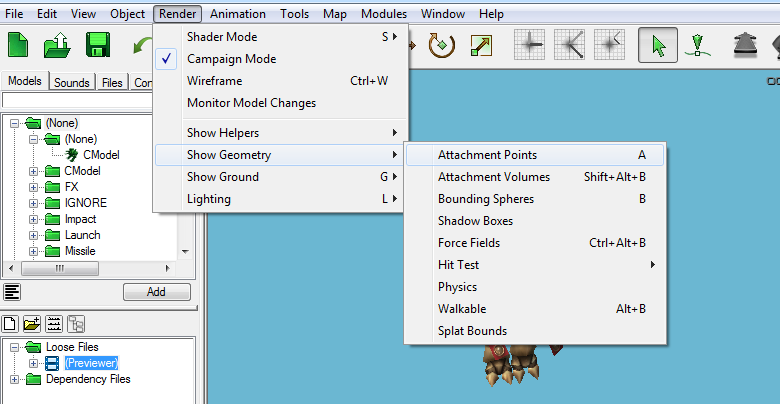|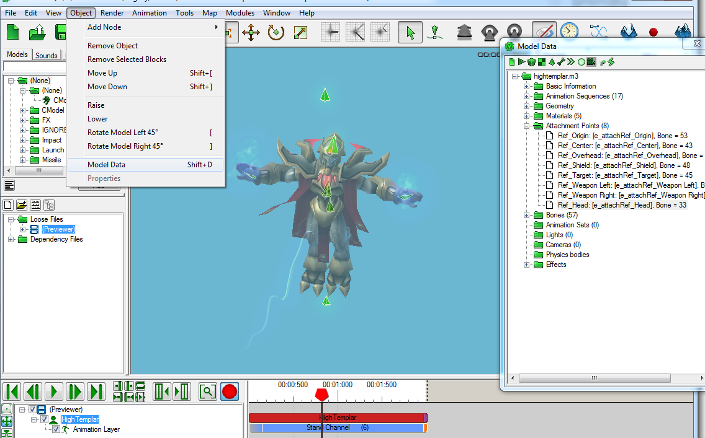|
| ------------- | ------------- |

---

通过这些步骤，我们已经迈出了向数据中制作精彩内容的第一步。

调查默认能力是如何制作的，以您和其他可能查看代码的人可以理解的方式命名事物。

尝试并实验吧！还要查看本网站的其他教程，以获取更多信息。从现在开始事情只会变得更好。
```