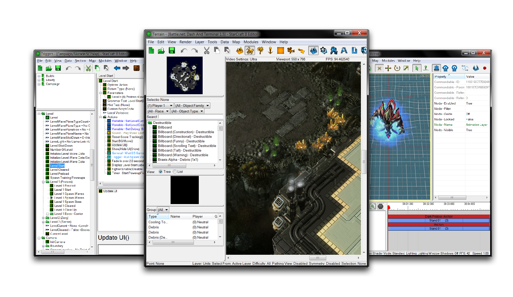
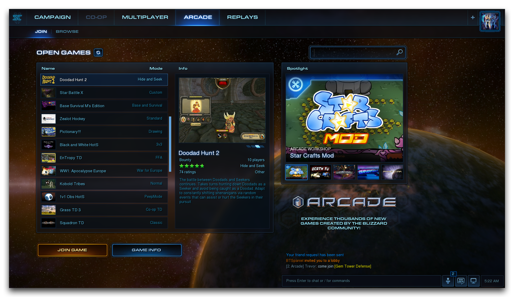
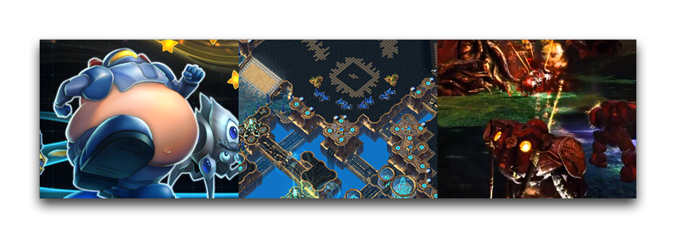
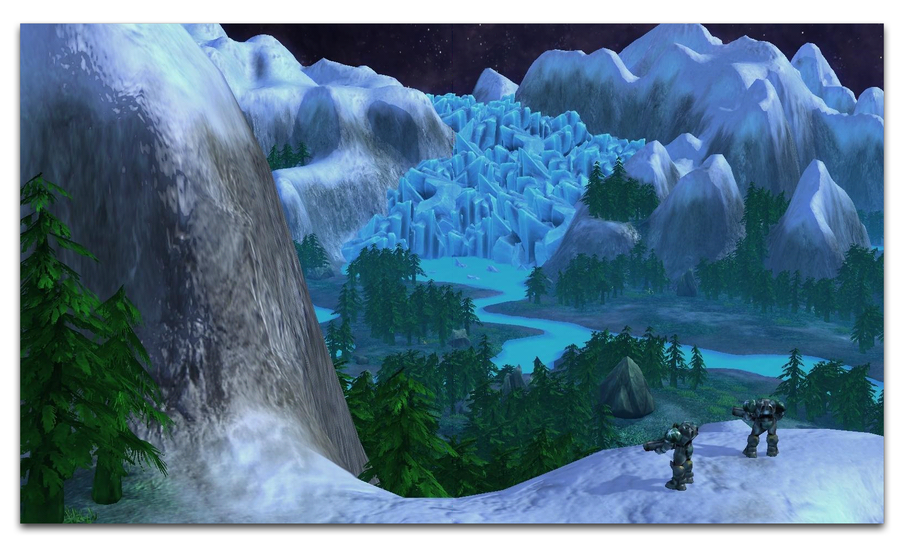

# 介绍

星际争霸 II 编辑器是一套与星际争霸 II 捆绑在一起的游戏开发工具套件。这些正是暴雪自己在开发最新版本星际争霸时所使用的工具。编辑器与战网和暴雪游戏厅一起，提供了一个强大的游戏开发平台，托管系统和多人网络。

星际争霸 II 编辑器于 2010 年首次与《自由之翼》一起发布，使玩家可以访问游戏的所有艺术和资源。这延续了暴雪向玩家社区提供完全访问其创意工具的传统，这一传统始于 1994 年《战争craft 2：黑暗潮汐》的发布。随着每个星际争霸 II 版本的推出，编辑器中添加了更多内容，包括一个包含所有《魔兽争霸 III》资源的官方套件。

## 游戏厅

星际争霸 II 修改社区回应了成千上万的自定义地图和修改。他们所有的创作都可以在由暴雪托管的平台上找到，称为游戏厅，玩家可以使用星际争霸 II 游戏客户端访问。在游戏厅中，玩家可以发现，玩耍并分享一个充满活力的在线游戏开发社区。使用编辑器将使您可以访问这个社区，包括展示您自己的项目，向观众展示，获得反馈，探索他人的游戏，获得灵感，最重要的是玩耍。

## 功能

编辑器是一个专业品质的游戏引擎，具有广泛的功能，包括自己的脚本语言。尽管如此，您不需要编码经验即可开始。如果您想开始学习如何使用编辑器，那么您来对地方了。本站点是任何想要学习使用星际争霸 II 编辑器的人的必备手册和课程计划。因此，请阅读介绍，然后开始探索本站点。

由于其作为地图设计中第一个社区工具之一的历史，编辑器通常被称为“地图编辑器”。但是，编辑器远不止于简单的地图创建。它是一个强大的游戏引擎，您可以使用它来制作各种类型的游戏、地图和修改星际争霸 II 体验。

如果您是竞技星际争霸 II 的粉丝，您可以为其他星际争霸 II 玩家创建新的近战地图进行对战。您的地图甚至可能变得足够受欢迎，成为总决赛中的决定性比赛的场地。

从那里，您可以开始调整和探索星际争霸的游戏性。您可以将自定义数据修改应用于任何现有的星际争霸 II 近战地图，包括您自己创建的地图。然后，您可以将您的地图打造成完整的自定义战役，在星际争霸的世界中讲述您自己的故事。

或者，您可以开始创建自己的游戏类型。开发者们创作了从简单环境到复杂的塔防地图，甚至是广阔的 RPG 史诗。您可以从魔兽和星际争霸的自定义游戏漫长历史中汲取灵感，这个繁荣的修改文化孕育了塔防和英雄激斗者等流派，如 DotA 和我们自己的风暴英雄（这款游戏的原型是在星际争霸 II 编辑器中构建的）。

模块
-----------

模块是主编辑器的主要分区。每个都提供了一个更小，更专注的编辑器，用于游戏开发过程的特定部分。作为个体工具，每个模块都非常专业化。作为一个整体，它们为您提供了构建整个游戏所需的创造性控制力。

 * **地形编辑器:** 地形编辑器允许您雕刻地形并赋予游戏世界。近战地图设计者可以为竞技战斗绘制景观，对于其他类型的创作，这是构建世界外观的主要工具。
 * **触发器编辑器:** 触发器编辑器是您为游戏赋予生命和逻辑的地方。您可以选择使用星际争霸 II 的内部脚本语言或适合编程新手的有用 GUI 系统。
 * **数据编辑器:** 数据编辑器是现有游戏资产和您独特创作的存储库。在这里，您可以设计单位、增益、能力、效果、声音等内容。随着您在创作游戏的经验增加，这些创作将一直存在，随时准备在新游戏领域中重新利用。
 * **导入器:** 导入器允许您从编辑器外部引入自定义设计的资产，包括 3D 模型，图像，音乐或任何您需要的其他内容。
 * **UI 编辑器:** UI 编辑器为您提供定义和创建自定义界面的工具，或修改已在星际争霸 II 中找到的界面。
 * **剧情编辑器:** 剧情编辑器允许您创建自己的影片，是游戏叙事和在游戏外展示 Machinima 内容的工具。
 * **文本编辑器:** 文本编辑器允许您更改游戏文本的字体、样式等排版效果。
 * **AI 编辑器:** AI 编辑器是您将创建和修改决定单位行动的人工智能的地方，打造一个终极的竞技对手，或定义您自定义游戏的由计算机控制的居民的思维。

前行！
-------

现在是学习和创造的绝佳时机。本站点将作为指南，帮助您进入星际争霸 II 编辑器的许多创意可能性。继续阅读，并记得享受其中。

探索的冒险在等待着！（来源：njordys）