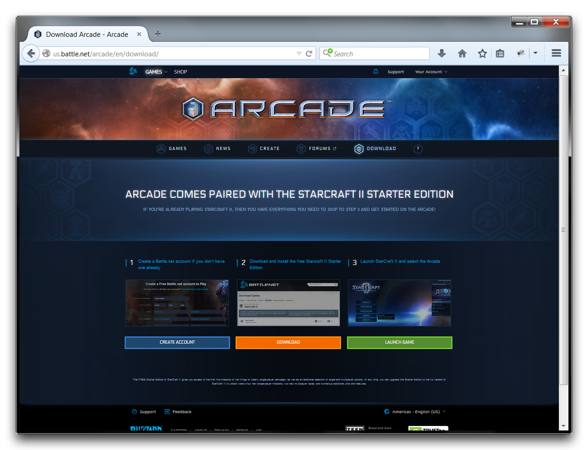
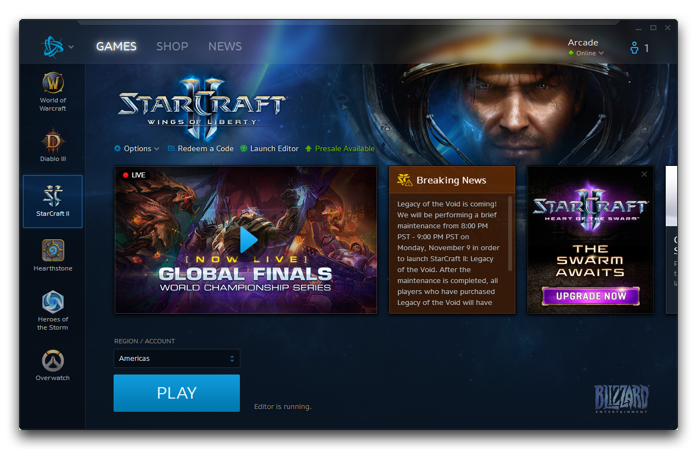
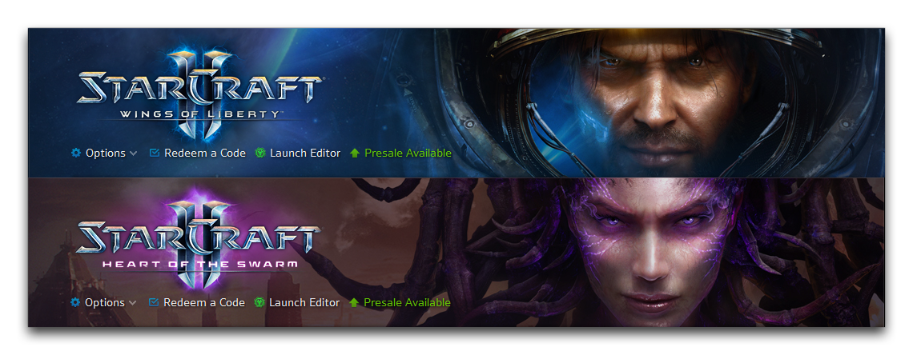
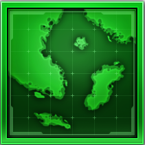
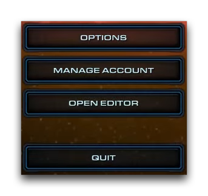
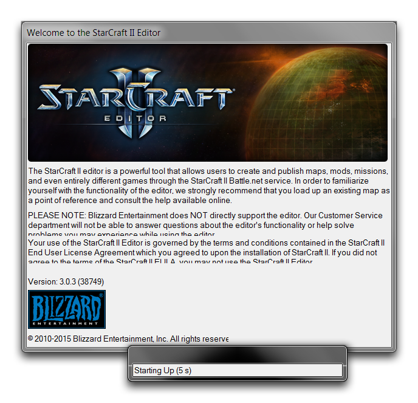

# 进入编辑器

编辑器随 StarCraft II 的所有版本捆绑提供，包括自由之翼、虫群之心和虚空遗迹。它也包含在免费的 StarCraft II 入门版中。您可以通过访问 us.battle.net/arcade/en/download 下载入门版，如下图所示。

下载客户端后，您可以通过 Battle.net 启动器访问编辑器。

您将在启动器中的标题链接下方找到“启动编辑器”按钮。下面的图像显示了启动器的两个版本中的外观。

您还可以在 StarCraft 安装文件夹和“开始”菜单链接中找到编辑器的本地链接。其图标如下所示。

您会发现打开任何本机的 .SC2Map 文件都会启动编辑器。它们的图标如下所示。

您还会发现 StarCraft II 登录界面左侧有一个选项卡，上面有一个名为“打开编辑器”的链接。该菜单如下图所示。

启动后，编辑器将显示其启动画面，同时加载。根据您的游戏设置和默认加载的地图集，这可能需要一些时间。启动画面如下图所示。

