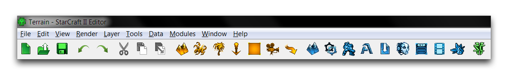
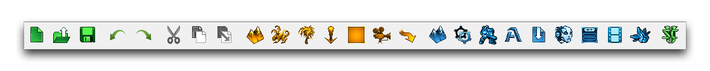
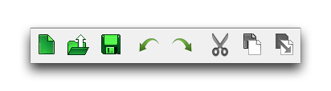
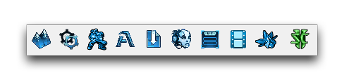
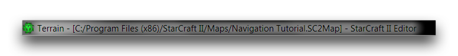
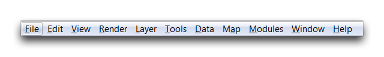
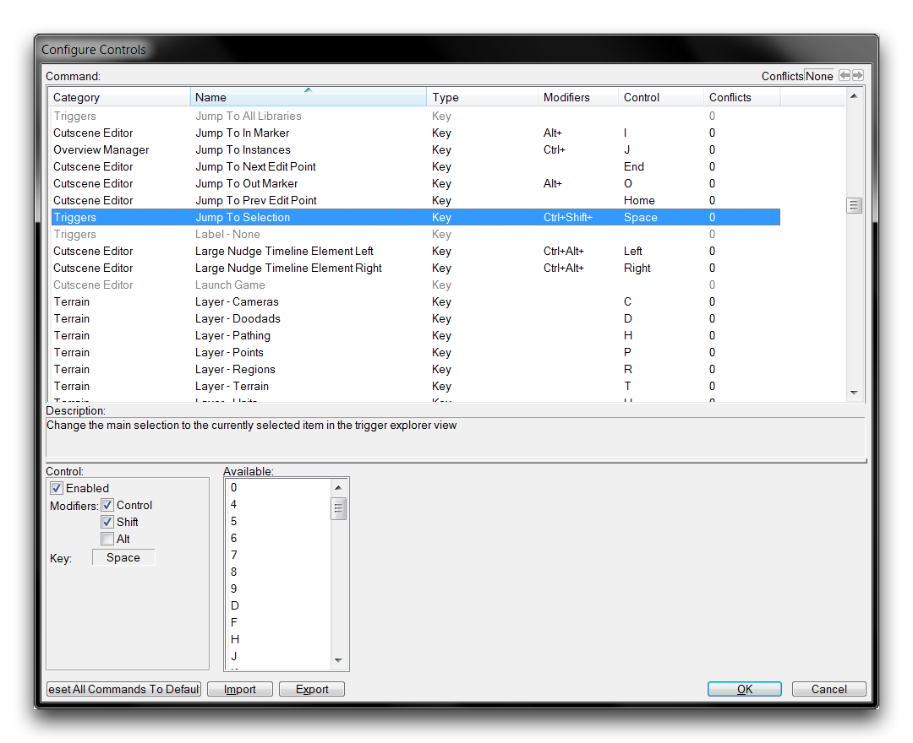

# 导航界面

编辑器分为八个不同的模块，每个模块展示游戏构建过程中的不同视图。这种分工在将开发过程的每个部分分开并理解时非常有用。然而，不同的视图数量意味着需要一些时间来理解导航整体环境和每个单独模块的基本规则。在下面，您将找到有关工具栏、视图和全局可用实用工具的快速描述。

如果您想了解每个模块特定界面的更多信息，您可以参考更深入介绍该模块的文章。

## 工具栏

在任何模块的顶部，您将找到一组选项卡和工具栏，它们将随着您在编辑器中的每个视图而变化。这些组件会根据您在编辑器中的视图不同而略有变化，为每个模块提供相关选项。从上到下，其主要组件有标题栏、文件栏和主工具栏。

主工具栏在整个编辑器中保持不变。尽管看起来像单一、实心的条形，但实际上由三个组件组成。其中两个组件，最左侧的实用工具栏和最右侧的导航栏是不变的，无论您在编辑器中的位置如何，它们的按钮都保持不变。工具栏的中间部分是针对当前模块的一个栏。这些包括地形栏、触发器栏、数据栏、AI 栏、UI 栏和剧情栏。导入器和文本编辑器没有具体的栏，但您会在概述管理器中找到一个概述栏。主工具栏如下图所示。

## 实用工具栏

实用工具栏提供了一些标准功能，这些功能对每个模块都是相关的。您可以通过其绿色按钮来识别此栏。下面您将找到该栏的图像以及其功能的细分。

| 按钮           | 功能                                                         |
| --------------- | ------------------------------------------------------------ |
| 新建 (Ctrl+N)  | 启动“新建文档”窗口，允许您创建新地图和修改。              |
| 打开 (Ctrl+O)  | 启动“打开文档”窗口，允许您打开本地文件或从战网下载文件。    |
| 保存 (Ctrl+S)  | 保存当前文件。                                               |
| 撤消 (Ctrl+Z)  | 撤销当前模块中所做的最后更改。                               |
| 重做 (Ctrl+Y)  | 重新应用使用撤消撤销的最后更改。                             |
| 剪切 (Ctrl+X)  | 删除当前选择并将其保存到剪贴板中。                           |
| 复制 (Ctrl+C)  | 复制当前选择并保存到剪贴板中。                              |
| 粘贴 (Ctrl+V)  | 将当前存储在剪贴板中的元素粘贴到位置。 对于剪切，这也将清除剪贴板。对于复制，剪贴板保留其选择。 |

请注意，这些操作是上下文敏感的，您可以根据您在编辑器中的当前模块使用它们。这意味着，如果您在触发器编辑器中，复制和粘贴将操作触发器、操作或事件等内容。同样，如果您在地形编辑器中，您可以复制和粘贴完全不同的元素，如单位或装饰物。

## 导航栏

**导航栏** 用于在各模块之间进行导航。您可以通过其蓝色按钮来识别它。下面您将找到该栏的图像以及其功能的描述。

| 功能                       | 效果                                                         |
| -------------------------- | ------------------------------------------------------------ |
| 地形编辑器 (F5)            | 进入地形编辑器。                                             |
| 触发器编辑器 (F6)          | 进入触发器编辑器。                                           |
| 数据编辑器 (F7)            | 进入数据编辑器。                                             |
| 文本编辑器 (F8)            | 进入文本编辑器。                                             |
| 导入器 (F9)                | 进入导入器。                                                 |
| AI 编辑器 (Shift+F5)       | 进入AI 编辑器。                                              |
| UI 编辑器 (Shift+F6)       | 进入UI 编辑器。                                              |
| 剧情编辑器 (Shift+F7)      | 进入剧情编辑器。                                             |
| 概述管理器 (F12)            | 进入概述管理器。                                             |
| 测试文档 (Ctrl+F9)         | 启动当前地图进行测试，如“首选项”中指定的那样。             |

这个栏是非常有用的“测试文档”功能的主要场所，您会经常使用它。您也可以使用它导航至概述管理器，它类似于对整个项目和每个模块进行鸟瞰。

## 其他栏

标题选项卡显示了编辑器中的当前位置，以及活动项目的当前位置和文件结构。下面显示了一个示例。

从战网访问文件时，文件结构将采用 \[战网：文件名\] 的形式。

文件栏也是您会找到许多选项卡的地方，这些选项卡涵盖项目各方面的选项。类似于主工具栏，不管您目前的位置如何，它都提供文件、编辑、视图、地图、模块、窗口和帮助选项卡。根据您在编辑器中的当前位置，还会发现其他一些上下文敏感的选项。

编辑器还提供一些上下文敏感的功能，只能在您目前位置可用和相关的位置使用。这些在描述编辑器中的主要位置、八个模块和概述管理器的文章中有更详细的讨论。

## 快捷键

编辑器支持广泛的快捷键，并允许完全定制其所有标准控件。您可以为几乎所有可用的功能设置快捷键，其中大部分没有默认快捷键。您可以通过导航至“文件” ▶︎ “配置控件”来访问快捷键控件。这将启动“配置控件”窗口，如下所示。

