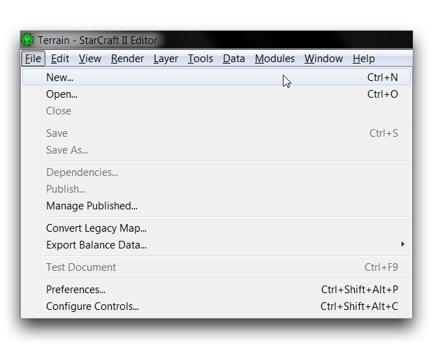
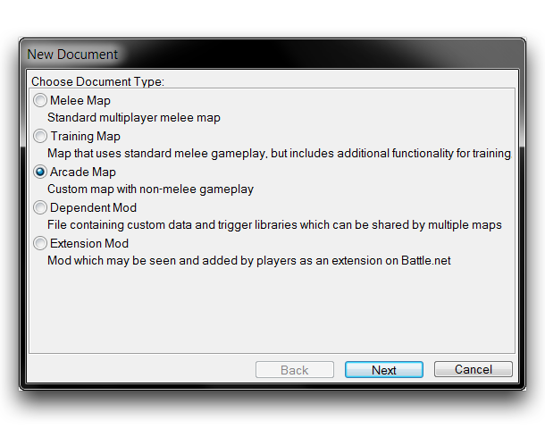
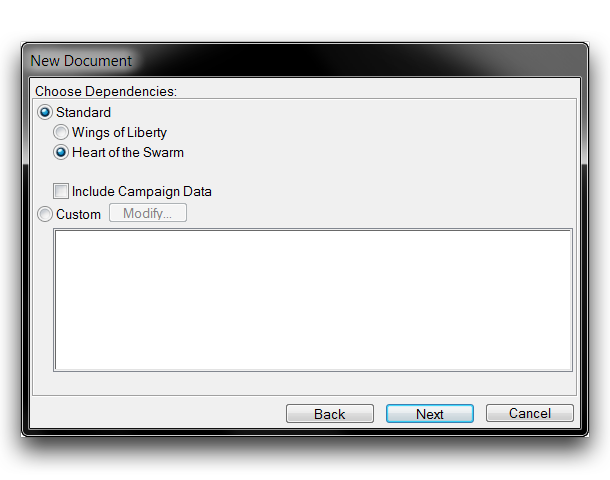
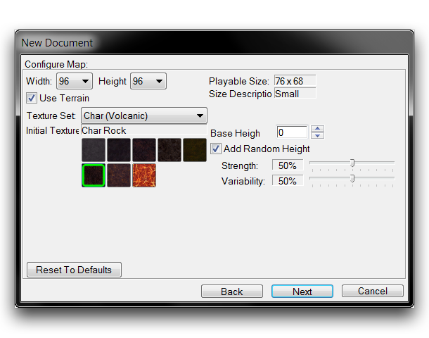
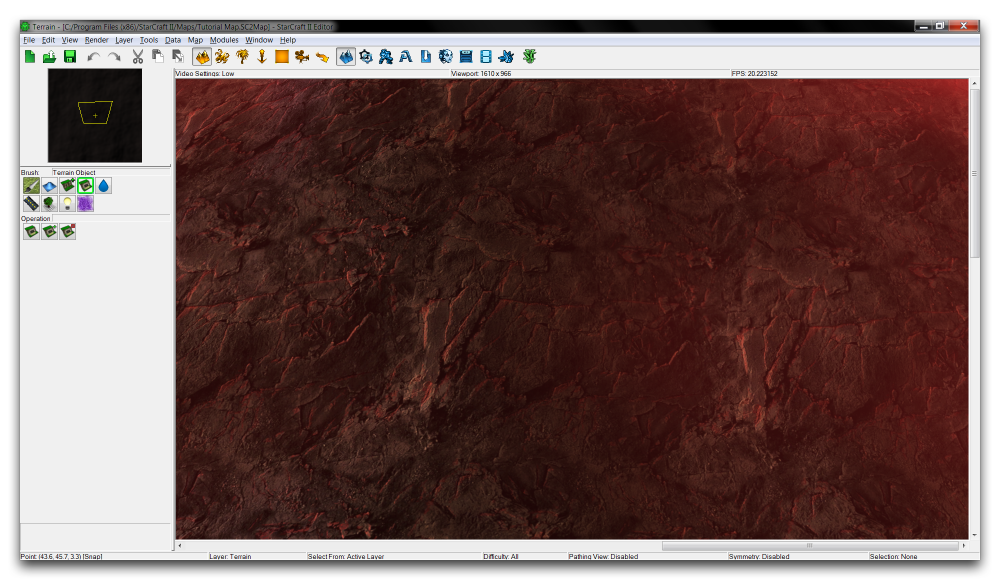

# 创建地图

任何项目的第一步都是创建一个新文档，可以是地图或模组。在创建文档时，您将看到一些选项，以帮助您快速配置项目。这些初始配置可以在编辑器内随后更改。

## 地图创建选项

启动编辑器后，导航到任何编辑器屏幕左上角的文件选项卡。

*文件菜单*

这将带您进入“新文档”窗口，在那里您可以选择要创建的文档类型。

*选择文档类型*

在这种情况下，通过单击左侧按钮选择“Arcade Map”，然后点击“下一步”继续。您将进入依赖项部分，如下图所示。

*选择依赖项*

依赖项描述了哪些模组文件将为项目提供资源。您始终可以通过导航到“自定义”标题，然后选择不选择任何内容来继续。这将提供一个完全空白的项目，没有模组文件依赖项。在本示例中，您将使用大量的星际争霸资源存档，通常被称为“标准依赖项”。使用标准依赖项是与编辑器一起工作的主要优势之一。

要导入最新版本的星际争霸资源，请选择“Swarm之心”标准依赖项，然后通过选择“下一步”继续。这将带您到地图配置部分，如下图所示。

## 地图配置

*示例生成选项*

地图配置屏幕是您将对地形初始外观做出一些基本决策的地方。每个选项的影响在下表中有所说明。

| 属性                      | 影响                                                                                                                                                                        |
| ------------------------ | ------------------------------------------------------------------------------------------------------------------------------------------------------------------------ |
| 尺寸 (宽 x 高)           | 设置地图的初始全尺寸。您可以稍后从地图边界选项更改此设置。尺寸范围为32至256单位，每次增加8单位。                                                                     |
| 可玩尺寸                | 地图上单位可以行进的实际区域，根据地图两侧的硬编码变量缓冲进行校正。在某些极小尺寸下，将避免此缓冲区。                                                                       |
| 尺寸描述                | 地图尺寸的基本描述。选项包括微小、小、中、巨大和史诗。                                                                                                                       |
| 使用地形                | 取消此选项将取消地形生成。尽管某些情况下可能需要一个无地形地图，但它在功能上类似于一个模组。                                                                              |
| 纹理设置                | 选择地图的“地形类型”，这是用于构建环境中地面的八种纹理的调色板。这也适用于淤泥视觉效果、悬崖类型、照明和大气音效设置。                                                              |
| 初始纹理                | 生成时，整个地形将被涂抹为此单一类型的地形设置。                                                                                                                           |
| 基本高度                | 所有地形都将以此默认高度生成。如果未选中“添加随机高度”选项，则地形将生成为平滑表面。                                                                                    |
| 添加随机高度            | 在基本高度中创建随机扭曲，扭曲的大小由强度和变化性选项滑块决定。这有助于产生更具自然基础的地形。                                                                           |

遵循上面我们所制定的“示例生成指南”图像中的准则，将使您得到一个看起来类似于下图的地图。这个地图已为启动项目做好准备。此时，通常明智地保存您的文件。

*新生成的岩石地图*