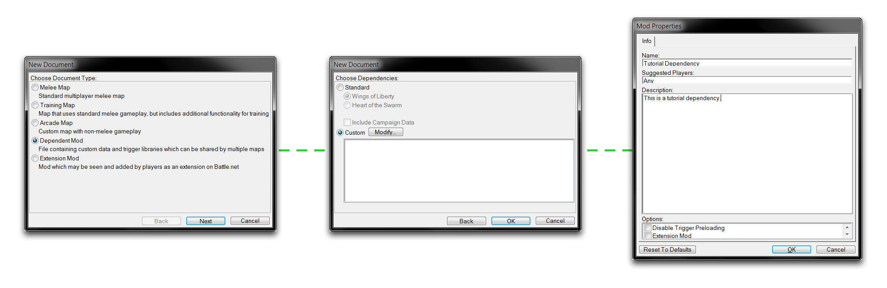
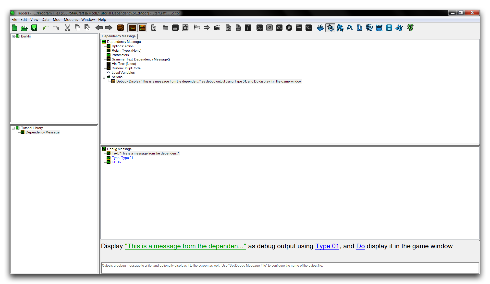
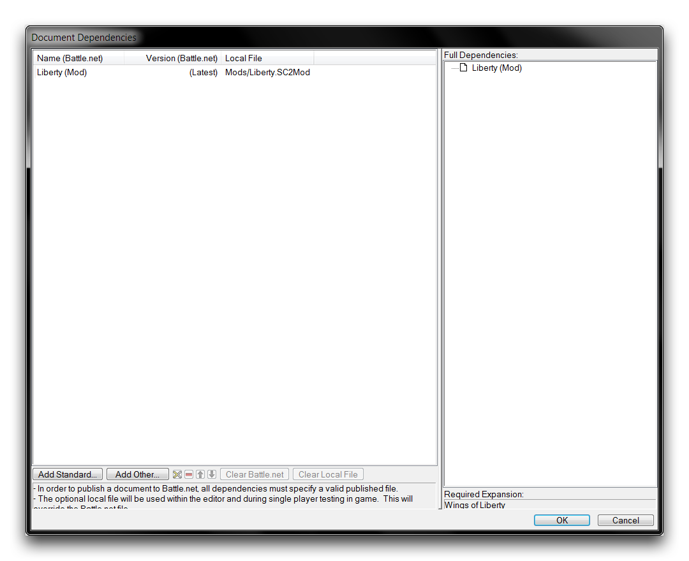
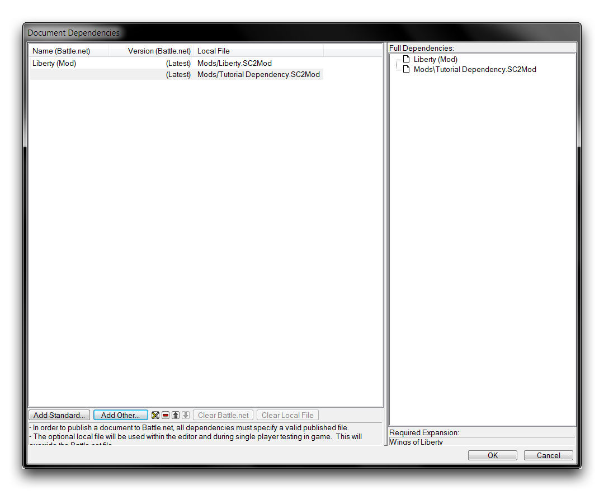
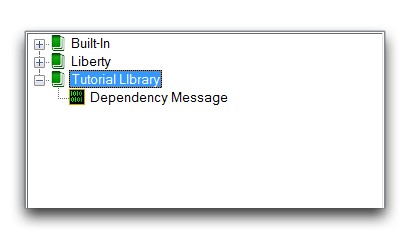
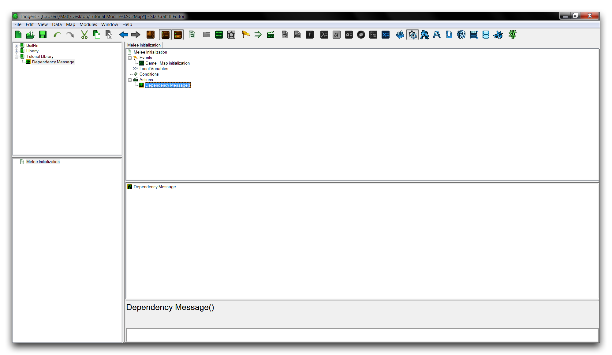
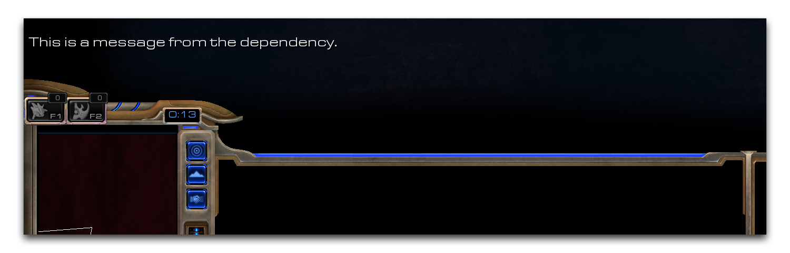

# 创建Mods

尽管地图文件始终是编辑器的最终产品，但mod文件才是任何项目的真正核心。通过将数据与构建的地图分离，mods允许开发和共享更自由的项目。这种关系超越了易用性。Mods将项目的可能性扩展到以前在暴雪编辑器中从未有过的程度。发现这一点的最佳方式是尝试编辑器构建、组合和利用mods的能力。

## 创建基本Mod

通过导航到 文件 ▶︎ 新建来创建一个新文档。这将启动“新建文档”窗口，在其中你应该选择创建一个“依赖Mod”。点击“下一步”进入“选择依赖项”标题，选择“自定义”，然后点击“确定”。现在使用地形模块导航到 Mod ▶︎ Mod信息，打开“Mod属性窗口”。在那里，输入标题“教程依赖项”到“名称”字段。你也可以输入一条描述，说明“这是一个教程依赖项”。使用下面的图像作为指南。

*Mod的创建与配置顺序*

你现在已经创建了一个简单的mod。'依赖Mod'是基本mod类型。它的名称源自于任何插入到mod中的地图都进入一种称为依赖关系的关系。当你在“选择依赖项”视图下选择了“自定义”并将其留空时，mod文件被设置为没有基础依赖项。一个空的mod是一个完全自定义项目的最佳起点。你的mod中唯一的信息是在最后一步中包含的几个细节。

将你的mod保存到首选位置，名称为“教程依赖项”。StarCraft为mods分配了.SC2Mod文件扩展名。

## 向Mod添加数据

mod的最终目的是成为资产的容器。通过向你的基本mod中添加一些触发器，你可以了解更多信息。请注意，一个mod文件将需要一个触发器库来保存其触发器。而对于地图文件来说，可以支持不在库中的触发器。

移至 **触发器模块**，在这里你将创建触发器库。右键单击 **触发器面板**，转到库 ▶︎ 新建库。新库将显示在列表面板中。将其重命名为教程库。现在通过选择触发器面板，转到新建 ▶︎ 新建动作定义，添加一个动作定义，将其命名为“依赖消息”。在这个动作定义中，通过动作 ▶︎ 调试消息添加一个新的动作。最后，将此动作的文本字段更改为“这是来自依赖关系的消息”。你应该看到类似下面的内容。

*Mod的触发器库*

## 使用Mod作为依赖项

既然你已经设置好mod文件，你需要创建一个新的地图文件来测试它作为依赖项。你可以通过导航到 文件 ▶︎ 新建 ▶︎ 休闲地图 来这样做。在地形屏幕上点击“恢复默认设置”，并将此地图保存为“教程Mod测试”。

要将一个mod作为这个地图的依赖项添加进去，请导航到 文件 ▶︎ 依赖项。根据默认地图配置，“Liberty (Mod)”标准依赖项已经被包含了。由于你想添加一个自定义mod，选择“添加其他”。

*添加依赖项视图*

这将启动一个“选择文档”窗口，可以访问存储在本地和Battle.net上的mod文件。在这种情况下，你已经将所需的mod文件保存在本地。使用提供的文件浏览器找到它，然后点击“确定”，之后你将被发送回依赖项选择屏幕。

*添加自定义依赖项*

通过点击“确定”完成添加依赖项，然后重新打开触发器模块。现在是一个很好的时机确保启用库显示，你可以通过查看 ▶︎ 显示库来做到这一点。你的自定义模式内的触发器资产现在应该可见并准备好使用。在顶部的列表面板中，你会看到标题为内置、Liberty和教程库的触发器库。

*从Mod导入的库*

通过将一个“依赖消息”动作添加到地图中的“混战初始化”触发器来测试依赖项的功能。右键点击“动作”标题下方，然后转到新建 ▶︎ 新建动作 ▶︎ 依赖消息。请注意，导入的动作定义将显示其来源为“教程库”，而不是Blizzard库中的“内置”或“Liberty”。然后，删除所有多余的默认混战动作。这将使你得到以下设置。

*使用的依赖项动作定义*

现在运行你的文档作为测试，应该会得到类似下面图像的结果。

*来自依赖库的输出*