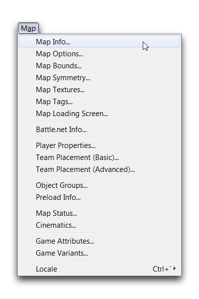
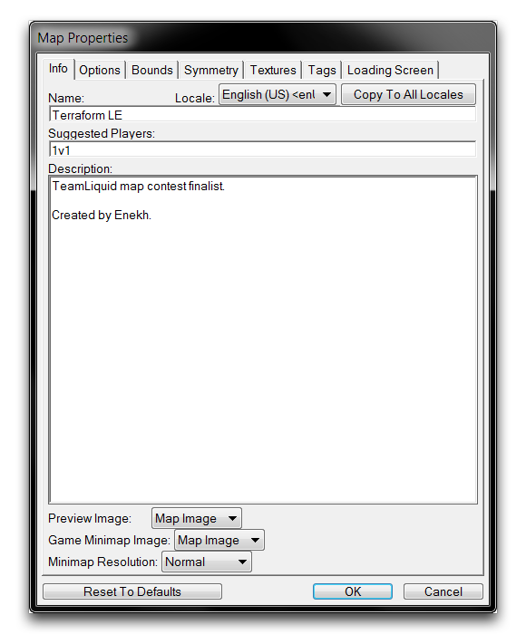
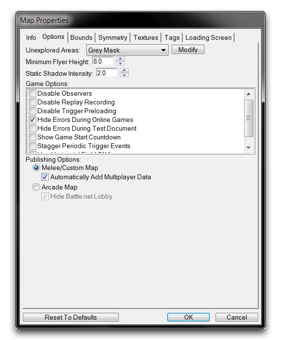
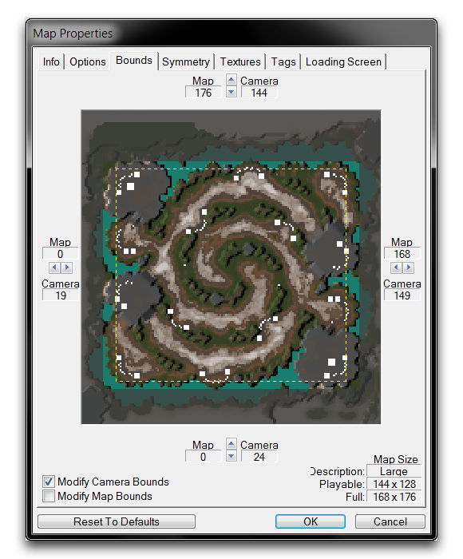

# 地图属性

地图属性影响各种设置，决定了从如何在战网上处理您的游戏大厅到“战争迷雾”行为。您可以通过地图 ▶︎ 地图信息，从任何编辑器模块导航到收集的地图属性。

*地图标签*

请注意，“地图属性”实际上指的是管理高级地图决策的八个选项卡的分组。访问地图选项卡下的任何八个选项卡标题将引导您到相同的“地图属性”窗口。这些选项卡在以下部分中进行了拆分。

### 地图信息

地图信息属性确定有关地图的后勤细节。

*信息标签*

<table>
<colgroup>
<col style="width: 10%" />
<col style="width: 89%" />
</colgroup>
<thead>
<tr class="header">
<th>属性</th>
<th>详细信息</th>
</tr>
</thead>
<tbody>
<tr class="odd">
<td>名称</td>
<td>地图名称，在战网、街机和发布屏幕等位置显示。</td>
</tr>
<tr class="even">
<td>建议玩家数</td>
<td>地图可能需要的玩家数量的内部注释。这与“游戏信息”和“地图信息”屏幕中发现的“建议玩家”值无关，这些值是从大厅信息自动生成的。</td>
</tr>
<tr class="odd">
<td>描述</td>
<td>用于描述地图内容的区域。这一部分经常用于作者署名或任何可能引起观众兴趣的一般消息。</td>
</tr>
<tr class="even">
<td>预览图像</td>
<td>此图像在多种情况下显示。</td>
</tr>
<tr class="odd">
<td></td>
<td><ul>
<li>作为街机“浏览”屏幕上的主缩略图。</li>
<li>在战网“自定义游戏”部分中突出显示游戏时。</li>
<li>在发布屏幕中。</li>
<li>作为默认地图设置下的地图预览屏幕。</li>
<li>在街机的“游戏信息”屏幕上，如果未选择任何屏幕截图。</li>
</ul></td>
</tr>
<tr class="even">
<td></td>
<td>可以设置为地图图像、自定义图像或隐藏。最后一个选项导致以上列表中的任何情况都没有图像显示。</td>
</tr>
<tr class="odd">
<td>游戏迷你地图图像</td>
<td>确定迷你地图将使用的图像。选项包括地图图像或自定义图像。传统上应该是地图图像，但为非传统游戏提供了这个选项。</td>
</tr>
<tr class="even">
<td>迷你地图分辨率</td>
<td>确定迷你地图的质量级别如下：普通：256 x 248，高：512 x 496，超高：1024 x 992。</td>
</tr>
<tr class="odd">
<td>区域</td>
<td>选择输入信息的地区版本。您还会注意到一个“复制到所有区域”的按钮，它将当前视图中的信息移到所有其他现有地区。</td>
</tr>
</tbody>
</table>

## 地图选项

地图选项是一个游戏性和视觉定向选项的收集，用于改变游戏。这里还有一些后勤选项，可以影响地图创建过程中的决策。

*选项标签*

| 属性                  | 详细信息                                                                                                                                                                                                                                                                                                                                 |
| ---------------------- | --------------------------------------------------------------------------------------------------------------------------------------------------------------------------------------------------------------------------------------------------------------------------------------------------------------------------------------- |
| 未探索区域类型        | 设置地图使用的“战争迷雾”类型。选项包括灰色蒙版、黑色蒙版和黑色蒙版（减小半径）。此外，“修改”选项卡将指引您到数据模块，以便更高程度的自定义。                                                                                                                                                                                    |
| 最小飞行高度          | 设置飞行单位将下降到的最小高度。                                                                                                                                                                                                                                                                                                         |
| 静态阴影强度          | 设置静态映射阴影的不透明度，供低图形使用。                                                                                                                                                                                                                                                                                                |
| “游戏选项”标志       | 禁用观察者：阻止在线比赛中的观察者。 禁用重放记录：关闭地图会话中的重放存档。 禁用触发器预加载：任何在触发器中明确引用的数据都有资格进行预加载，以在牺牲触发器加载时间的情况下减少初始加载时间。 在线游戏期间隐藏错误：防止在战网上显示任何地图调试或错误消息。 测试文档期间隐藏错误：防止在使用“测试文档”功能期间显示任何地图调试或错误消息。 显示游戏开始倒计时：在地图加载后启用动画倒计时。 分时触发器事件：自动间隔周期触发器，以优化性能并避免触发器排队。 使用水平视场：将游戏从默认的垂直视场转换为水平视场。对于自定义项目（如第一或第三人称射击游戏）很有用。 |
|                      |                                                                                                                                                                                                                                                                                                                                           |
| 发布选项              | 将地图类别设置为对战/自定义地图或街机地图。此区分确定地图是否在战网的“自定义游戏”或街机部分中可用。“自动添加多人游戏数据”允许对对战/自定义地图在游戏启动时添加所需的多人游戏依赖项。“隐藏战网大厅”允许街机地图用户在等待游戏开始时最小化大厅。 |

## 地图边界

地图边界允许动态调整地图内可玩区域和摄像机区域的尺寸限制。地图两侧的箭头按钮允许沿特定轴进行调整。

*边界标签*

| 属性                   | 详细信息                                                                                          |
| ---------------------- | ------------------------------------------------------------------------------------------------ |
| 修改摄像机边界        | 锁定或解锁摄像机区域大小调整的效果。                                                              |
| 修改地图边界          | 锁定或解锁对可玩地图区域大小调整的效果。                                                          |
| 恢复为默认值          | 将所有配置的边界更改为它们的默认设置。                                                          |
| (地图尺寸) 描述       | 地图尺寸的基本生成描述。选项包括：微型、小型、中型、巨大和史诗。                                |
| 可玩区域尺寸         | 当前地图的尺寸，减去地图周围无法游玩的缓冲区域。                                                |
| 完整地图尺寸         | 当前地图的尺寸，包括缓冲区域。                                                                  |