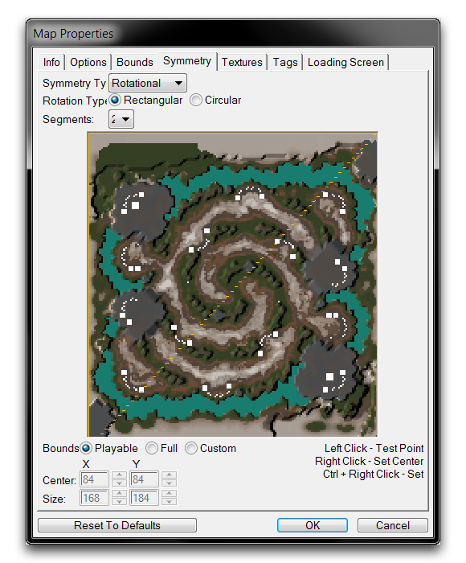
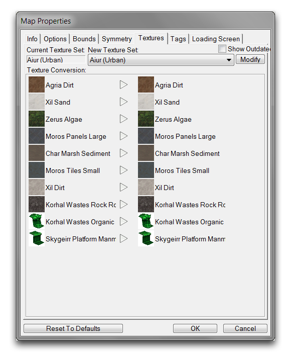
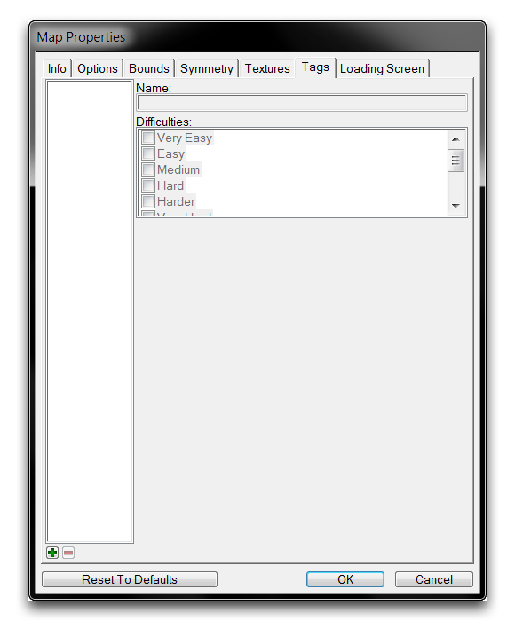
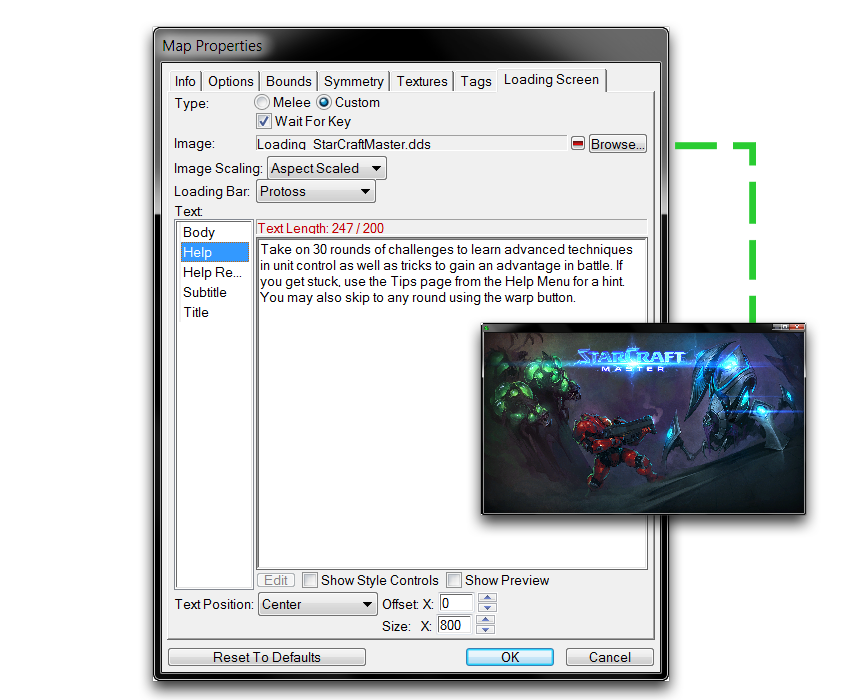

## 地图对称性

*对称性选项卡*

地图对称性用于在地图中设置对称性控制。在地形生成中，对称性通常是竞技地图的必要特性，有助于提高游戏竞争性。

## 地图纹理

*纹理选项卡*

每个地图使用特定的纹理集类型，这是一个包含八种用于绘制地图地面的纹理的调色板。您可以在"地图纹理"选项卡中选择这些调色板使用。注意，悬崖风格也是这个调色板的一部分，可能会在此处进行配置。

## 地图标签

地图标签用于创建用于组织地形对象的难度标签，例如单位、装饰物、区域和点，允许您在以后查看时对其进行筛选。

*标签选项卡*

## 地图加载画面

"地图加载画面"选项卡允许您配置在地图加载时显示给玩家的引导画面。

*加载画面选项卡*