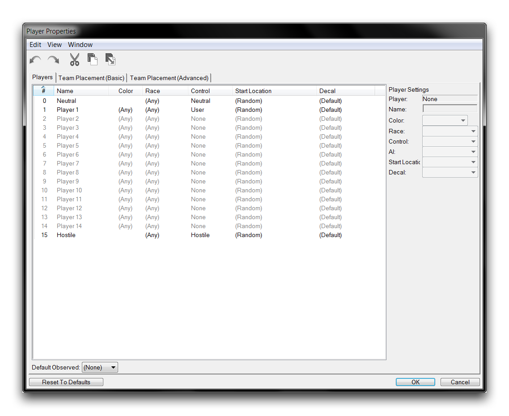
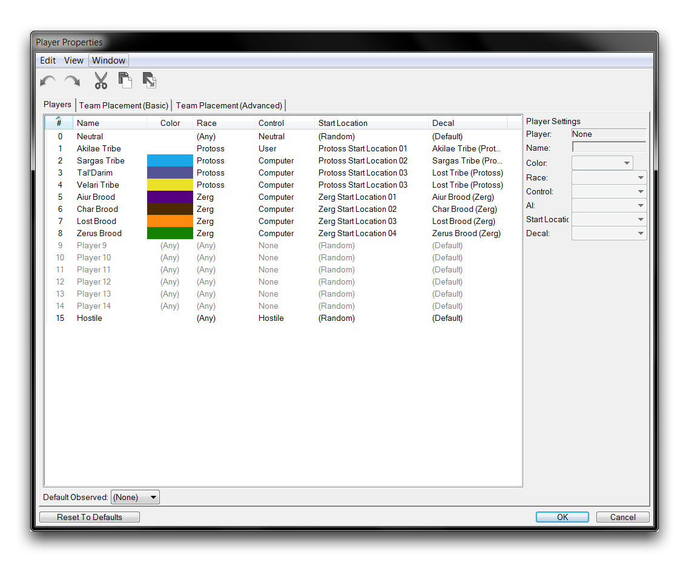

# 玩家属性

玩家属性是设置游戏中许多基本选项的地方。您可以通过从编辑器的任何模块导航到地图▶︎玩家属性来找到它们。这将启动下方显示的窗口。

*玩家属性窗口*

## 玩家属性字段

玩家属性涉及控制、起始位置、种族和颜色等问题。在这方面，它类似于典型的战网大厅。更改这些属性将影响在线游戏时游戏大厅的外观。然而，这些选项进一步延伸，因为它们还控制与非传统游戏相关的全局属性。

以下表格详细列出了玩家属性中的选项以及每个选项的描述。

| 操作            | 效果                                                                                                                                                                                                                                                                                                                                                                                                                                                                                                                                                      |
| -------------- | ------------------------------------------------------------------------------------------------------------------------------------------------------------------------------------------------------------------------------------------------------------------------------------------------------------------------------------------------------------------------------------------------------------------------------------------------------------------------------------------------------ |
| \#             | 用于排序和引用玩家的编号。                                                                                                                                                                                                                                                                                                                                                                                                                                                                                                                                       |
| 名称           | 一个多功能的ID。通常在突出显示由该玩家拥有的单位时显示，但也可以在其他方面使用。在在线游戏中，玩家的战网ID总是显示为名称属性。由Hostile或Neutral控制的玩家拥有的单位不显示名称。                                                                                                                                                                                                                                                                                                                          |
| 颜色           | 确定玩家的队伍颜色。如果设置，这在游戏大厅中是不可更改的。与近乎游戏玩法不同，多个玩家可以被分配相同的队伍颜色。总共有16种颜色选项，设置为(Any)将允许玩家从大厅中选择他们的颜色。                                                                                                                                                                                                                                                                                                      |
| 种族           | 确定玩家从选项Protoss、Terran、Zerg、Neutral或(Any)中选择的种族。选择Neutral将使玩家的种族随机，而设置为(Any)将允许玩家从大厅选择他们的种族。                                                                                                                                                                                                                                                                                                                                         |
| 控制           | 确定每个玩家插槽的控制器。用户为人类玩家创建一个插槽，在游戏的大厅中添加一个开放插槽，可由人类玩家或由AI控制的计算机填充。None将玩家插槽设置为无玩家。这是默认值。计算机创建一个由游戏默认AI控制的玩家。 Neutral创建一个由所有其他玩家具有中立联盟设置的计算机控制玩家。 Hostile创建一个由所有其他玩家具有敌对联盟设置的计算机控制玩家。 |
| 起始位置       | 通过“为每个玩家创建近战起始单位”操作来确定默认单位的创建位置。在所有其他地图类型中，除非另有说明，否则将控制玩家的相机起始位置。                                                                                                                                                                                                                                                                                                                                                                   |
| 徽章           | 设置用于支持徽章的玩家单位的默认徽章。                                                                                                                                                                                                                                                                                                                                                                                                                                                                                                                         |
| 默认观察者     | 在没有查看特定玩家视角时，确定观察者玩家的相机设置。                                                                                                                                                                                                                                                                                                                                                                                                                                                                                                           |

请注意，尽管有16个玩家插槽，但星际争霸II仅支持最多15名人类玩家。至少必须将一个插槽设置为Neutral、Hostile或None。这包括正在观看在线比赛的玩家。

## 玩家自定义

在近战地图中，仅通过玩家属性就可以用于自定义场景。请看下方如何创建一个简单的Protoss对抗Zerg主题地图的方法。

*自定义游戏玩家属性*

## 附件

 * [009_Player_Properties_Completed.SC2Map](./maps/009_Player_Properties_Completed.SC2Map)
 * [009_Player_Properties_Start.SC2Map](./maps/009_Player_Properties_Start.SC2Map)