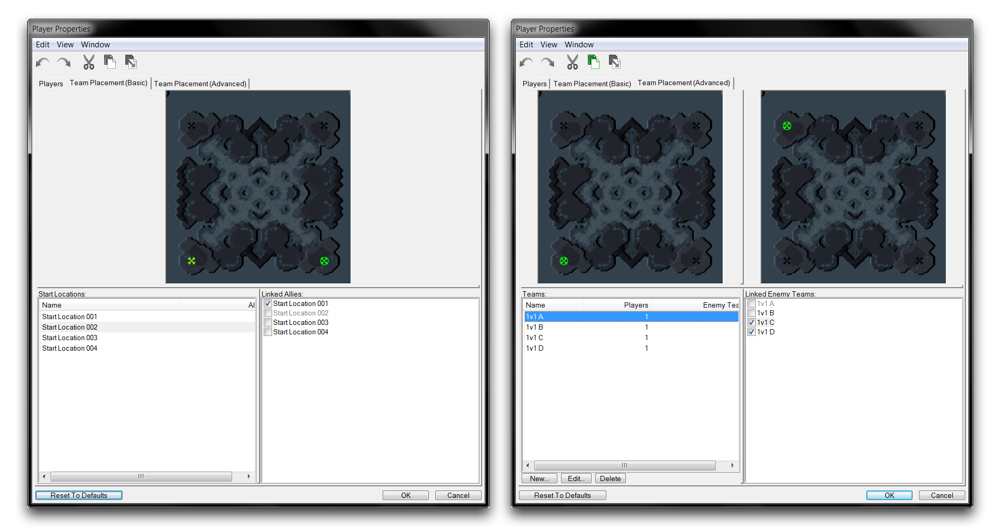
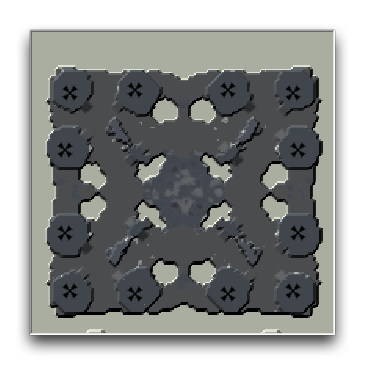
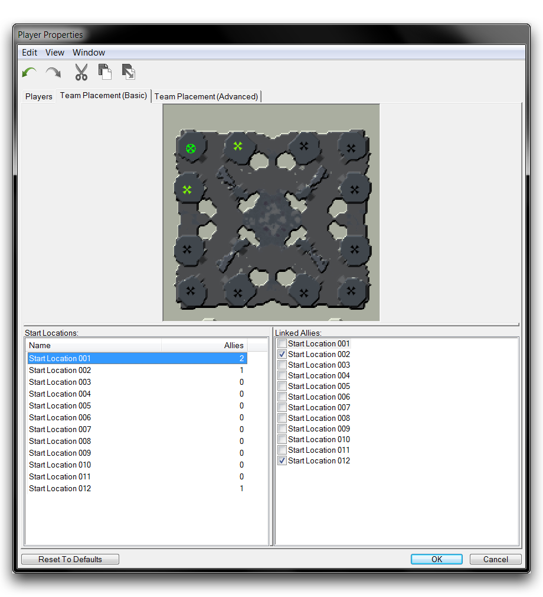
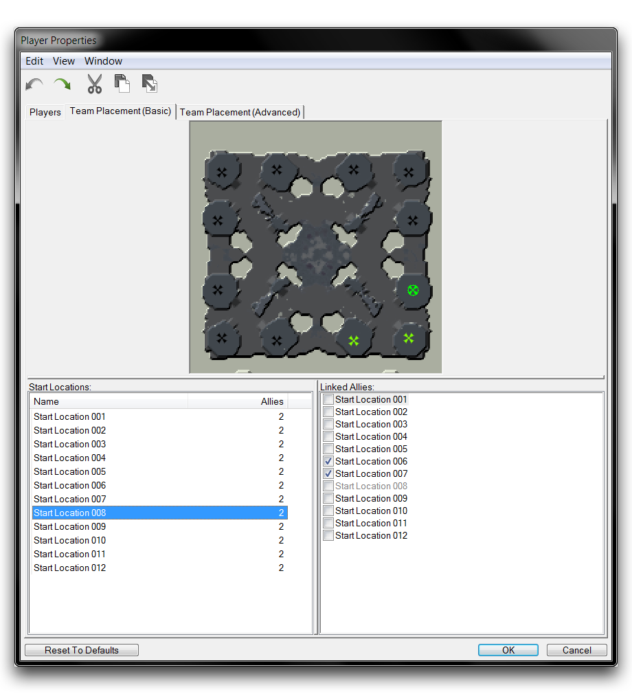
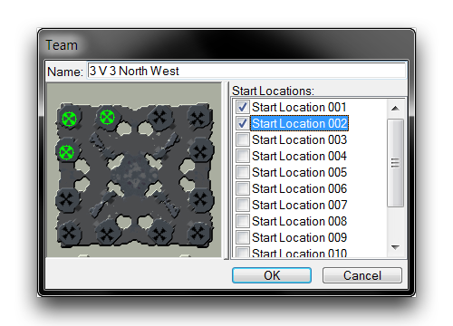
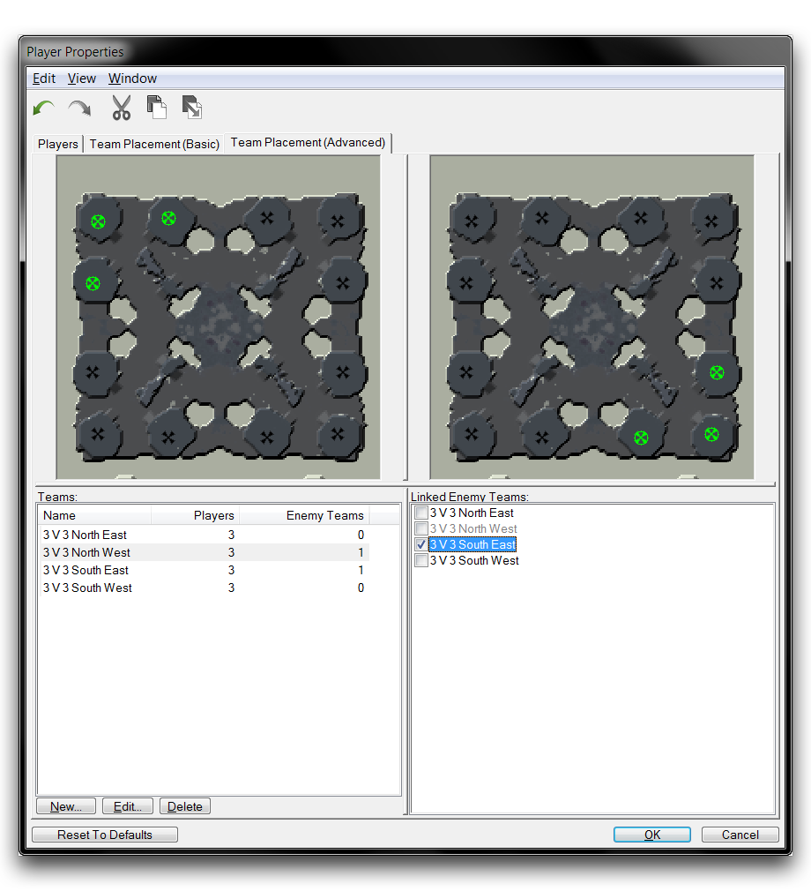
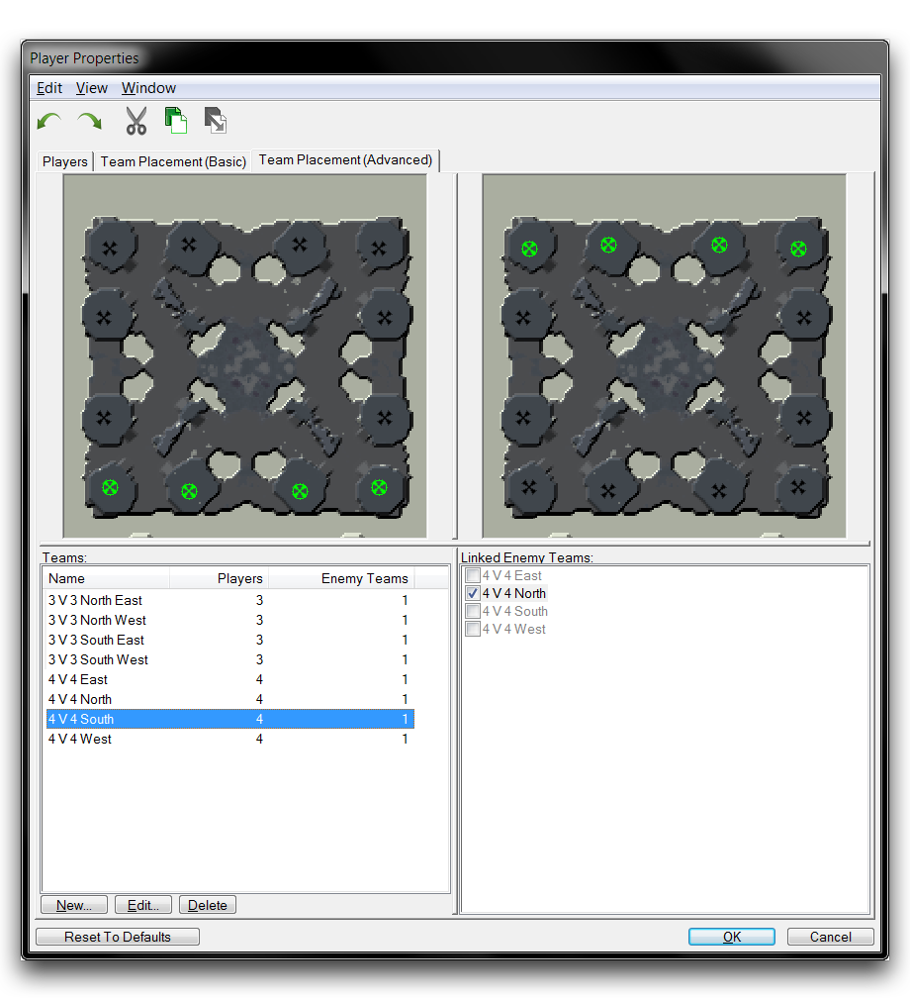

# 队伍安置

Team Placement 提供了一组控件，用于组织玩家的生成点。这种组织从“起始位置”点开始，您可以使用 Terrain Module 放置这些点。这些点表示玩家可能生成的所有可能位置，但它们只是标记。在特定情况下，没有逻辑决定哪些玩家可以生成到这些点上。相反，这种逻辑是在 Team Placement 中设置的，其中位置被分组成特定的安排，确定团队如何以及在哪里生成。

尽管该系统最初是为近战地图而建立的，但在处理非传统游戏时仍然很有用。通过使用起始位置将玩家分组并控制团队生成相对于敌人的位置，可以用于任何地图类型，尽管在近战游戏之外的场景中可能用途有限。

基本队伍安置（Team Placement (Basic)）和高级队伍安置（Team Placement (Advanced)）是玩家属性的子类，并可以在玩家属性选项卡下找到。否则，您可以通过导航至地图 ▶︎ Team Placement (Basic) 或 地图 ▶︎ Team Placement (Advanced)来找到 Team Placement。

*队伍安置视图*

在本文旁边，您会找到一个示范地图。这张地图包含了大约12个起始位置，这些位置大致均匀地分布在一个正方形的边缘周围，允许进行许多合理的团队生成安排。

*示范地图迷你地图*

## 基本队伍安置

通过导航至地图 ▶︎ Team Placement (Basic) 打开基本队伍安置。除了当前项目的迷你地图外，您还会看到地图上每个起始位置的列表。您可以通过选择每个起始位置并将它们连接到潜在的盟友来确定队伍。对于基本队伍安置，您必须使用游戏变体或触发器来激活游戏中的这些队伍。

## 演示基本队伍创建

您可以通过选择起始位置子视图下的一个起始位置，然后选择链接盟友子视图下另一个起始位置的复选框来创建队伍链接。使用示范地图，在地图的西北角选择起始位置 001，然后点击其两个最近的相邻起始位置 Start Location 002 和 Start Location 012 的复选框。当您将盟友添加到一个队伍时，他们的起始位置将变为绿色。完成这一步应该得到以下结果。

*基本队伍设置*

每个起始位置旁边的盟友字段将显示连接到每个起始位置的盟友数量。通常情况下，对于近战地图，您希望每个起始位置都有相同数量的盟友，这将展示对称排列选项的数量。继续链接起始位置，连接剩余三个角落的起始位置到各自的相邻位置。完成后的地图应如下图所示。请注意，每个潜在的团队安排都有相同数量的盟友。

*完全配置的队伍安置*

## 高级队伍安置

通过导航至地图 ▶︎ Team Placement (Advanced) 打开高级队伍安置。在迷你地图视图旁边，您将找到“团队”和“已链接敌方团队”的列表。团队类别使您可以像在基本队伍安置中那样排列团队，然后与敌对团队配置配对。与基本队伍安置不同，这是一个最终选项，处理团队构建和可能的敌对团队安排的选择。完成后，游戏可以被暂时设置在“游戏变体”中，然后完全准备好进行游戏。

## 演示高级队伍创建

点击“团队”子视图下方的“New”按钮即可添加一个团队。您将进入下图所示的窗口。

*团队创建弹出窗口*

在这里，您可以通过选择组的起始位置来构建团队。在本例中，选择“Start Location 001”，“Start Location 002”和“Start Location 012”来创建一个位于地图西北角的团队。命名为“3 V 3 North West”。使用类似的命名约定为地图的每个角落重复此过程。您现在应该总共有四个团队。请注意，每当添加一个团队时，它都会作为“已链接敌方团队”变为可用。

现在，您可以将两个团队作为敌人链接起来。选择一个团队，以“3 V 3 North West”为例，然后从“已链接敌方团队”子视图中选择您希望成为可能的敌对团队安排的团队。结果应如下图所示。

*作为敌人配置的团队安排*

该系统支持任意规模的团队，但是这些团队应该与规模相同的对手组配对。还值得注意的是，团队之间不能共享任何起始位置。尽管如此，在此处支持许多可能的配置。下面您将找到另一种可能的安排。

*进一步的团队安排可能性*

最后，您应该了解高级队伍安置比基本队伍安置更强大。因此，如果在地图中同时配置了这两个区域，则高级队伍安置将优先。

## 附件

* [010_Team_Placement_Completed.SC2Map](./maps/010_Team_Placement_Completed.SC2Map)
* [010_Team_Placement_Start.SC2Map](./maps/010_Team_Placement_Start.SC2Map)