# Battle.Net 信息

Battle.net 信息是自定义展示地图在街机模式下的中心。

## 常规

[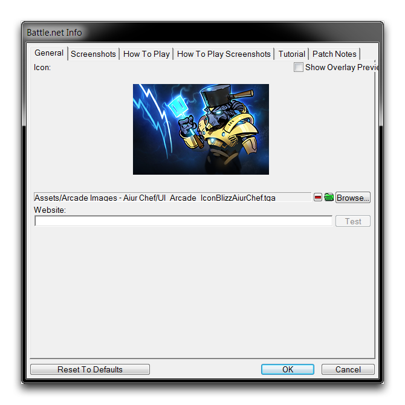](./resources/011_BattleNet_Info01.png)
*常规选项卡*

在常规选项卡下设置了项目的图标和关联的网站。网站将追加到游戏详细信息的底部，并可以提供到社区网站的超链接。项目的图标经常在街机中用作项目的主要表示。这包括浏览屏幕、正在进行的游戏列表和许多其他位置。在下图中，您可以看到在概览屏幕上游戏标题旁边的图标。

[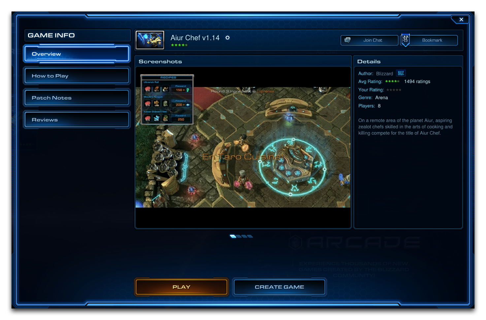](./resources/011_BattleNet_Info02.png)
*街机概览屏幕*

## 屏幕截图

屏幕截图选项卡允许您选择五个宣传截图发布到项目的概览屏幕。

[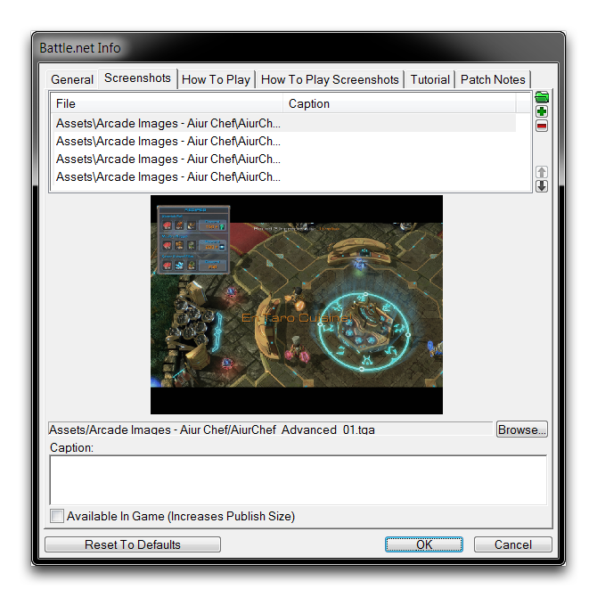](./resources/011_BattleNet_Info03.png)
*屏幕截图选项卡*

屏幕截图可以通过存档浏览器或本地计算机上传。每张截图必须具有 800x600 像素的分辨率。如果您的屏幕截图超过默认分辨率，您将被提示裁剪源图像到所需大小。选中“游戏内可用”选项将单独将该屏幕截图添加到游戏数据中（以发布大小为代价）。添加后，您的屏幕截图将用于填充“概览”屏幕上的“屏幕截图”轮换，如下图所示。

[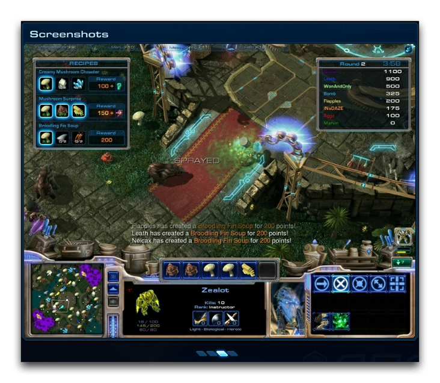](./resources/011_BattleNet_Info04.png)
*概览屏幕中的屏幕截图*

## 游戏玩法

您可以在“游戏玩法”选项卡下添加详细的玩法说明。街机中的玩家将在“游戏玩法”屏幕上看到这些详情。玩家通常会在地图加载或在大厅空置时查看此屏幕。这为您提供了在加载屏幕之前传达一些战略或游戏信息的机会。您可以查看下图中如何构建您的“游戏玩法”部分。

[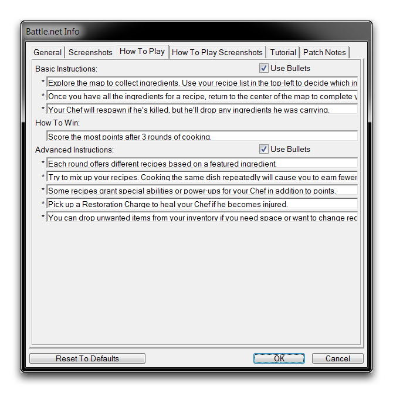](./resources/011_BattleNet_Info05.png)
*游戏玩法选项卡*

填写基本说明、如何获胜和高级说明字段将填充它们在“游戏玩法”屏幕上对应的部分。“使用项目符号”选项，您的玩法说明在街机上保持相同的项目符号外观。您可以在以下图像中看到街机中这些描述的外观。

. [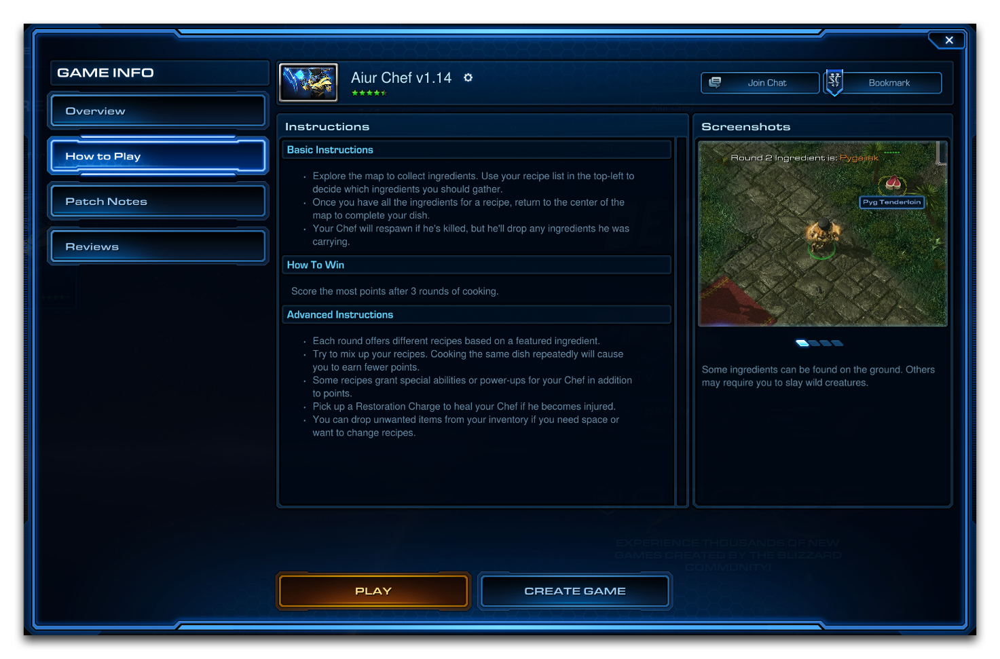](./resources/011_BattleNet_Info06.png)

街机游戏玩法屏幕

## 游戏玩法截图

“游戏玩法截图”选项卡的功能与“屏幕截图”选项卡相同，用于向项目的街机页面的“游戏玩法”部分添加高达五张截图。

[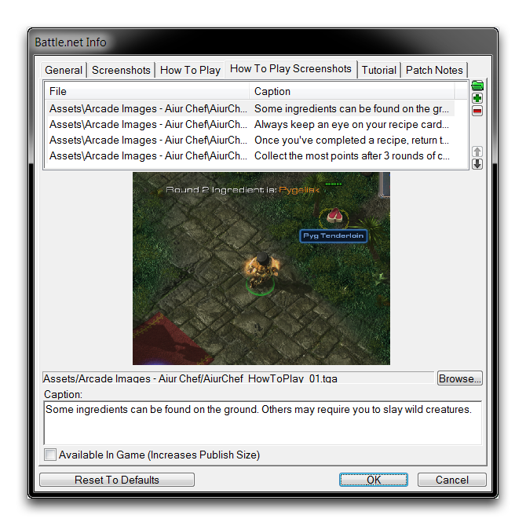](./resources/011_BattleNet_Info07.png)
*游戏玩法截图选项卡*

截图应调整为 800x600 像素，您可以为每张截图添加说明以帮助增加上下文。一旦添加，这些截图将用于填充“游戏玩法”屏幕最右侧的部分，如下图所示。

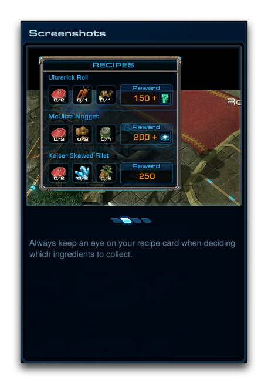
*街机游戏玩法屏幕中的游戏玩法截图*

## 教程

“教程”选项卡可用于设置项目的指导教程地图。设置后，玩家可以通过“概览”屏幕上的“播放教程”按钮单独访问此地图。教程地图可用于让玩家在主地图所需的基本技能上获得一个安全、无风险的学习空间。玩家将被提供播放教程地图的选项，如下图所示。

[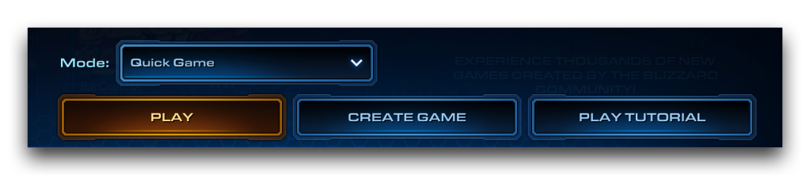](./resources/011_BattleNet_Info09.png)
*概览屏幕上的播放教程按钮*

“教程”选项卡本身如下所示。

[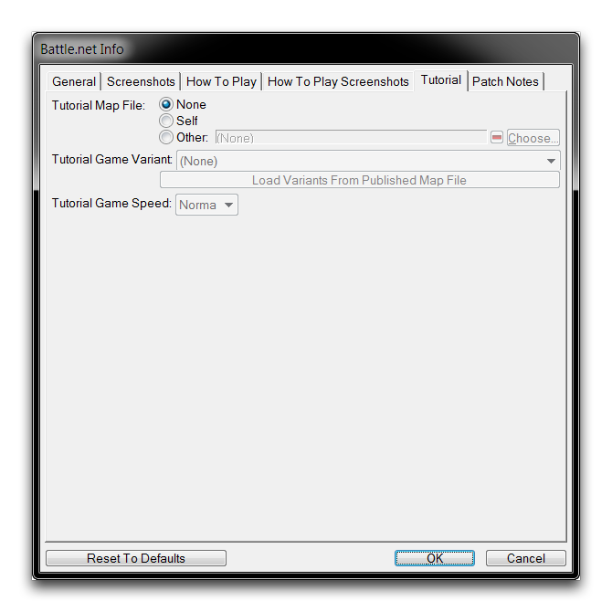](./resources/011_BattleNet_Info10.png)
*教程选项卡*

教程地图通过“教程地图文件”进行关联。有三个选择：选择“自定义”将提供教程作为当前地图的教程游戏变体。选择“其他”允许您定义另一个地图文件，可以保存在本地或在 Battle.net 上，以用作教程。或者，您可以选择“无”，这将从“概览”屏幕上移除“播放教程”按钮。

“教程游戏速度”选项允许您在不影响主地图的情况下设置教程地图的游戏速度。

## 补丁说明

“补丁说明”选项卡允许您为项目的每个版本添加补丁说明。这些说明将公开显示在街机的“补丁说明”屏幕上。用户可以使用此页面跟踪任何重要更新和平衡更改，以及查看地图是否仍在维护中。

[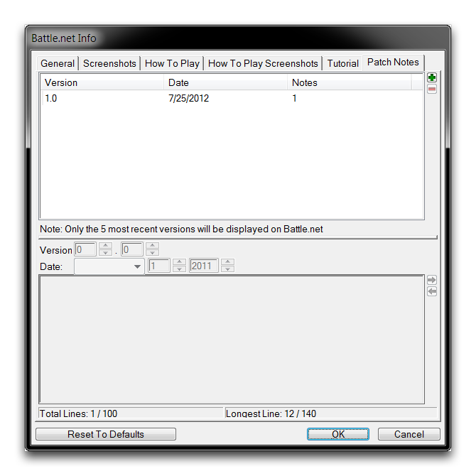](./resources/011_BattleNet_Info11.png)
*补丁说明选项卡*

每个“补丁说明”条目包含版本、日期和一组说明。补丁永远根据其版本号显示，最新补丁位于顶部。每组说明最多可以有 100 行，而单行长度不能超过 140 个字符。您可以手动设置版本和日期，并且无需匹配街机发布系统生成的值。

[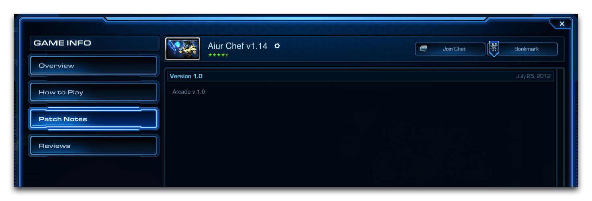](./resources/011_BattleNet_Info12.png)
*街机补丁说明屏幕*