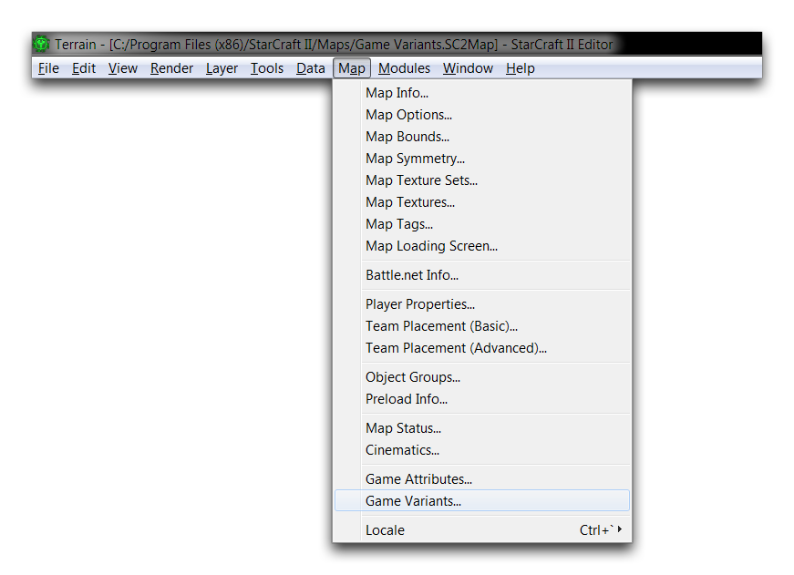
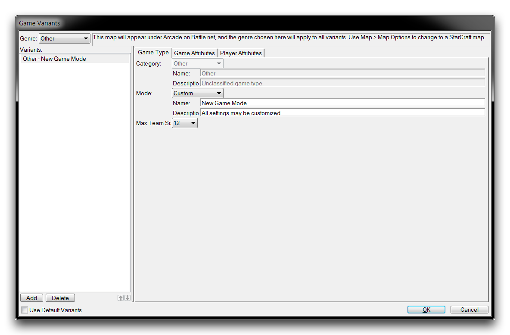
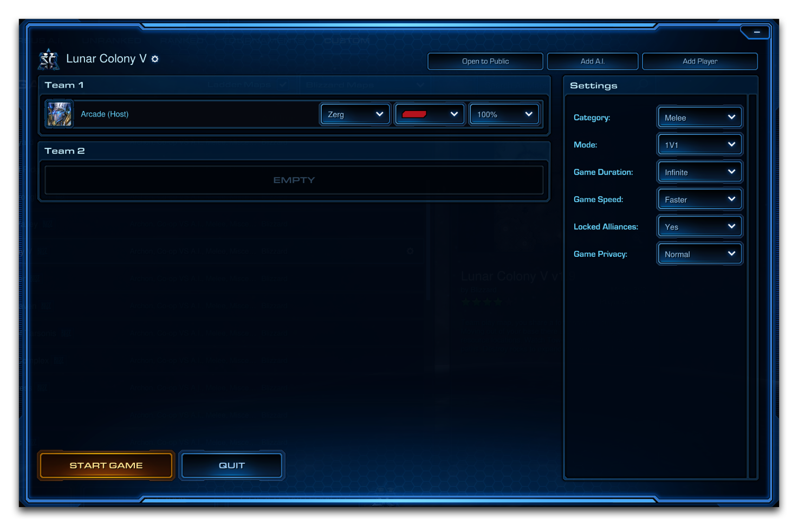
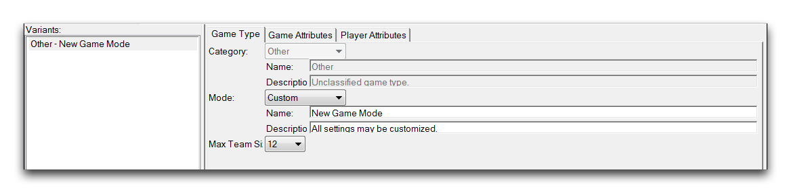
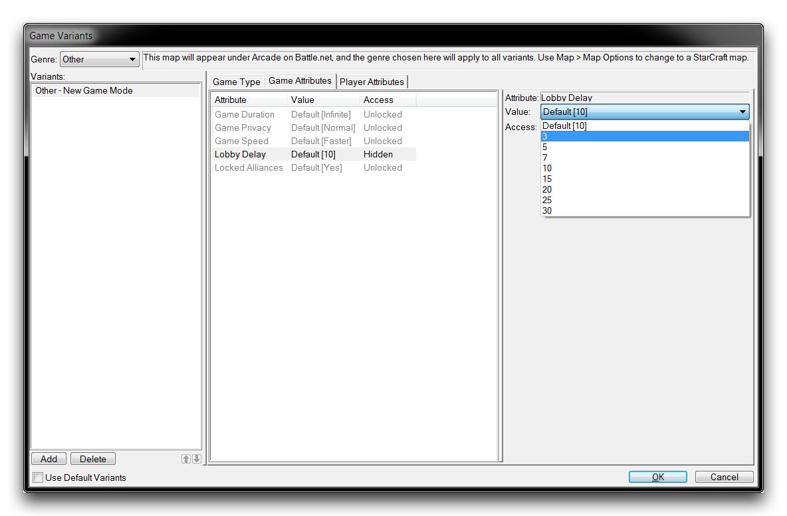
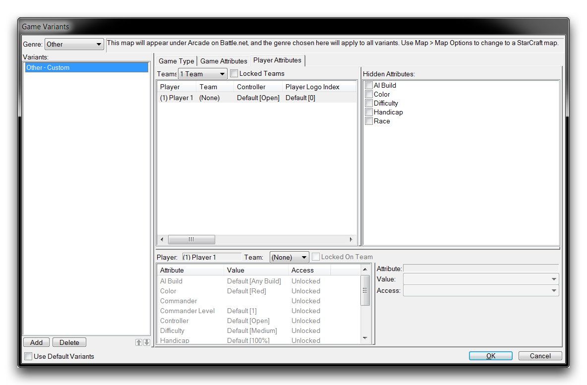

# 游戏变体

设置游戏变体允许开发人员指定地图上的战网大厅中玩家可用的选项。与游戏属性一起，游戏变体控制您的项目可能呈现的不同模式的区别。这些变体只能在地图文档中设置，而不能在mod文件中设置。通过从编辑器中的任何位置导航到地图▶︎游戏变体来配置它们。您可以在下面的图像中看到位置。

*导航至游戏变体*

一旦选择了游戏变体，您将看到以下窗口。

*游戏变体窗口*

请注意左侧边栏，标题为“变体”。此列表详细说明了游戏可用的所有模式，无论您选择哪个选项卡视图，它都会保持活动状态。您可以通过在此侧栏中右键单击并选择“添加”或“添加标准”来创建新变体。

如果您正在开展新项目，在开始编辑变体之前，您需要取消选择底部左侧角的“使用默认变体”选项以退出默认设置。从侧边栏中选择一个变体将允许您在三个选项卡中更改其设置：游戏类型、游戏属性和玩家属性。这些选项卡中的设置稍后将在本文中详细介绍。

## 变体 - 大厅视图

游戏变体用于定义街机大厅主机可用的选项。这些选项可通过典型大厅的“设置”面板访问，如下图所示。

*默认大厅*

## 游戏类型

*游戏类型选项卡*

变体的基本设置在游戏类型选项卡中确定。模式定义了通常被认为是变体的内容，而类别则提供了排序选项。这将在玩家在游戏大厅中看到的“类别”和“模式”字段中反映出来。游戏的 Genre 设置，位于变体窗口顶部的下拉菜单中，定义了该地图在街机中按照主搜索类别进行排序。

## 游戏属性

*游戏属性选项卡*

游戏属性选项卡确定了典型大厅的“设置”部分中找到的大多数可配置值。这里的每个五个属性都可以设置为默认值。在某些情况下，可以使用“移除值”选项从可能选择的列表中删除值。每个属性的细节在下表中有所说明。

| 属性            | 详情                                                                                                                                                                                                                                                              |
| ---------------- | ----------------------------------------------------------------------------------------------------------------------------------------------------------------------------------------------------------------------------------------------------------------- |
| 游戏时长        | 游戏结束后的时间长度。通常情况下，将其设置为无限，游戏将有自己的方法确定何时结束游戏。                                                                                                                 |
| 游戏隐私        | 确定比赛历史和建造顺序可见性选项。这主要用于支持高水平的竞技游戏，玩家可能希望将某些游戏信息保密。标准设置“正常”在游戏后将比赛历史和建造顺序设置为可见。                                                   |
| 游戏速度        | 确定引擎运行的具体游戏速度。标准设置为更快。                                                                                                                                                      |
| 大厅延迟        | 设置游戏从大厅启动后将播放的倒计时器。标准设置为 10 秒。                                                                                                                                           |
| 锁定联盟        | 设置联盟锁定状态。解锁的联盟将允许玩家在游戏中协商他们的盟友和敌人。默认情况下显示，但被锁定。也可以隐藏，这将锁定联盟但不会显示这些联盟是什么。                                |

为了了解这些属性如何在大厅中设置，重要的是了解访问 的概念。每个属性都有一个特定的访问，确定是否可以在游戏大厅中更改它。如果属性设置为解锁，它可以在大厅中更改。锁定属性可以在大厅中看到，但无法更改。隐藏属性既不能被看到也不能被更改。在大厅中可配置的任何属性只能由大厅主机设置。

## 玩家属性

*玩家属性选项卡*

玩家属性选项卡是玩家属性的更详细版本。在这里，您可以为每个单独玩家设置属性，包括 种族、颜色、障碍等标准近战选项。

与游戏属性选项卡类似，每个属性的访问可以在此处设置，但这里是基于每个玩家的基础进行处理。