# 标准依赖

StarCraft II三部曲中使用的每个数据资产都通过依赖模块进行分发。这些标准依赖建立在游戏的基础 Core.SC2Mod 的基础上，并提供与特定版本的 StarCraft 相关的资产。本文详细介绍了每个标准依赖，包括其目的和内容的信息，无论是资产还是其他依赖。

[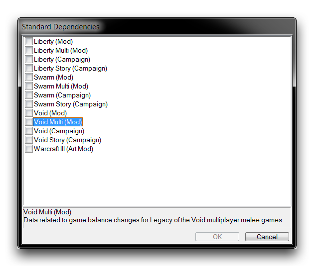](./resources/013_Standard_Dependencies01.png)
*标准依赖选择*

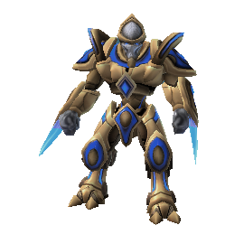

包含支持自由之翼对抗游戏的主要数据资产。

依赖内容: 空值

数据计数:

单位 432 技能 227 行为 139

效果 474 武器 57 验证器 636

升级 111 演员 1930 移动器 61

模型 2042 纹理 259 声音 3398

按钮 496 灯光 134 地形类型 24

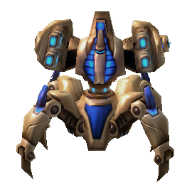

为自由之翼多人对抗游戏制定的更新和平衡更改。

依赖内容:

*自由*

数据计数:

单位 2 技能 48 行为 20

效果 55 武器 12 验证器 8

升级 49 演员 32 移动器 2

模型 1 纹理 1 声音 1

按钮 3 灯光 0 地形类型 0

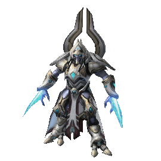

独特于自由之翼单人战役的数据和资产。

依赖内容:

*自由*

数据计数:

单位 950 技能 282 行为 340

效果 913 武器 112 验证器 206

升级 156 演员 2571 移动器 71

模型 2150 纹理 338 声音 1714

按钮 320 灯光 294 地形类型 1

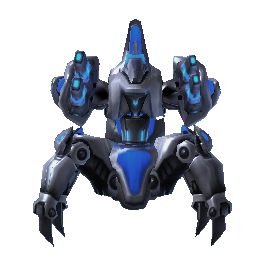

包含与自由之翼剧情模式相关的资产，例如来自海皮里恩号内部和一些战役升级的配音。

依赖内容:

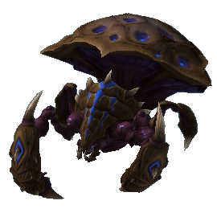 

自由 自由战役

数据计数:

单位 8 技能 37 行为 3

效果 10 武器 5 验证器 2

升级 91 演员 119 移动器 0

模型 31 纹理 0 声音 3215

按钮 1 灯光 0 地形类型 0

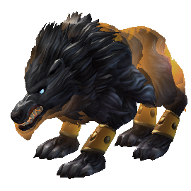

包含支持虫群之心对抗游戏的主要数据资产。

依赖内容:

*自由*

数据计数:

单位 330 技能 383 行为 187

效果 577 武器 32 验证器 291

升级 84 演员 1699 移动器 30

模型 1436 纹理 74 声音 1314

按钮 129 灯光 43 地形类型 64

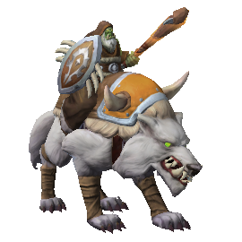

为虫群之心多人对抗游戏制定的更新和平衡更改。

依赖内容:

 

自由 虫群

数据计数:

单位 4 技能 64 行为 47

效果 144 武器 21 验证器 48

升级 49 演员 156 移动器 5

模型 2 纹理 0 声音 14

按钮 30 灯光 1 地形类型 0

[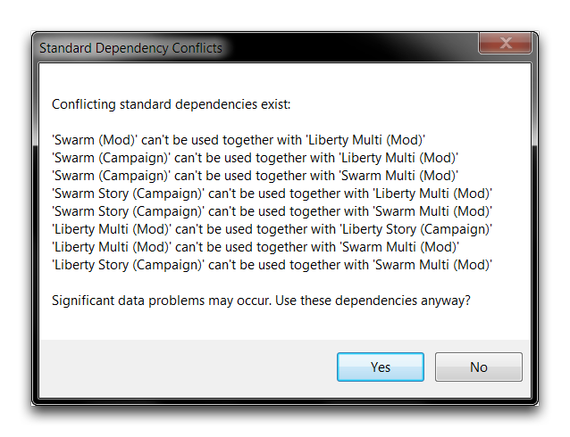](./resources/013_Standard_Dependencies08.png)

独特于虫群之心单人战役的数据和资产。

依赖内容:

  

自由 自由战役 虫群

数据计数:

单位 705 技能 554 行为 492

效果 1722 武器 212 验证器 508

升级 111 演员 2021 移动器 83

模型 1386 纹理 20 声音 1160

按钮 573 灯光 82 地形类型 1

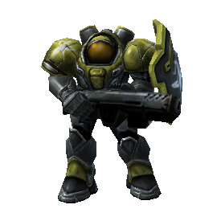

包含与虫群之心剧情模式序列相关的资产，例如登上凯瑞甘的利维坦。

依赖内容:

   

自由 自由战役 虫群 虫群战役

数据计数:

单位 157 技能 0 行为 0

效果 0 武器 0 验证器 0

升级 0 演员 258 移动器 0

模型 320 纹理 59 声音 840

按钮 0 灯光 84 地形类型 1

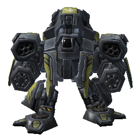

包含支持虚空之遗对抗游戏的主要数据资产。

依赖内容:

 

自由 虫群

数据计数:

单位 284 技能 428 行为 133

效果 520 武器 37 验证器 227

升级 75 演员 1553 移动器 27

模型 1173 纹理 68 声音 1283

按钮 110 灯光 46 地形类型 40

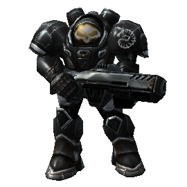

为虚空之遗多人对抗游戏制定的更新和平衡更改。

依赖内容:

  

自由 虫群 虚空

数据计数:

单位 8 技能 51 行为 47

效果 122 武器 30 验证器 52

升级 41 演员 131 移动器 5

模型 18 纹理 0 声音 4

按钮 10 灯光 2 地形类型 0

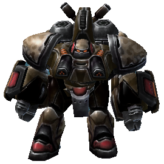

包含独特于虚空之遗单人战役的数据和资产。