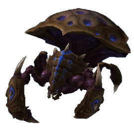

依赖内容：

    

自由 自由战役 群居 群居战役 虚空

数据统计：

单位 566 能力 700 行为 767

效果 2977 武器 166 验证器 848

升级 327 演员 2851 移动者 133

模型 1698 贴图 19 声音 2164

按钮 740 灯光 48 地形类型 0

包含与“Swarm之心”的故事模式序列相关的资产，例如登上“Adun之矛”。

依赖内容：

     

自由 自由战役 群居 群居战役 虚空 虚空战役

数据统计：

单位 217 能力 0 行为 2

效果 1 武器 0 验证器 0

升级 0 演员 232 移动者 0

模型 569 贴图 49 声音 4004

按钮 0 灯光 265 地形类型 0

*## War3.Sc2Mod*

从《魔兽争霸III》中获取的模型、艺术品、界面和声音资源的高清更新。

依赖内容：空

数据统计：

单位 0 能力 0 行为 0

效果 0 武器 0 验证器 0

升级 0 演员 0 移动者 0

模型 0 贴图 0 声音 0

按钮 0 灯光 0 地形类型 0

支持《魔兽争霸III》艺术更新的数据和资产，使其成为游戏的可玩版本。

依赖内容：

 

自由 War3

数据统计：

单位 1595 能力 960 行为 83

效果 2092 武器 754 验证器 260

升级 0 演员 3068 移动者 384

模型 2669 贴图 61 声音 2782

按钮 2077 灯光 0 地形类型 2

## 依赖冲突

将模块中的依赖项填充为具有相同依赖内容的依赖项将导致标准依赖冲突，如下图所示。

*标准依赖冲突*