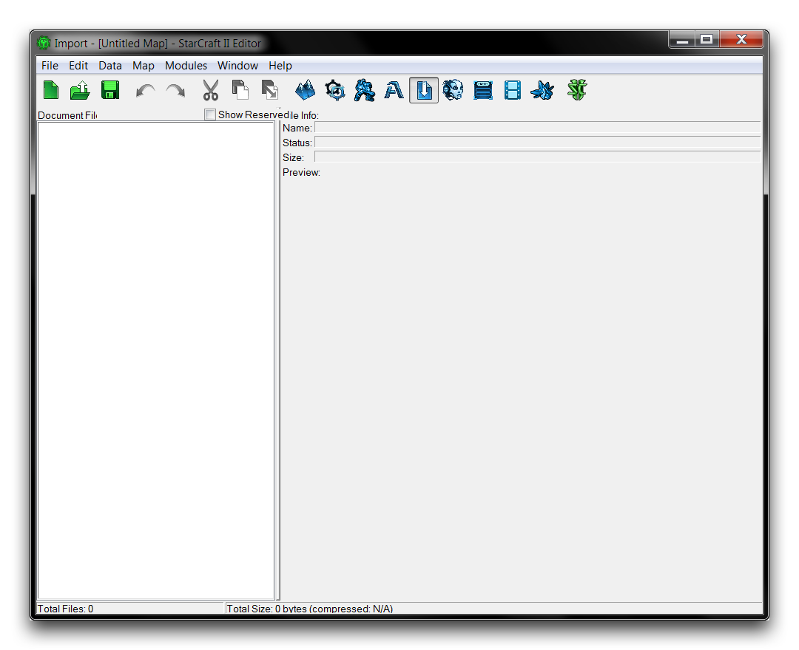
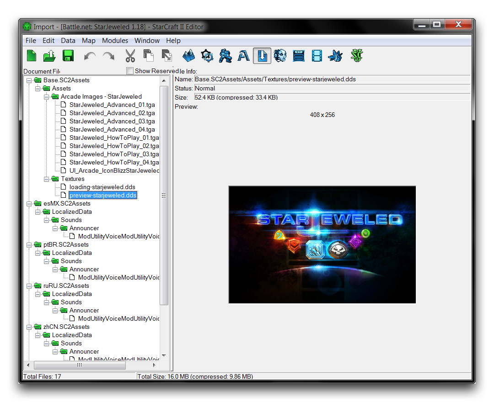
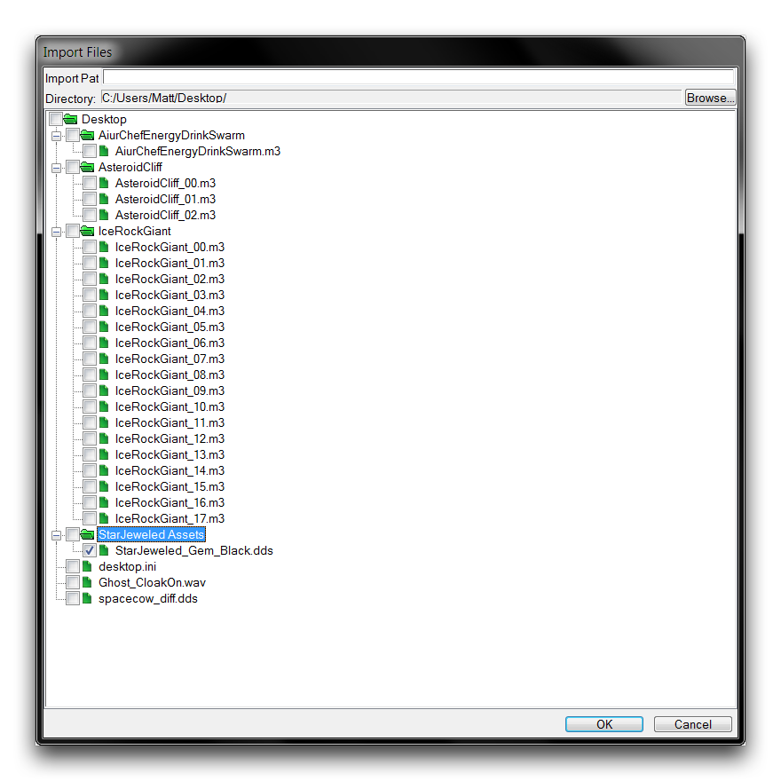
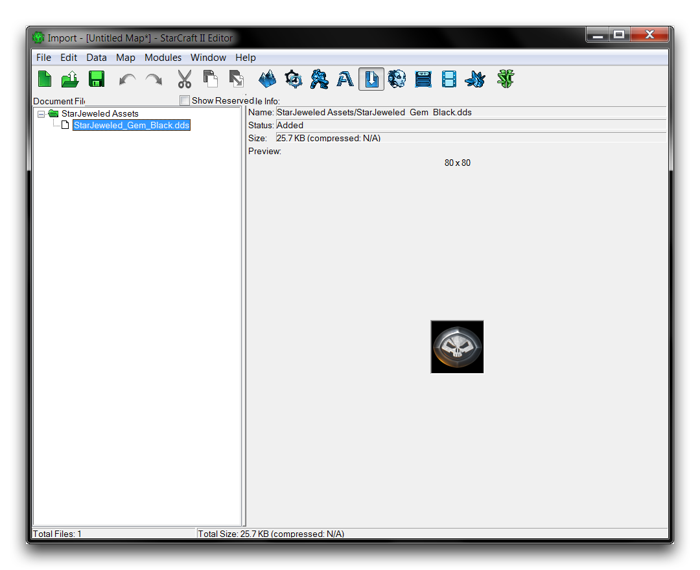
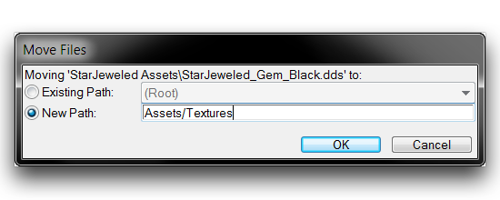
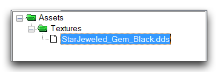
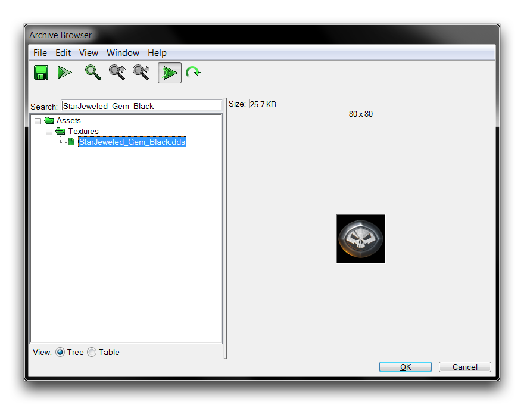

# 导入工具

导入工具允许您将来自标准星际争霸库之外的自定义资产整合到您的项目中。

# 浏览导入工具

通过导航到模块 ▶︎ 导入工具打开导入工具。这将呈现给您以下视图。

*导入工具*

在左侧，您将看到一个标记为“文档文件”的子视图。这是所有导入文件按其各自目录列出的位置。在右侧，您将看到一个标记为“文件信息”的子视图。这是一个信息窗口，显示当前文件的详细信息。激活文件的导入工具将类似下面的图片。

*激活项目中的导入工具*

正如您所见，即使文件已经被导入到项目中，它们在导入工具中仍保持其文件结构。虽然其名称暗示导入工具仅用于向项目引入新文件，但它也充当一种‘导入模块’，您可从其中查看引擎外的任何资产并查看其当前文件结构。

## 导入文件

通过右键单击“文档文件”区域并导航到导入文件来导入文件。这将启动下面显示的“导入文件”窗口。

*导入文件*

此窗口将自动填充所选目录中的所有文件。标记为复选框的每个文件将在您点击“确定”按钮后被导入到导入工具中。您可以通过选中或取消选中文件夹层次结构的顶部来激活或停用特定文件夹中的所有文件。

选中最顶部的文件夹，这里是“桌面”，将准备好导入每个目录文件。一旦您做出选择，您可以使用“导入路径”字段在导入工具中设置文件结构。上面的图片显示了从暴雪自定义地图StarJeweled借来的资产。它将被导入到路径'Assets/Textures'，这将把纹理'StarJeweled\_Gem\_Black.dds'放置在星际争霸资产结构中一个预先存在的位置。

## 导入文件目录

回到导入工具，您会看到文件名被标记为绿色。这表示文件已被导入，但未保存。导入工具中有几种颜色编码的状态，如下表所示。

| 颜色  | 状态                                       |
| ----- | ------------------------------------------ |
| 绿色  | 文件已被导入，但未保存。                   |
| 红色  | 文件已被移除，但未保存。                   |
| 蓝色  | 文件已被移动或重命名，但未保存。           |
| 黑色  | 文件已保存。                               |

此时，您应该保存以巩固文件在项目文件结构中的位置，如下所示。

*导入文件结构*

接下来，确认文件是否在正确的目录中。请记住，文件被设置为路径到'Assets/Textures'文件夹，但似乎保留了其原始位置的'StarJeweled Assets'文件夹。您可以使用导入工具的文件移动功能来纠正这一问题。

## 移动文件

您可以通过右键单击文件并导航到移动文件来移动文件。完成后，将出现“移动文件”窗口。该窗口提供将资产移动到“现有路径”或“新路径”的选项。选择“新路径”，并输入“Assets/Textures”以将文件移动到应该最初放置的目录中。

*更改文件路径*

在保存文件后检查导入工具应该展示如下所示的结果。

*已更正目录的导入文件*

现在文件看起来已在正确位置。作为最后检查，您可以通过导航到窗口 ▶︎ 控制台来打开归档浏览器。在控制台中键入 'browse'。使用浏览器的搜索功能并输入资产名称来确认其在文件结构中的位置。这一操作的结果如下所示。

*归档浏览器确认正确的文件结构*