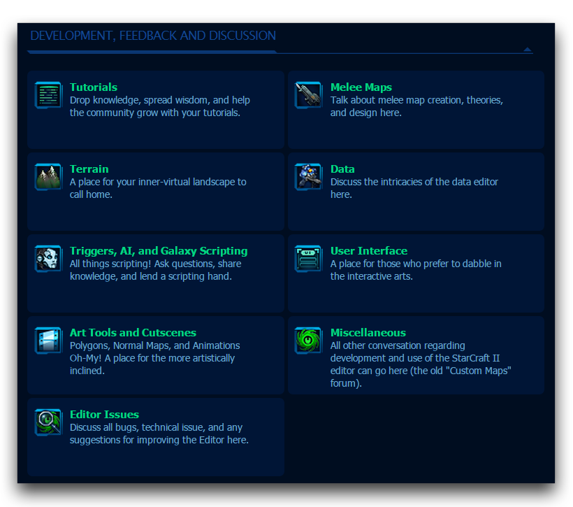
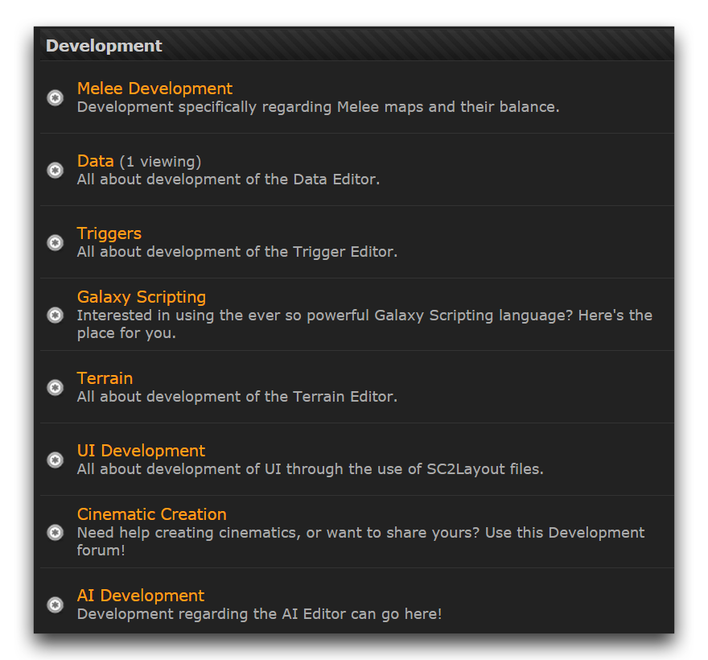
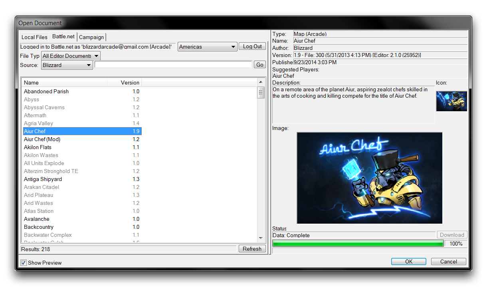

# 寻求帮助

由于游戏设计的广泛性质，可能永远不会有一个单一的全面指南，包括您想要了解的一切。解决这个问题的最佳方式通常是与社区互动。寻求教育和贡献是非常有益的，也有助于解决问题。知道在这些情况下可以找到帮助是作为开发者的重要一部分。

## 态度说明

在开始讨论之前，请记住您正在向另一个个人请求帮助。他们可能正在自愿提供时间，所以要充分利用他们回答问题的时间。您应该开始准备寻求帮助。仔细检查问题，确保问题不是由于挫折或疲劳导致的。准备好任何可能需要的截图和信息，尽可能简洁地描述您的问题。

寻求帮助时，保持有礼貌和耐心很重要。有时候可能感觉没有人在关注你，但值得考虑的是，对于其他人来帮助您可能需要一些时间，特别是如果您的问题很困难。如果是一个特定问题，可能需要一些时间才能找到已经处理过该问题的其他人。如果您感觉没有得到帮助，可以尝试自己探索以解决问题。

## 社区论坛

讨论论坛可能是获取您所需信息的绝佳地方。您可以在<http://us.battle.net/sc2/en/forum/index>找到暴雪官方星际争霸 II 论坛。有几个论坛可以找到帮助，但您可能希望从“开发、反馈和讨论”部分开始。

*暴雪官方 SC2 论坛*

请注意，这些论坛被分为不同子论坛，大部分以编辑器模块为标题。在适当的子论坛发帖可以确保您的问题找到最适当的听众。您也可以尝试搜索社区论坛，其中最引人注目的是 SC2Mapster。您可以找到它在地址<http://www.sc2mapster.com/forums>。您会想要关注“开发”论坛部分。与暴雪的官方论坛一样，那里的论坛也被分为子论坛。

*SC2Mapster 社区论坛*

无论论坛是官方的还是非官方的对讨论质量没有影响，但如果您有软件问题，最好在官方论坛上解决，因为暴雪员工经常访问。一些社区网站，如SC2Mapster，还拥有IRC频道上的实时聊天。这些可以是向活跃用户提问问题并快速指导您解决问题的好地方。

## 建立关系

几乎每个开发者在某个时候都需要帮助测试他们的游戏。通过自愿帮助他人，您很快就会交到朋友。拥有一个强大的开发者网络是解决问题和学习的最佳方式。将来，在寻找测试者时，您将获得帮助。一旦您开始建立自己的知识库，自愿帮助解决问题可以帮助您与社区建立关系。

## 扩展您的搜索

面临问题时寻找帮助的另一种方法是查找现有的文档或教程。您可能希望将搜索重点放在大型基于社区的媒体网站上。像YouTube这样的服务拥有多年积累的大量社区教程。

现有的星际地图可能是自我教育的最佳资料。任何状态设置为“已解锁”的地图都可以被任何编辑器用户打开、阅读和修改。但请记住原作者的意愿，如果您将另一个人的作品作为自己的作品重新发布，可能会受到惩罚。

其中值得注意的“已解锁”内容包括暴雪利用编辑器制作的作品。整个战役已经向公众公开供学习，以及许多暴雪街机项目。通过“文件”▶︎ “打开”▶︎ “战网”，然后将搜索来源设置为“暴雪”，点击“前往”。这将提供暴雪发布地图的完整列表。特别值得调查的地图包括“星际大师”、“Left 2 Die”和“艾尔厨师”。

*暴雪的开源地图之一*

如果您的问题涉及更一般的概念，例如数学、物理或设计，请不要犹豫将您对知识的追求扩展到这些主题中。更专业的网站、书籍和其他资料将帮助您学习这些学科。然后您可以将新知识应用于游戏开发。这样，您可以继续用新颖且令人激动的灵感丰富您的设计。