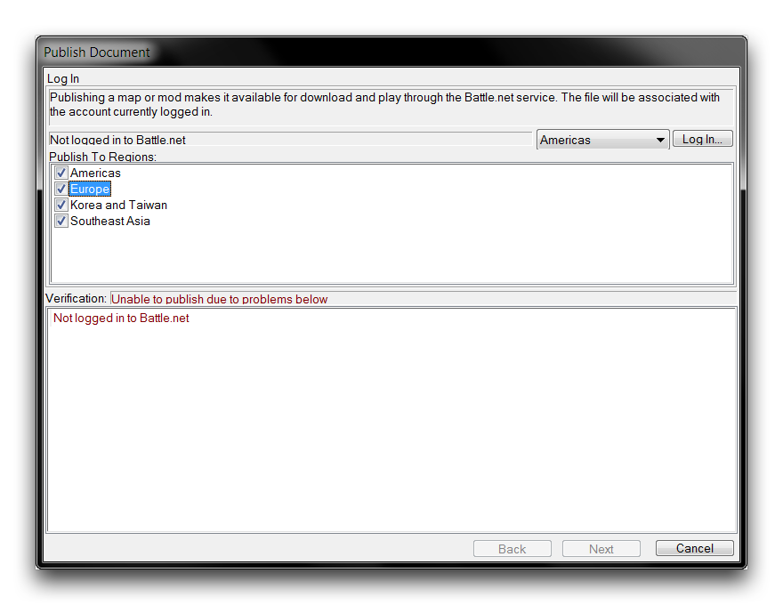
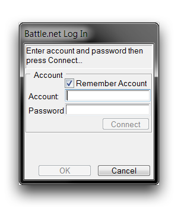
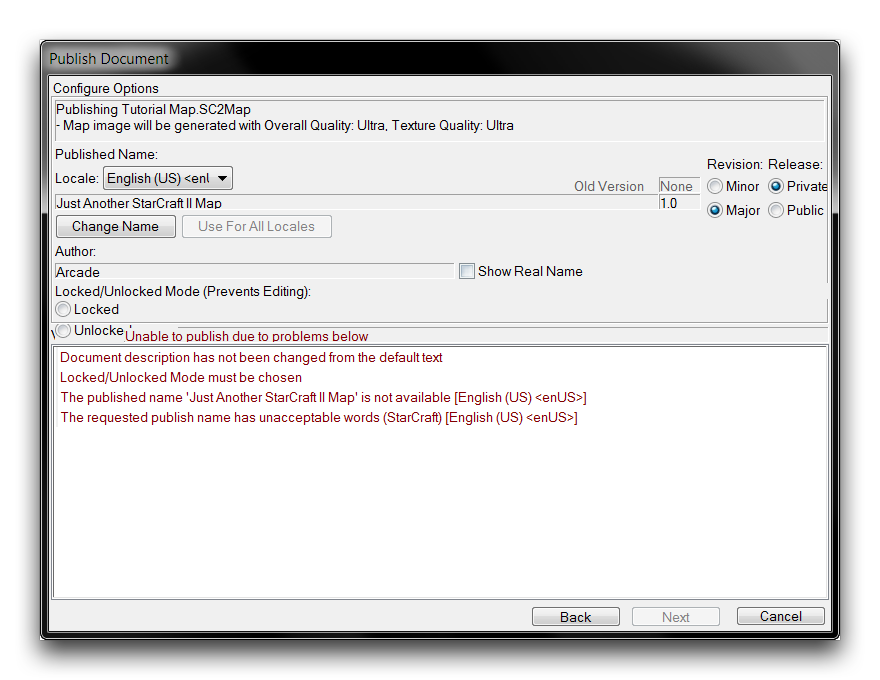
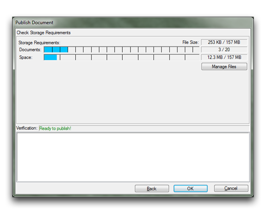

# 发布

虽然使用“编辑器”制作的项目可以在本地以单人形式进行游玩，但大多数创作者的意图是在线分享他们的作品。幸运的是，作为暴雪游戏的托管平台，Battle.net已经得到扩展，以支持在星际争霸引擎下工作的开发人员。过去，项目必须通过游戏托管来共享，这是《魔兽争霸III》和《星际争霸：自由之翼》的情况。现在，玩家可以找到并下载游戏，无需开发人员的干预。这种独立系统还为用户提供了额外的保护、版本控制和本地化支持。

然而，基于网络的项目共享需要游戏开发人员进行一些更多的预先准备。这种准备以“编辑器”中的新发布系统的形式呈现。您可以通过导航到“文件 ▶ Publish”来找到它们，这将启动下面展示的“发布文档”窗口。

*发布文档窗口*

您将首先看到的屏幕是“登录”视图，“验证”字段中提到了发布状态。正如您所见，由于“未登录到Battle.net”，用户无法继续。为了进行发布，您需要一个附有完整版星际争霸II的Battle.net帐户。“编辑器”本身配备了星际争霸II：入门版，但免费用户无法在线发布。这个功能可以通过任何版本的星际争霸II帐户获得，包括独立游戏。

如果单击“登录”按钮，您将被提示输入您的帐户名称和密码。

*Battle.net登录窗口*

在这里输入您的帐户电子邮件和密码，然后选择“连接”。如果您的帐户关联有身份验证器，另一个窗口将要求您输入身份验证器代码。如果您打算经常进行发布，您可能会想要使用“记住帐户”切换，这可以节省您大量时间。

一旦您登录并返回主屏幕，应该会看到“验证”显示更加鼓舞人心的“准备发布”消息。您还应该发现“下一步”按钮现在可以使用。在继续之前，请注意“发布到区域”的控件。这些是方便选项，允许您的项目一次发布到多个区域，而无需再次登录。

## 发布要求

从“登录”窗口选择“下一步”将带您到主要的发布视图“配置选项”。在将游戏托管到Battle.net之前，游戏必须满足一系列要求。这个屏幕为您提供了几种选项来准备项目上传，但最重要的是底部子视图中的发布要求。如果您的项目未达到这些要求中的任何一个，那么“验证”字段将显示“由于下面的问题无法发布”，如下图所示。

*发布选项窗口*

发布要求通常是需要在上传前澄清的一些小型后勤问题。下表详细列出了一些常见问题及其解决方案。在这些解决方案中提到的一些选项将在后续部分中进行更详细的描述。

| 要求                                                              | 描述及解决方法                                                                                                                                                                                                                                                    |
| ------------------------------------------------------------------ | ----------------------------------------------------------------------------------------------------------------------------------------------------------------------------------------------------------------------------------------------------------------- |
| 文档描述未更改为默认文本。                                       | 项目必须更改其默认描述。                                                                                                                                                                                                                                          |
|                                                                   | 返回编辑器，导航到“Map ▶︎ Map Info”，并更改“描述”字段中的文本。                                                                                                                                                                                                  |
| 必须选择已锁定/未锁定模式。                                       | 发布的地图必须设置为已锁定或未锁定之一。                                                                                                                                                                                                                         |
|                                                                   | 从发布系统的“Configure Options”窗口中的“Locked/Unlocked Mode”字段中设置地图为已锁定或未锁定之一。                                                                                                                                                              |
| 已存在名称'X' \[Locale\].                                          | 在指定区域的语言环境中，发布名称“X”已经被使用。                                                                                                                                                                                                                 |
|                                                                   | 为所有地区选择一个新的发布名称，或返回到“发布到区域”选项，然后手动为有问题的区域进行本地化处理，并使用不同的名称。请注意，这种方法将导致项目以后需要进行多次发布。                                                                              |
| 请求的发布名称包含不可接受的词语。                               | 项目的发布名称中存在保留词语。                                                                                                                                                                                                                                    |
|                                                                   | 更改发布名称。                                                                                                                                                                                                                                                     |

一旦满足了所有发布要求，“验证”字段将显示“准备发布！”

## 发布选项

“配置选项”包括一系列选项，旨在为地图准备发布，并在上传前解决要求问题。以下是详细说明。

| 字段                | 详情                                                                                                                                                                                                                                                          |
| ------------------- | -------------------------------------------------------------------------------------------------------------------------------------------------------------------------------------------------------------------------------------------------------------- |
| 发布名称            | 项目的发布名称。这是在线使用的名称，默认设置为“Map Info”中设置的项目名称。您可以使用“更改名称”按钮更改此名称。                                                                                                                                            |
| 语言环境            | 选择用于发布的本地化版本。                                                                                                                                                                                                                                      |
| 修订                | 增加自动生成的“版本”字段。主要版本的增量为1.0，而次要版本的增量为0.1。修订与发布名称相关联。每当名称更改时，值将重置为默认值0.0。                                                                                                                           |
| 发行                | 设置游戏的可访问性。私人模式要求上传者托管，并且需要为每个玩家手动邀请。公共模式允许任何人托管。                                                                                                                                                        |
| 作者                | 使用您的Battle.net ID列出作者信息。如果选择“使用真实名称”，则将附加您的暴雪帐户的名称。                                                                                                                                                                      |
| 锁定/未锁定模式     | 锁定状态与源项目的可用性有关。任何开发人员都可以在编辑器中下载未锁定的地图。设置为已锁定将删除源项目的公共可用性。                                                                                                                                       |

在考虑已锁定和未锁定状态时要小心。前者将完全保护您的地图免受任何开发人员的侵害，包括您自己。如果选择了此状态并遗失文件，您的项目将保留在线，无法恢复。将项目设置为未锁定可以纠正这个问题，同时还使您能够与其他开发人员共享项目，有助于促进协作知识的增长。

## 文件管理

在配置每个项目选项并满足所有要求后，您可以点击“下一步”到达“存储要求”视图。这将为您展示文件占用的空间以及项目的大小限制。

*存储要求视图*