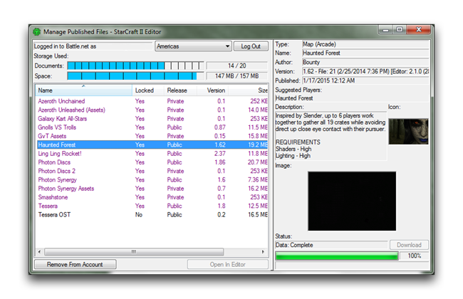
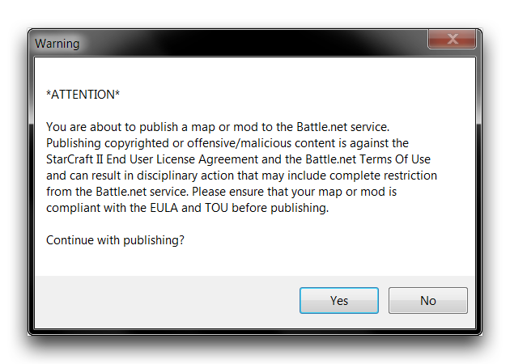

每个 Battle.net 账户被分配以下存储空间：20 个同时上传的文件、总计 157 MB 的上传空间，以及地图最大单独上传大小为 20 MB，模组为 100 MB。这些限制不在区域之间共享。如果您接近任何这些限制，您可以选择“管理文件”来对当前上传文件进行更改。您将被带到下面显示的“管理已发布文件”窗口。

*已发布文件管理器*

该屏幕显示您账户当前上传的所有项目，列出它们的锁定状态、发布、版本和大小。突出显示一个项目将显示其完整详情。任何已发布的项目均可从 Battle.net 中删除。如果您需要释放空间，可以使用“从账户中删除”按钮。完成后，关闭窗口，通过单击“检查存储要求”视图中的“确定”来发布。您将看到一个包含 EULA 和 TOU 协议的弹出窗口。

*合规性检查*

确认您遵守协议后，单击“是”进行发布。