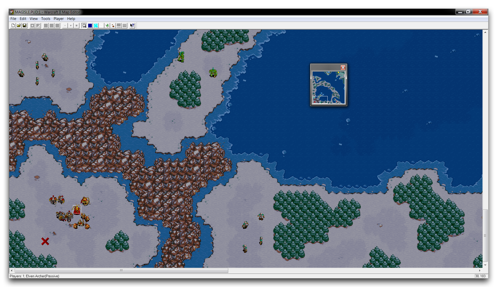
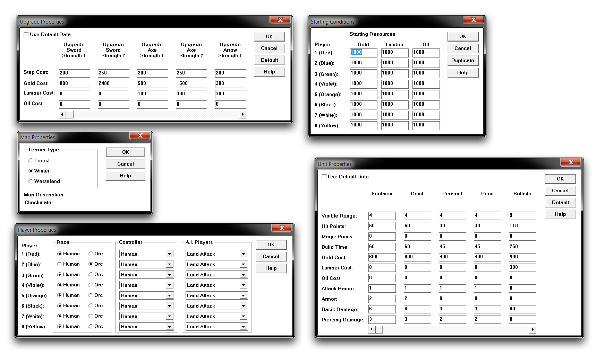
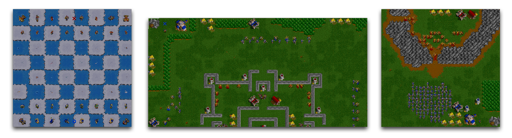
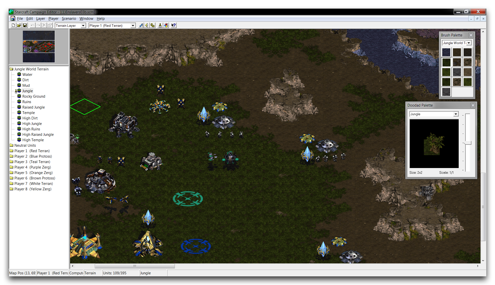
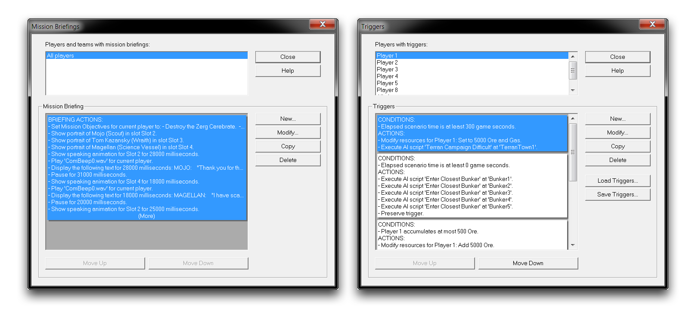
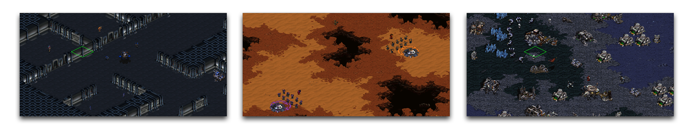
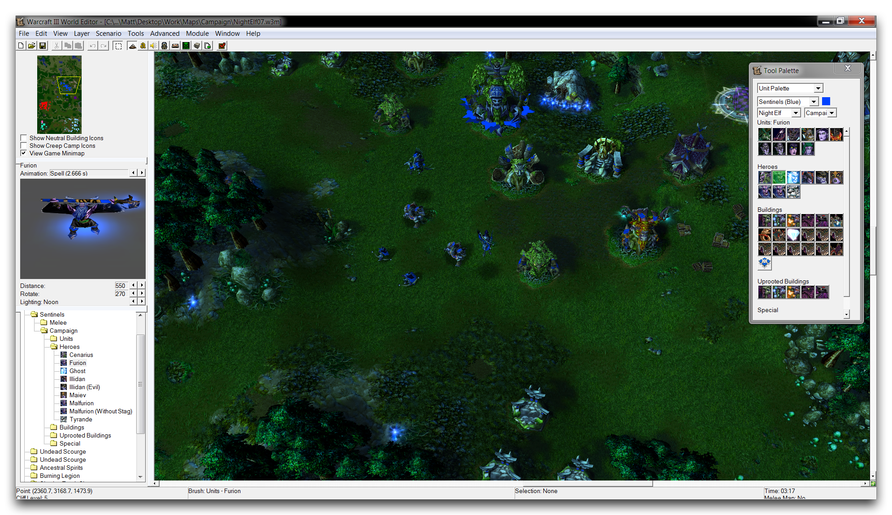
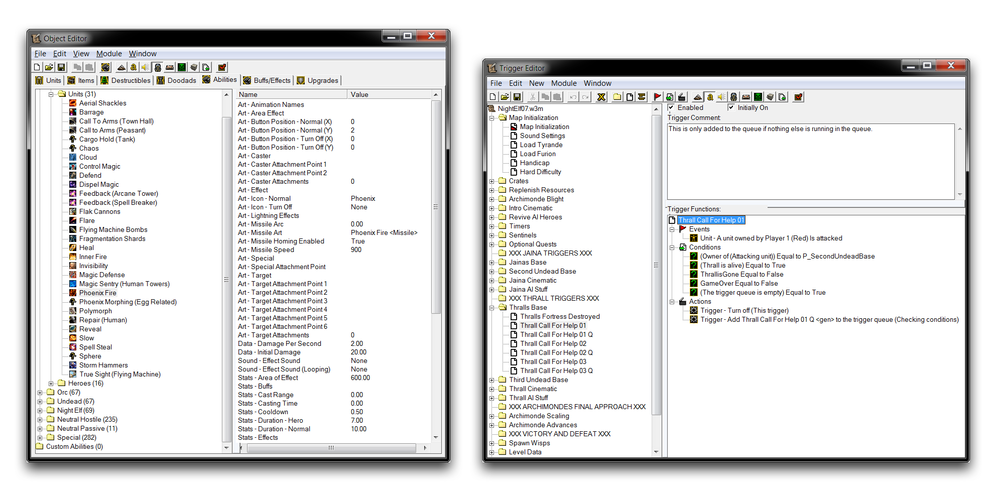
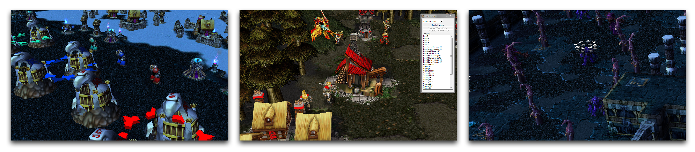

# 编辑器历史

暴雪公司在其即时战略游戏旁边发行了许多编辑套件。随着每一次新版本的发布，工具的功能不断增强，为社区提供了更广泛的机会。正是这个漫长的开发和完善过程使得我们今天拥有了星际争霸 II 编辑器。本文将简要介绍这些编辑器的历史，其中许多仍在积极使用中，以便更好地理解星际争霸 II 编辑器。

《魔兽争霸 II 地图编辑器》于 1995 年发布。玩家首次有机会进入开发者工具，创建自己的地图，既可用于朋友间的对战，也可用于自定义战役。

*地图编辑器视图*

显著的新功能

- 玩家首次可以使用编辑器为暴雪 RTS 制作自定义任务。
- 地形可以使用七个元素在各种大小的地图上建造。
- 所有主要资源都可以放置在地图上。
- 使用任何单位、建筑和战役英雄，并将它们分配给高达八个不同的玩家方。
- 将地图配置为四种可用地形集之一。
- 编辑升级成本、起始资源和单位属性。
- 将八个玩家方中的每一个分配给各种 AI 控制器。

在《魔兽争霸 II 地图编辑器》下，所有地图的自定义设置都通过五个属性窗口进行配置，如下图所示。

*编辑器属性窗口*

没有支持任何自定义逻辑、对象或类似的功能，使地图创建者无法丰富项目。尽管如此，仍有许多独特的地图利用创意地形和单位布置来构建有趣的体验。

*魔兽争霸 II 地图创建*

《星际争霸战役编辑器》于 1998 年发布。通过支持触发器，一种脚本逻辑，地图创建者的选项得到了极大扩展。新的 Battle.net 也使得玩家能够更轻松地连接和分享地图，引发了自定义创作受众的激增。

*战役编辑器视图*

显著的新功能

- 现在包括通过触发器编辑器的自定义逻辑系统。
- 可以使用任务简报编辑器构建任务前故事模式序列。
- 可以为地形集添加多样的环境元素。
- 雾战数据可以绘制到地图中。
- 可以导入并使用自定义声音进行叙述序列或其他效果。
- 可以构建对玩家输入和驱动触发器做出反应的位置。
- 单位和英雄可以重命名，使地图创建者能够为地图创建新的想象主题样式。

新编辑器出现为任务序列和触发逻辑拓宽了编辑体验。

*任务简报编辑器 -- 触发器编辑器*

由于积极的在线社区和扩展工具的结合，许多新的游戏类型和故事得以共享。使用这些工具创造的许多创新促成了游戏世界的更广泛发展。

*星际争霸地图创建*

《魔兽争霸 III 世界编辑器》于 2002 年发布。为了适应迈向 3D 的过渡以及《魔兽争霸 III》的需求，编辑器的功能扩展到了如此多样化和规模，以至于被分解为各个独立模块。这些工具已经成为一套编辑套件，为其用户提供了游戏开发的所有主要学科的控制权。

*世界编辑器视图*

显著的新功能

- 编辑器现在由八个模块组成：地形编辑器、触发器编辑器、声音编辑器、对象编辑器、战役编辑器、AI 编辑器、对象管理器和导入管理器。
- 可在地图项目数据中创建完全新的单位、对象、升级、能力、物品和英雄。
- 可以设置自定义摄像机，并在游戏过程中动态使用。
- 触发系统被扩展以提供重要的游戏时脚本。

几乎每个工具功能的扩展导致编辑器发展成为一个模块化工具集。

*对象编辑器模块 -- 触发器编辑器模块*

在这一点上，即时战略游戏编辑工具已经发展成为一个强大的游戏开发套件。随着活跃至今的社区和许多发布项目的漫长历史，《魔兽争霸 III 世界编辑器》仍然受到设计学生、爱好者和玩家的喜爱。 

*魔兽争霸 III 地图创建*