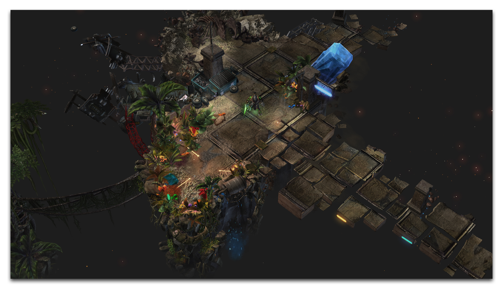
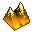

# 地形编辑器介绍

地形编辑器提供了控制项目中世界外观的工具。地形编辑器让您可以在七个层次中工作，因此您可以根据您的需求构建地图，无论是竞争性的还是创造性的。

*Masvard的地形场景 'One Wicked Dream'*

## 层次

这是用于构建世界的最底层。在这里，您可以抬高或降低基本地貌以形成山丘和山谷。地面上涂有一种动态绘画系统，应用了各种草地、泥土、金属、岩石等的调色板。您可以在其上添加植被、水域、悬崖和坡道。

这个层次允许您放置任何单位、建筑物或可破坏地形。

这一层允许您放置数千个与编辑器一起提供的装饰元素之一。这些小玩意可以被精心制作和修改到最微小的细节，使您能够为您的景观增添味道。

这一层是您放置点的地方，这些点用于标记数据中的位置并触发游戏的部分内容。这就是您计划设计效果放置的方式。

与点类似，区域允许您划定具有特定游戏条件的整个区域。通过在编辑器视图中构建这些区域，您将能够直观地了解您的项目逻辑和实际游戏将如何配合。

您可以在此层中安排和设置摄像机。编辑器具有强大的选项，使您可以在三维空间的任何位置设置摄像机对象，测试它们，然后将它们用于过场动画或游戏。在使用摄像机时还有各种可用的视觉效果，您可以将其导出到新项目中继续使用。

路径图层是您设置特定单位类型规则的地方，无论是地面单位还是飞行单位，并确定地图的哪些区域可以通行。正确控制路径使您能够决定玩家可以旅行的位置。