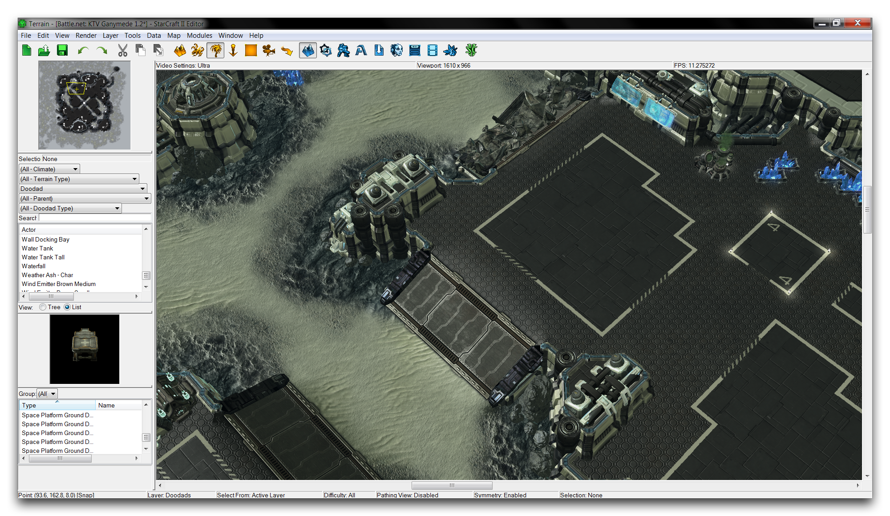
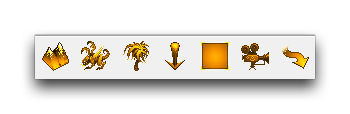
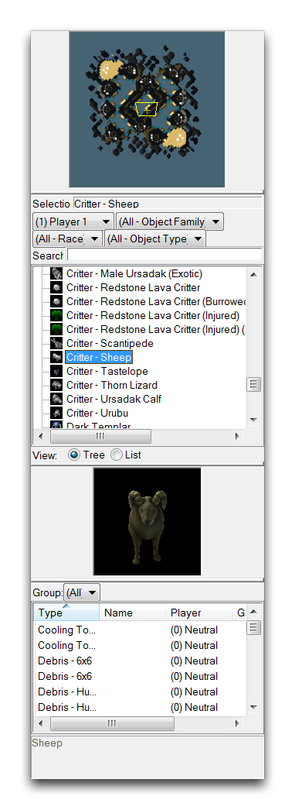
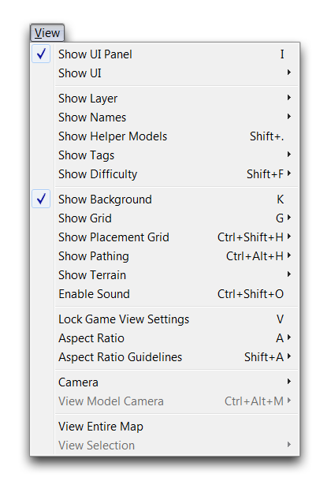
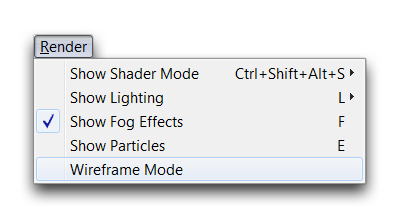
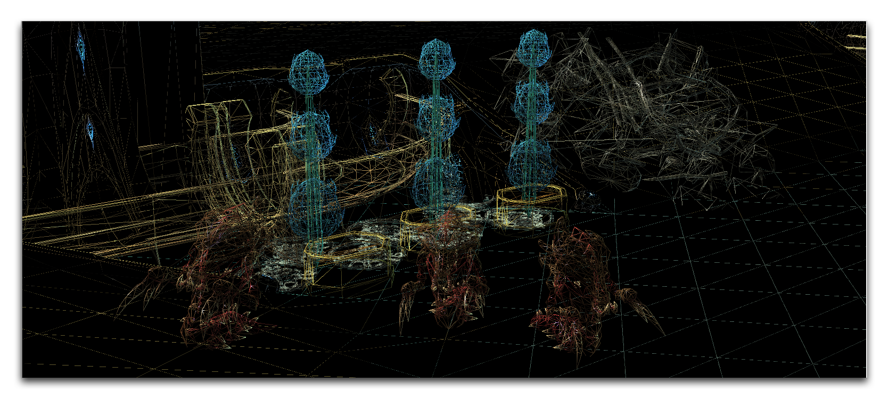
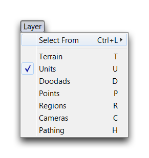
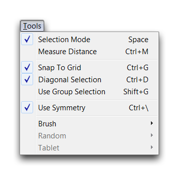
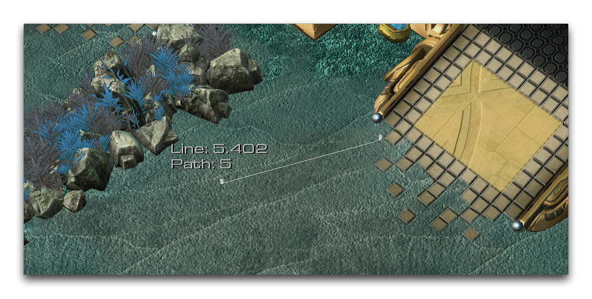

# 地形编辑器界面

地形编辑器可能是编辑器中最多样化的部分。除了用作地图设计的工作空间之外，它还是许多其他部分与地图文件交互的地方。例如，触发器编辑器通过点和区域与地形编辑器进行通信。数据编辑器通过单位和其他实体与之通信，而剧情编辑器则通过摄像机等方式运行。

## 界面

*乌旋塔克的伽尼米德的界面视图*

正如你从上面可能猜到的那样，地形编辑器充当一种项目中心。最终结果是，它具有广泛的选项和功能。这导致它被分成七个单独的层。您可以使用主工具栏上的地形栏来导航这些层。在那里，您会找到按钮，直接进入每个层，如下所示。

*地形栏*

默认情况下，这些层分开明确。一旦启用了一个层，您只能处理指定给该层的元素。在使用地形编辑器时，您始终只能有一个活动层。您可以通过检查当前突出显示的层按钮来找到您目前的位置。

每一层都有自己的选项。这些选项显示在主地形视图的左侧的一个大面板上。这被称为“UI面板”。下面的图像显示了在打开“单位层”时的外观。

*UI面板*

**UI面板**随当前层的不同而改变。每个层都有一个调色板，其中提供了该层中大多数主要控件。您可以在处理每个层的个别文章中更详细地阅读有关调色板的信息。值得注意的是，顶部的“文件”选项卡提供了许多选项，这些选项被分成子选项卡。下面将对这些进行描述。

## 视图选项

这些选项控制编辑器内单个组件的可见性，更改当前视口属性，并为相机功能提供一些支持。您可以从“视图”选项卡中找到它们，如下所示。

*视图选项卡*

| 操作               | 效果                                                                                     |
| -------------------- | ------------------------------------------------------------------------------------------ |
| 显示UI面板        | 控制UI面板的可见性。                                                   |
| 显示UI              | 控制显示几个高级UI功能的可见性，例如帧率。                |
| 显示层           | 分别控制每个层的可见性。                                        |
| 显示名称          | 控制元素名称的可见性，如点和区域。                  |
| 显示标签           | 控制在“地图属性”菜单中创建的标签的可见性。                  |
| 显示难度      | 控制单位的难度设置的可见性。                                |
| 显示背景      | 控制编辑器显示中的天空盒的可见性。                               |
| 显示放置网格  | 控制网格组件的可见性。                                                |
| 显示路径  | 控制不同类型路径的可见性，例如“不可通行区域”。         |
| 显示地形         | 控制可见性某些地形组件，如蔓生物、水域或地图边界。|
| 启用物体声音 |	切换在编辑器中放置对象时的声音效果。                               |
| 锁定游戏视图 | 锁定摄像机到近战游戏中找到的特定设置。|

## 渲染选项

这一部分包含您可以用来控制编辑器中高级图形元素可见性的选项。您可以在“渲染”选项卡中找到它们，如下所示。

*渲染选项卡*

| 操作              | 效果                                                                                |
| ------------------- | ------------------------------------------------------------------------------------- |
                  | 控制不同类型着色器的可见性。                            |
| 显示光照       | 选择显示游戏光照或当前正在编辑的自定义光照。 |
| 显示雾特效    | 控制雾特效的可见性。                                              |
| 显示粒子     | 控制包括模型、演员等在内的粒子元素的可见性。  |
| 显示线框模式 | 启用一种显示每个元素的线框模式。	                            |

以下是一张几个食脑虫被设定为在线框模式下显示的截图。

*线框模式*

## 层选项

这一部分允许您控制任何给定时间哪些层是活动的，打破它们的默认分离。您可以使用“选择自”字段来激活不同配置的层。您还会在这里找到导航选项，它们允许您像地形栏一样从层移动到层。您可以使用“图层”选项卡找到层选项，如下所示。

*图层选项卡*

## 工具

在这里，您将找到支持选择和设计地图等基本功能的选项。您可以使用“工具”选项卡导航工具。

*工具选项卡*

| 操作              | 效果                                                                    |
| ------------------- | ------------------------------------------------------------------------- |
| 选择模式     | 允许您使用鼠标选择对象。                             |
| 测量距离     | 将光标变为测量工具。                                 |
| 对齐网格        | 更改放置元素的网格对齐行为。                       |
| 对角选择  | 旋转选择轴的轴，使框选择沿着45°轴发生。 |
| 使用分组选择  | 将选择行为更改为仅影响组内的单位。           |
| 使用对称  | 切换用于地图的对称行为。                           |

“测量距离”选项会更改默认鼠标，以便您可以从一个点测量到另一个点。这在确定事物的粗略距离（如近战地图设计）以及帮助计算触发器或数据时很有用。您可以通过点击一次开始测量，然后在您所需的端点处单击来使用该工具。下面的图像显示了“测量距离”的操作示例。

*测量工具*