# 地形图层

地形图层涉及地形设计的基本元素，包括地面纹理、高程、悬崖和水域。您可以通过单击下方显示的图标，在地形栏中访问它。

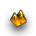
*地形图层图标*

## 地形调色板

每个地图都从创建屏幕开始，在这里您将做出有关地图外观的基本决策，确定其纹理、高度和大小。一旦编辑器生成了地图，它将在地形编辑器中打开，为您提供一块全新的地形板、一块空白画布。

[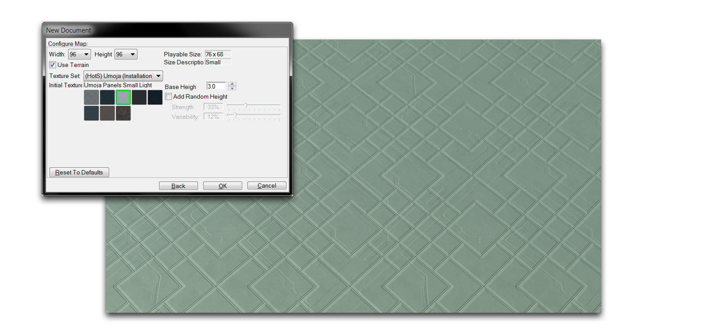](./resources/020_Terrain_Layer2.png)
*地图创建*

地形开发过程通常从地形图层开始。延续绘画主题，该图层中的工具称为画笔。这些画笔可以在下方的地形调色板中找到。

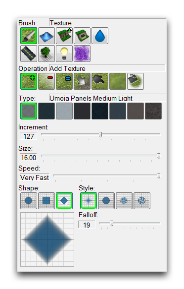
*地形调色板*

## 画笔选项

选择任何画笔将显示调色板中的各种修改器。每个画笔都有选项，允许您控制 '绘制' 地形的方式。下面您将看到这些选项的一个示例，然后是所有可用选项的详细说明。

[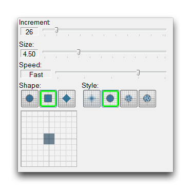](./resources/020_Terrain_Layer4.png)
*画笔选项*

| 属 性      | 效 果                                                                                                                                                                                                                                                                               |
| ---------- | ------------------------------------------------------------------------------------------------------------------------------------------------------------------------------------------------------------------------------------------------------------------------------------ |
| 增 益      | 调整执行当前操作的大小。                                                                                                                                                                                                                                                            |
| 大 小      | 更改执行当前操作的尺寸。                                                                                                                                                                                                                                                            |
| 速 度      | 调整执行当前操作的速度。                                                                                                                                                                                                                                                            |
| 形 状      | 选择执行当前操作的区域形状。                                                                                                                                                                                                                                                        |
| 样 式      | 将效果应用于正在执行的操作。这些包括各种不透明度、形状和随机性选项。                                                                                                                                                                                                              |
|            | 画笔样式是默认标准，没有额外效果。                                                                                                                                                                                                                                                  |
|            | 喷枪样式在应用区域的边缘周围应用一定程度的不透明度，由可变性滑块控制。                                                                                                                                                                                                               |
|            | 噪声风格向应用添加一个随机成分，而分形风格则递归地应用画笔。这最后两种风格及其与属性可变性和分辨率的修改最好通过编辑器中找到的预览来描述。 |

除了这些常规选项外，地形图层中提供的九种画笔每种都有许多独特的选项。您可以在下面的部分中阅读有关这些画笔及其选项的详细说明。

## 画笔

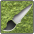

此工具允许您将纹理绘制到地图表面上。绘制是用一种混合系统完成的，该系统允许每张地图上的八种纹理进行动态分层。

[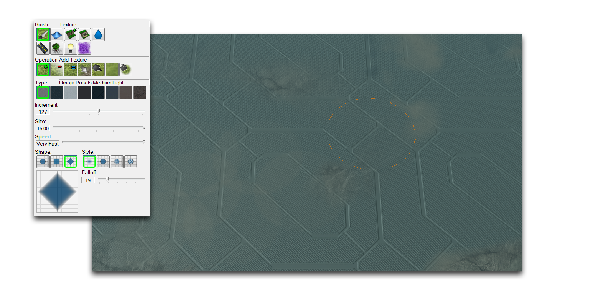](./resources/020_Terrain_Layer6.png)
*纹理画笔及其使用*

| 属 性           | 效 果                                                                                                                                                                                               |
| ---------------- | ---------------------------------------------------------------------------------------------------------------------------------------------------------------------------------------------------- |
| 添加纹理       | 使用选定的画笔选项将当前选择的纹理应用到地图上。                                                                                                                                                    |
| 移除纹理       | 使用选定的画笔选项从地图中移除当前选择的纹理。                                                                                                                                                      |
| 均匀纹理       | 以锁定的 Alpha 值将当前纹理应用到地图上，导致不透明度无变化。                                                                                                                                     |
| 替换纹理       | 用第二个纹理替换第一个纹理选择，不会改变任何其他纹理。                                                                                                                                           |
| 涂抹纹理       | 将用户点击的第一个纹理推到其他纹理上，只要按住按钮不放。                                                                                                                                          |
| 模糊纹理       | 软化相邻纹理之间的边界。                                                                                                                                                                          |
| 填充纹理       | 使用选择的纹理填充整个区域。区域的选择基于单击画笔时的海拔高度。                                                                                                                                    |

此工具允许您改变地形拓扑。使用该画笔制作的所有高度特征将保持在单位移动可通过的路径上，无论它们看起来多么奇异。您可以使用悬崖和路径工具进行路径划分。

[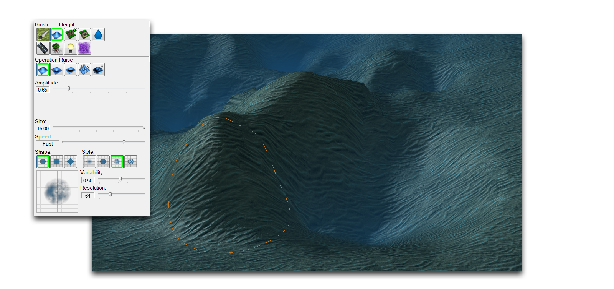](./resources/020_Terrain_Layer8.png)
*高度画笔及其使用*

| 属 性   | 效 果                                                                                               |
| ------ | ---------------------------------------------------------------------------------------------------- |
| 提 升  | 根据画笔选项和幅度增加目标区域的高度。                                                             |
| 降 低 | 根据画笔选项和振幅减少目标区域的高度。                                                              |
| 均匀   | 改变画笔目标区域内的高度，使之大致相等。                                                          |
| 噪音   | 对目标区域的高度应用随机变化。                                                                       |
| 幅度   | 设置高度调整的大小，类似于标准画笔选项的增量。                                                    |

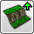

此工具更改目标选择的悬崖级别。地形有四个不同级别，具有特殊的游戏规则和交互。基于地面的单位通过坡道在层之间移动。您还可以使用此工具放置这些坡道。

[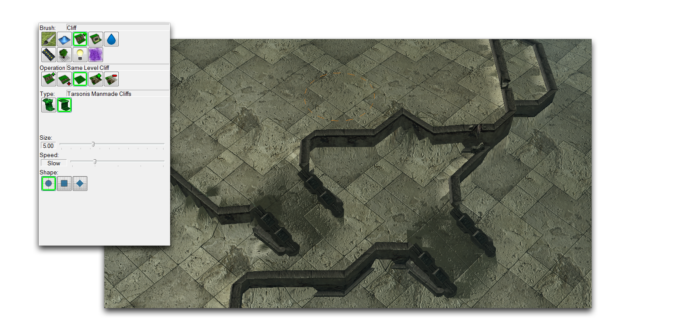](./resources/020_Terrain_Layer10.png)
*悬崖画笔及其使用*

| 属 性          | 效 果                                                                                                                                                  |
| -------------- | ------------------------------------------------------------------------------------------------------------------------------------------------------- |
| 提升悬崖      | 将当前目标区域中的所有地形提升一个悬崖级别。如果该区域已在最高级别，则不会更改。                                                                      |
| 降低悬崖      | 将当前目标区域中的所有地形降低一个悬崖级别。如果该区域已在最低级别，则不会更改。                                                                      |
| 同一级悬崖    | 使用此画笔单击选择目标区域的悬崖级别，按住按钮将在移动画笔时应用此悬崖级别的任何地方。                                                               |
| 添加坡道      | 在目标处为不同地形级别之间创建坡道，如果可能的话。                                                                                                |
| 移除坡道      | 移除目标区域中的任何坡道。                                                                                                                         |
| 类型          | 在当前地形类型中的坡道可能视觉风格之间切换。                                                                                                        |

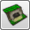

此工具允许您从编辑器中提供的动态场景对象数组中进行选择。这些地形对象需要特殊的放置和与装饰品或单位的合作，才能产生所需效果。

[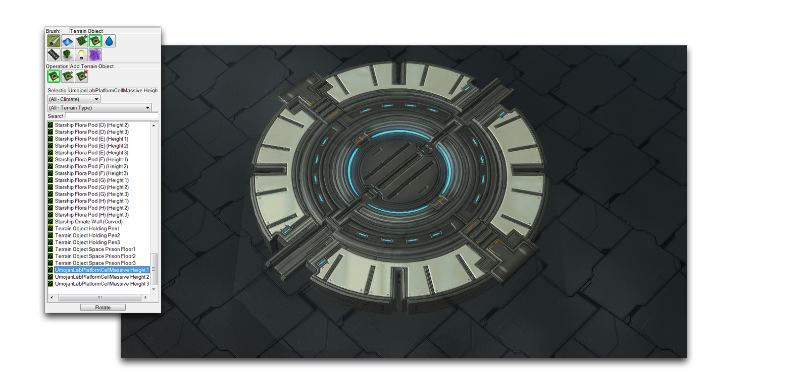](./resources/020_Terrain_Layer12.png)
*地形对象画笔及其使用*