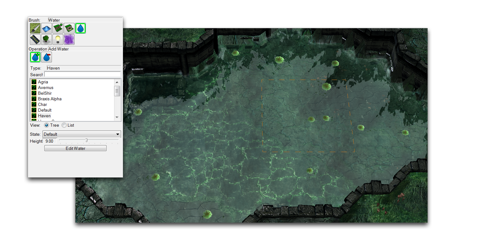
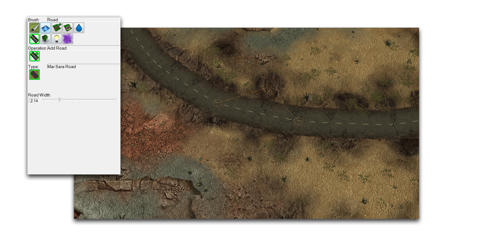
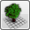
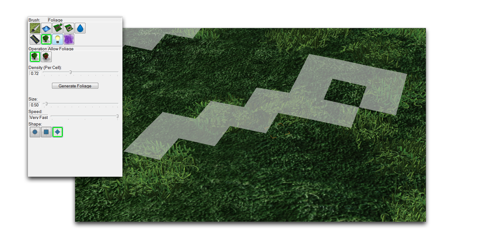
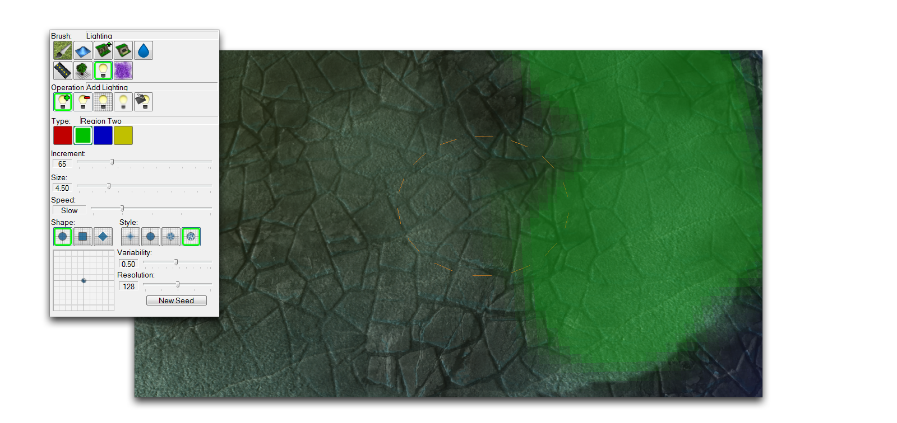
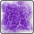
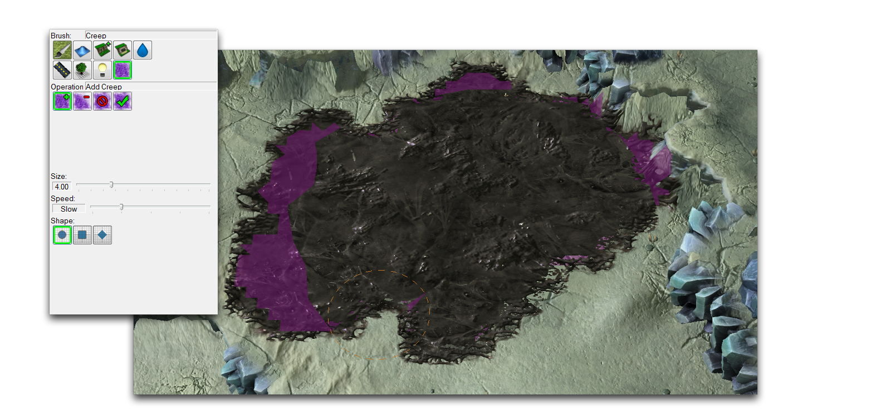

| 属性                 | 效果                                                                                   |
| ------------------- | --------------------------------------------------------------------------------------- |
| 添加地形对象          | 在目标区域放置当前选择的地形对象。                                                     |
| 显示地形单元          | 显示目标区域中已更改可见性的任何地形单元。                                             |
| 隐藏地形单元          | 更改目标区域中任何地形单元的可见性。                                                   |
| 地形对象清单          | 所有可用地形对象的列表，按适当应用的悬崖级别排序。                                   |

此刷子将应用区域到地图上，其中水将被渲染。在这种情况下，“水”实际上指的是各种动态流体，在某些地形类型中可能会出现为熔岩或酸。这些区域通过此刷子锁定为一个常量大小，以平方单位应用。

*水刷和其用途*

| 属性                  | 效果                                                                                             |
| --------------------- | ------------------------------------------------------------------------------------------------- |
| 添加水                 | 在目标区域应用水区域。                                                                          |
| 移除水                 | 移除目标区域内的任何水区域。                                                                   |
| 水类型列表              | 提供可应用的各种水类型选择。请注意，这些不与地形类型相关联，可以以任意量应用。              |
| 状态                    | 在当前水类型中切换到任何备用设置。                                                            |
| 高度                    | 正在应用区域中水的高度。水在每个区域以固定高度应用。此设置可能会影响特定区域的外观，从浅滩到被淹没。 |

此工具渲染道路，道路被视为一种特殊类型的视觉元素。道路会沿着此工具放置的路径自动渲染点。该系统旨在快速生成外观逼真的道路，无需放置单独的装饰片段。

*道路刷和其用途*

| 属性              | 效果                                                                                                           |
| ----------------- | --------------------------------------------------------------------------------------------------------------- |
| 添加道路           | 通过放置单个点创建道路段。在当前放置的点之外单击将添加新的段。在当前放置的点内单击允许您更改道路段。            |
| 类型               | 在当前地形类型中选择可用的道路纹理。                                                                             |
| 道路宽度           | 更改当前放置的道路段的宽度。                                                                                   |

## 植被刷

此工具允许您绘制区域，因此编辑器可以根据其当前纹理自动生成植被。植被是一种自动生成的视觉元素，类似于装饰物，在编辑器中不能直接更改。

*植被刷和其用途*

| 属性                  | 效果                                                                                                                                                     |
| -------------------- | --------------------------------------------------------------------------------------------------------------------------------------------------------- |
| 允许植被              | 设置目标区域以允许生成植被。激活刷子后，这些区域将显示为灰色叠加。                                                                                    |
| 禁止植被              | 设置目标区域不生成植被。                                                                                                                              |
| 每个单元的密度        | 确定在使用生成植被选项时要生成的植被量。                                                                                                             |
| 生成植被              | 在地图的标记区域内创建植被元素。还将清除上次生成运行的植被，更新植被状态已更改的区域。                                                             |

此工具让您可以存取四个照明区域的调色板，并将其绘制到地图上。它还允许您混合这些区域。游戏启动时，每个单独的区域将应用相应的照明选项。具有混合照明区域的任何区域也将混合照明选项。这使您能够构建动态、逼真的照明环境。激活刷子时，四个照明区域将使用红色、绿色、蓝色和黄色的着色叠加显示。

*照明刷和其用途*

| 属性                    | 效果                                                                                                                                    |
| ----------------------- | ---------------------------------------------------------------------------------------------------------------------------------------- |
| 添加照明                | 使用所选刷子选项将当前选择的区域应用到地图上。                                                                                        |
| 移除照明                | 使用所选刷子选项从地图上移除当前选择的纹理。                                                                                         |
| 统一照明                | 刷子的第一次点击会采样选择区域的构成。继续使用刷子将应用该构成到其他区域。                                                         |
| 模糊照明                | 在相邻光区域之间创建更柔和的混合。                                                                                                    |
| 填充照明                | 使用所选灯光区域填充整个区域。区域基于单击刷子时的高度选择。                                                                         |

蔓延工具允许您在地图上创建蔓延，而无需蔓延生成的异虫单位。它还允许您为某些区域指定特殊规则，以允许或禁止蔓延。

*蔓延刷和其用途*

| 属性                 | 效果                                                                                            |
| -------------------- | -------------------------------------------------------------------------------------------- |
| 添加蔓延              | 将蔓延应用到目标区域。                                                                          |
| 移除蔓延              | 从目标区域中移除蔓延。                                                                          |
| 不允许蔓延            | 标记选定区域不允许生成蔓延。                                                                    |
| 允许蔓延              | 标记选定区域允许生成蔓延。                                                                    |