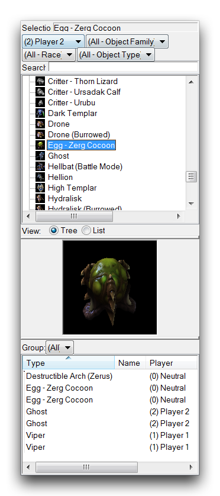
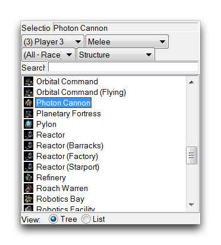
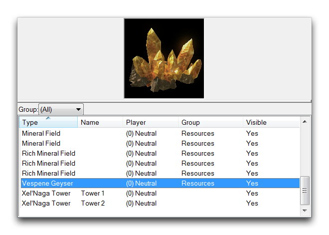
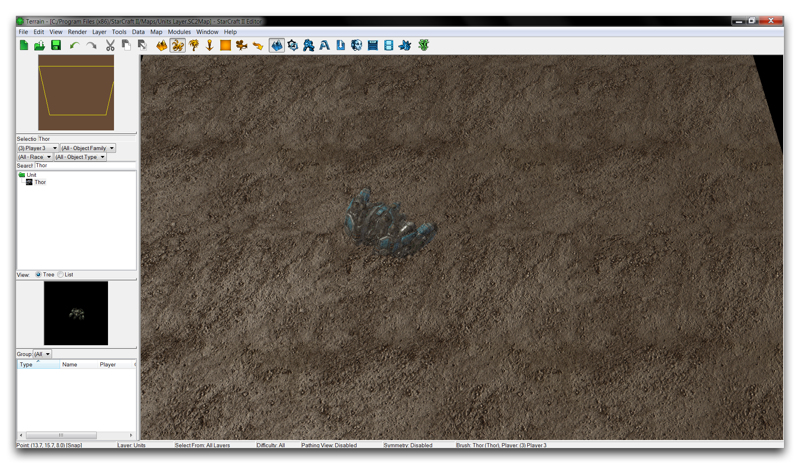
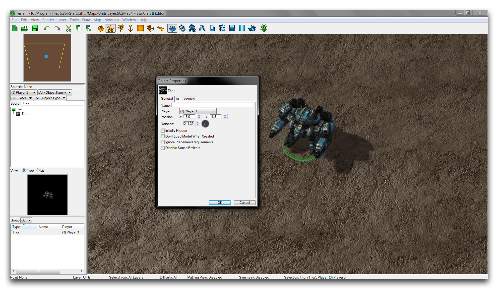
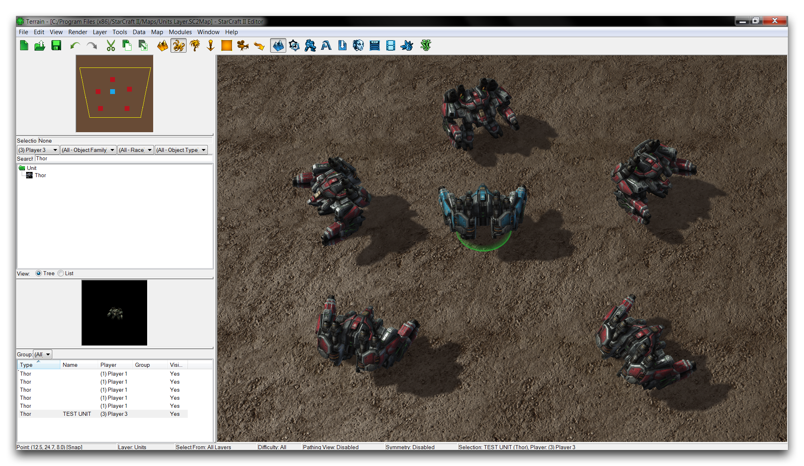
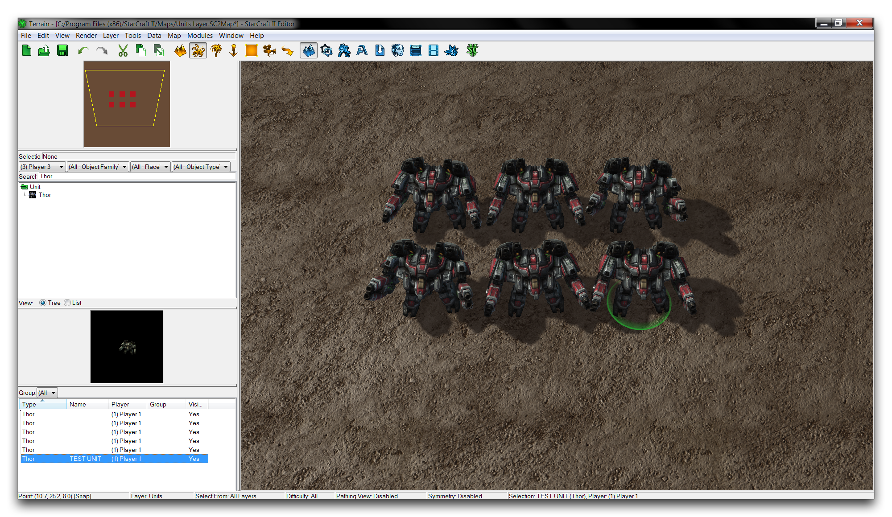

# 单位层

单位层是您可以在地图上放置单位并以各种方式配置它们的地方。虽然单位可能通过触发器或其他来源进入游戏，但直接在编辑器中放置它们对于设计游戏的外观和感觉很有用。您可以通过单击下面显示的图标从地形栏访问此层。

*单位层图标*

## 单位调色板

“单位”是一个非常灵活的术语，通常指的是玩家可以操作的角色，比如海军陆战队员、狂热者等。这些示例实际上是单位，但在编辑器的上下文中，该术语更广泛地指代一种数据类型。在这种情况下，单位是可以放置在编辑器中并在游戏中使用的实体。这包括传统的星际争霸单位，还包括视觉道具、可摧毁的地形、资源、建筑、标记和小动物。

正如前面提到的，单位层是一个很好的工具，可用于设置游戏的工作部件，完全避免任何编码。这对于完全初学者来说可能很有用，但也为任何经验水平的用户提供了组装快速模型的能力。您在地表编辑器中放置的每个单位都将在游戏中可见，除非稍后使用触发器修改或禁用它们。您可以查找、选择和放置单位，使用单位调色板中提供的选项，如下所示。

*单位调色板*

单位调色板的主要特点是列出了在地图中可供放置的所有单位。此列表是从地图当前的数据结构中填充的，包括其依赖项和当前地图的任何本机数据。该列表还为您提供了三层过滤器，允许您按照玩家、对象类型、种族和对象类型查找。您可以在下面的图像中看到它的使用方式。

*查找近战建筑*

该调色板还拥有一些辅助功能。现有对象列表记录了您在地图上放置的每个单位。它提供了有关每个单位类型的详细信息，其所有者，是否属于任何当前群组以及其可见性状态。这对于在拥挤的地图中查找单位或在性能故障排除期间估算整体单位数量非常有用。最后，还有一个预览功能，显示当前选定的放置单位的渲染。您可以使用标准摄像机控件重新定向此视图。这些功能显示在下面的图像中。

*单位预览和现有对象列表*

## 放置单位

要放置单位，请查看单位调色板中的列表，手动查找主题，或使用搜索栏和过滤器。尝试通过在搜索栏中键入Thor来选择一个Thor。单击单位并导航至主视口将显示一个准备放置的透明预览单位。

*单位放置预览*

再次单击以放置单位，单位应变为实体，并现在将显示在现有对象列表中。

## 配置已放置单位

在地形编辑器中放置单位时，您还可以展开一些属性以便轻松配置它们。您可以通过双击主视窗中的Thor来编辑Thor的属性。这将打开下面显示的“对象属性”窗口。

*单位对象属性*

对象属性窗口允许您对选定单位进行各种调整。显示的选项可能因您正在处理的单位而异。下面将会对此窗口允许您编辑的属性进行详细说明。

| 属性      | 描述                                                                                       |
| --------- | ------------------------------------------------------------------------------------------ |
| 名称      | 为指定单位设置自定义标签。此标签在“现有对象”列表中可见。                                    |
| 玩家      | 设置单位的所有权。                                                                        |
| 位置      | 通过X和Y坐标设置单位在地图中的位置。                                                     |
| 旋转      | 调整编辑器中单位的朝向角度。                                                             |

作为展示这些功能实用性的练习，使用先前的步骤在地图上放置几个Thor。编辑每个单位的对象属性，并确保它们的所有者值均为Player 1。现在选择最初的单个Thor，并将其所有权设置为Player 3。使用其对象属性名称为其添加标签TEST UNIT。如果检查“现有对象”列表，带标签的单位应当清楚可区分，如下图所示。

*带标签的单位*

返回到分配给Player 3的Thor，并将其所有权更改为Player 1。将这些Thors在单位层上移动在一起。您甚至可以使用它们的旋转属性使它们都面向相同方向，使它们看起来完全相同。请注意，旋转270°的单位将朝向相机。您应该得到类似下图的结果。

*具有名称属性的单位位置*

在正常情况下，这些单位将无法区分。在这种情况下，您为Thor分配的标签仍然显示在调色板的现有对象列表中，这将有助于在混乱后找到您独特的Thor。如果您为此单位赋予了某些特殊的游戏关联，例如在触发器中引用，那么快速在地形模块中找到它的能力特别有用。

## 附件

 * [021_Units_Layer.SC2Map](./maps/021_Units_Layer.SC2Map)