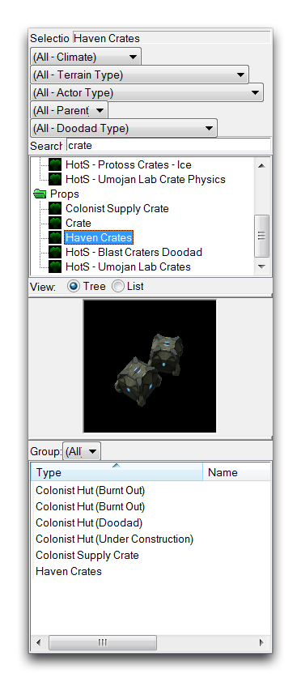
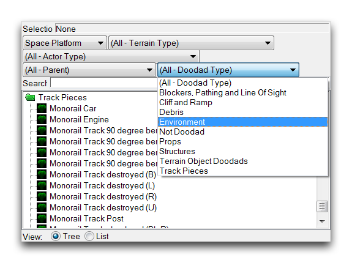
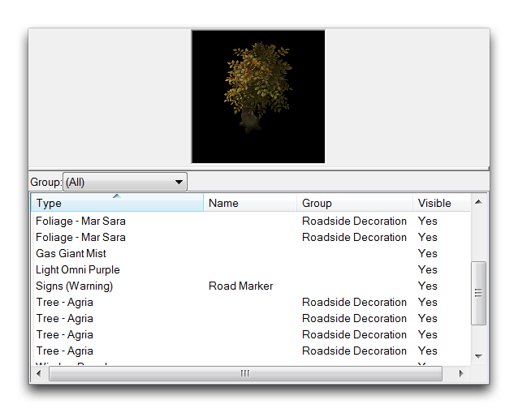

# Doodads 图层

Doodads 图层包含称为 doodads 的装饰性环境物体。这些是编辑器中的基本地图样式元素，有数千种可用。您可以通过地形栏找到此图层，使用下面看到的图标。

*Doodad 图层图标*

## Doodads 调色板

Doodads 调色板作为 doodads 的目录，允许您对 doodads 进行排序、搜索和放置。对于 Doodads 的使用没有限制，调色板可以让您访问当前版本中提供的任何 doodads。请注意，doodads 可能会积累得很快，过度使用 doodads 是性能下降的常见原因。当 Doodads 图层处于活动状态时，您会在地形编辑器的最左侧找到此调色板。调色板本身如下所示。

*调色板预览和现有对象列表*

Doodad 调色板拥有五个搜索过滤器，帮助您查找地图元素。您可以通过导航到特定下拉菜单并选择筛选选项来应用这些过滤器，如下所示。

*Doodad 过滤*

列表将更新以包括具有所选属性的每个 doodad。这些过滤器可以叠加，因此您可以一次按多个属性搜索。以下表格包含您可以使用的过滤器的详细信息。

| 过滤器        | 描述                                                                                                                                                                                                                         |
| --------------- | ------------------------------------------------------------------------------------------------------------------------------------------------------------------------------------------------------------------------- |
| 气候           | 地形类型的主要分区，通过一般季节、生物圈或感觉来帮助缩小 doodad 选项。                                                                                                                                           |
| 地形类型       | 通过原始设计用于放置 doodad 的特定设置和纹理集进行筛选。使 doodads 与地图的地形类型相匹配是选择相辅相成的优秀起点。                                                                    |
| 角色类型       | 默认设置为 Doodad。通常，此筛选器应保持在此设置上，但在高级用法中，此筛选器允许您将一些其他类型作为地图装饰放置，就好像它们是 doodad 一样。                                                               |
| 父级            | 通过 Data Editor 中的 doodad 的亲属关系进行筛选。与角色类型一样，这是一种高级用法类别，允许放置一些非传统的 doodad 元素。                                                                        |
| Doodad 类型    | 通过每个 doodad 预期用途的标签进行筛选。提供了有用的描述性类别，如 Environment，其中包含树木和灌木，或 Cliff 和 Ramp，其中包含可以嵌入墙壁的 doodads。|

除了搜索过滤器，doodad 图层还提供了一些用于放置和编辑现有 doodads 的补充功能。与单位图层一样，存在一个现有对象列表，跟踪当前放置在编辑器中的所有 doodads，并且一个预览，提供了当前选择的 doodad 的渲染。双击一个 doodad 将启动其‘对象属性’窗口，您可以在其中为其添加名称，并以多种方式更改其视觉属性。以下是这些功能的组合展示。

*Doodad 预览和现有对象列表*