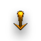
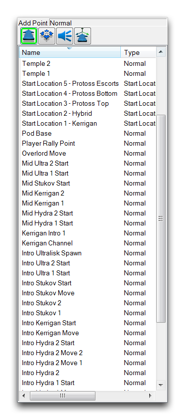
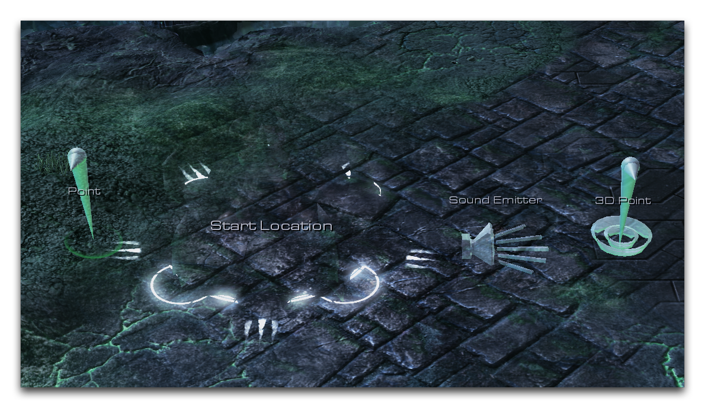
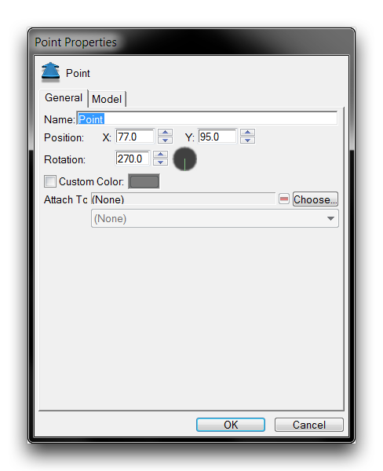
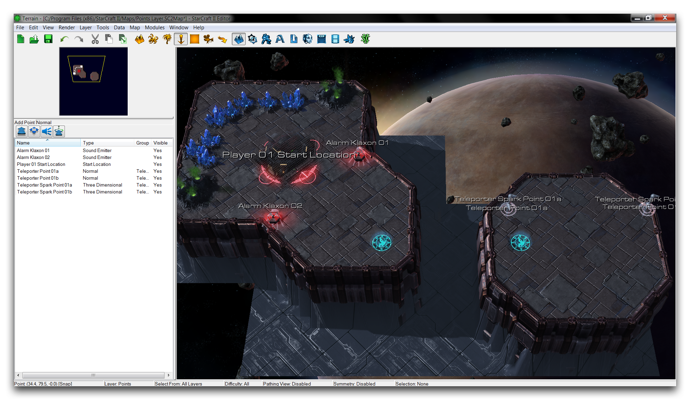
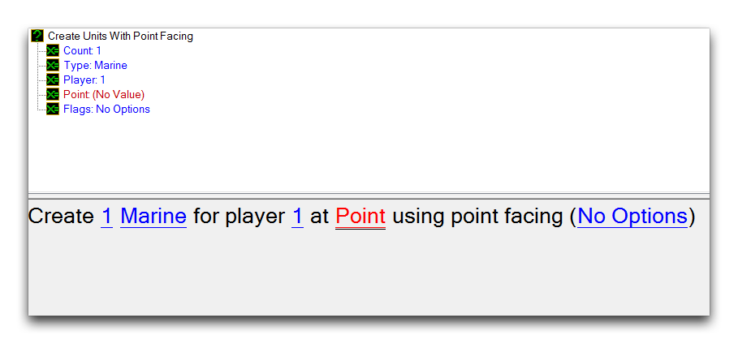
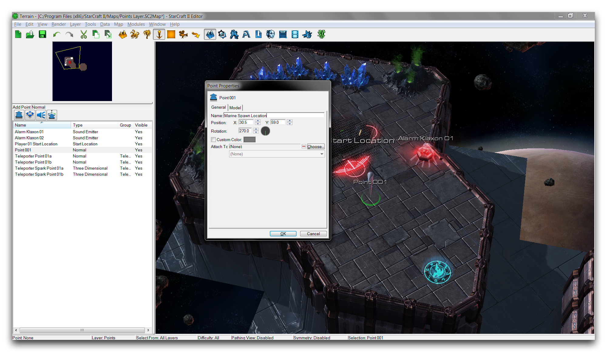
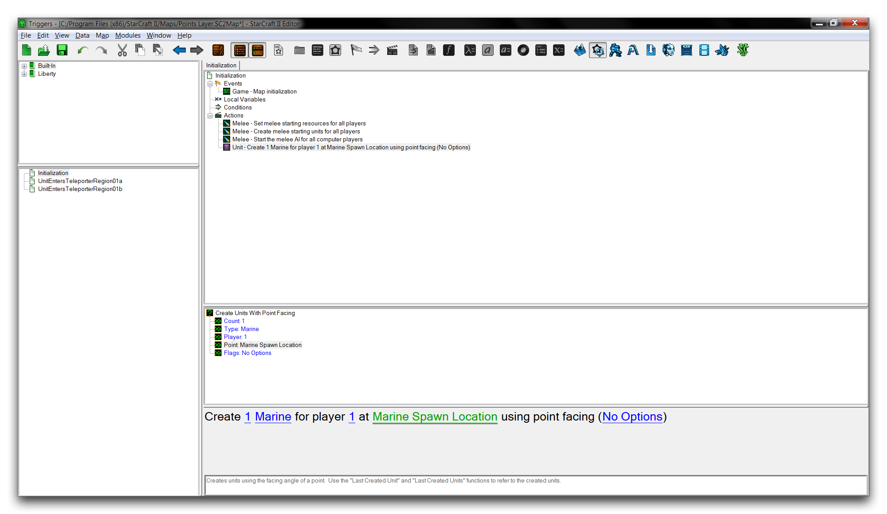
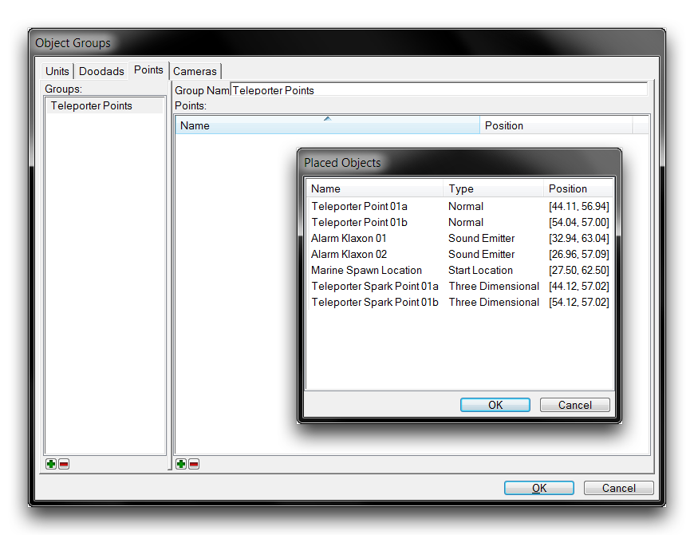

# 点层

点层使用称为点的标记元素。点向其他模块传达位置，并可以通过下面所示的图标在地形栏中访问。

*点层图标*

## 点调色板

点调色板是您可以找到用于创建不同类型点的工具以及地图中每个活动点列表的地方。当点层处于活动状态时，您可以在地形编辑器左侧找到它。

*带有现有点列表的点调色板*

有四种类型的点，普通点、起始位置、声音发射器和3D点。您可以通过选择它们各自的工具并单击地图上所需的位置来放置每个点。这将在该位置标记一个点并在该位置创建一个标记。放置点后，可以通过选择并拖动标记来移动点。尽管它们的标记出现在地图上，但点不会占用任何空间，并且在编辑器之外不可见。您还可以通过右键单击点调色板中的点并更改它们的“在编辑器中显示”属性来单独隐藏标记。点标记显示在下面图像中所示的编辑器中。

*四种类型的点标记*

## 点类型

 普通点在XY平面上标记地图上的特定坐标。

 起始位置分配给玩家，标记他们的初始起始位置。这是一个特殊的区分，在整个编辑器中有几个用途。这些点标记生成标准近战游戏中基地和工作者的产生位置。它们还为其各自的玩家设置默认初始摄像头位置。

 声音发射器在其位置播放声音。通常它们在地图上的特定距离范围内产生环境音效。这意味着您可以将它们用作一种音频小工具，创建装饰性和氛围性声音。

 三维点类似于普通点，但具有附加的高度值，这意味着它们用于在XYZ或3D空间中标记坐标。

## 点属性

点有许多配置选项，可以从“点属性”窗口中设置这些选项。您可以通过双击地形模块中点的标记来访问此窗口。或者，您可以双击点调色板上列表中的点名称。下面是一个点属性窗口的示例以及它提供的选项的解释。

*点属性*

| 属性      | 描述                                                                                                                                                                                                                                                                       |
| --------- | ------------------------------------------------------------------------------------------------------------------------------------------------------------------------------------------------------------------------------------------------------------------------ |
| 名称      | 用于在点调色板中识别点的标签。                                                                                                                                                                                                                                           |
| 位置      | 点在地图上的位置，作为XY值。                                                                                                                                                                                                                                             |
| 旋转      | 存储在点内的角度，可能会用到。点的默认朝向是270度。带有自定义标记的点将显示此朝向。                                                                                                                                                                                     |
| 颜色      | 给点的标记着色。这个选项对于起始位置不可用。                                                                                                                                                                                                                               |
| 附加到    | 选择一个带“选择”的单位将立即将点的位置设置为该单位的位置。然后，点将随着单位的移动而保持附加，允许它作为单位位置的标记，有助于向其他模块传达动态位置。                                                                                                        |
| 模型      | 自定义点的标记模型。                                                                                                                                                                                                                                                      |
| 高度      | 仅适用于3D点。设置点位置的Z分量。                                                                                                                                                                                                                                         |
| 声音      | 仅适用于声音发射器。设置由发射器播放的声音。                                                                                                                                                                                                                             |

## 演示点

打开此文章提供的演示地图。您将看到一个小课程嵌套在一个太空平台上，已经放置了几个点。该课程应该如下图所示。

*演示地图课程*

这里的目标是利用一些现有的触发代码，将生成一个海军陆战队员，然后允许地图上的信标将海军陆战队员从一个平台传送到另一个平台。转到触发编辑器，注意“初始化”触发器。已经设置了一个用于生成海军陆战队员的触发器，但需要一个点来生成海军陆战队员。该触发器显示如下。

*需要生成点的触发器*

通过转到地形编辑器并单击点调色板中的普通点工具，在左侧最左侧的空间平台附近单击以创建一个点。双击新建的标记以打开“点属性”窗口，并将点命名为“海军陆战队员生成位置”。您应该看到类似下图的内容。

*命名一个点*

返回到触发编辑器并将生成触发器的“点”值设置为“海军陆战队员生成位置”。完成后的触发器应与下图匹配。

*点连接到触发器*

现在您的海军陆战队员已准备好使用传送系统，但是如果您注意到地图上控制传送的点已移出位置，您会发现使用“对象组”帮助您重新定位这些点很有用。您可以通过导航到地图▶︎对象组▶︎点来找到它们。

将这些点分组在一起可以让您一次性操作它们。首先，您需要将它们都放在一个组中。右键单击左侧子视图，选择“添加组”。将组命名为“传送点”，然后右键单击右侧子视图，选择“添加点”。这将启动“放置对象”窗口，您可以在该窗口中将点添加到组中。选择传送点01a、传送点01b、传送火花点01a和传送火花点01b，然后单击“确定”。这个过程如下图所示。

*创建对象组*